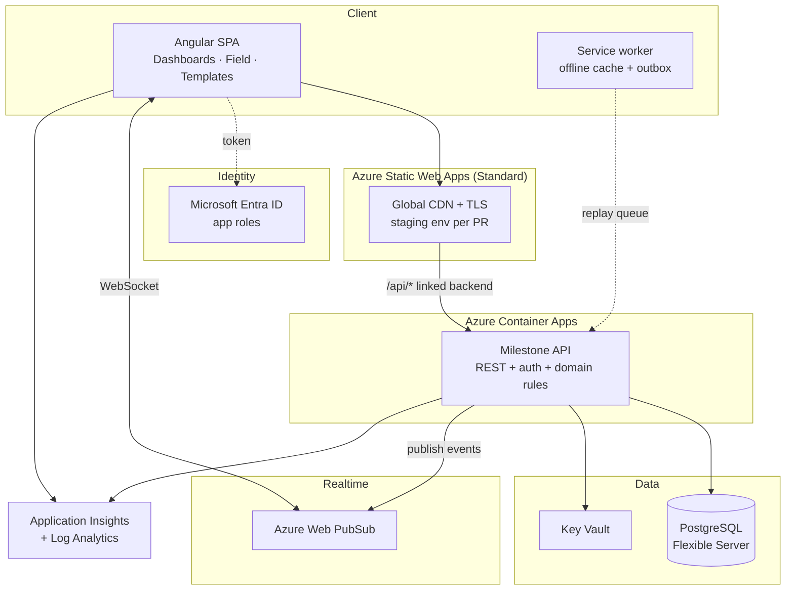

# Milestone Command — Azure Deployment Plan

**Status:** planning · **Written:** 2026-08-14 · **Repo:** `rachidpeaqock/stones-angular` (`main`)

> **Superseded on topology, cost and roadmap** by [`platform-architecture.md`](./platform-architecture.md) (2026-08-15): the product is now three separate front-end apps in three repos over a microservices backend. **Still authoritative here:** the gap analysis (§2), database schema (§4), endpoint contract (§5), auth model (§7), the working-day calendar problem (§8), and concurrency/offline (§9) — none of which change with decomposition.
>
> **Backend internals:** [`backend-architecture.md`](./backend-architecture.md) — Spring Boot 4.1 design, applied per service.

---

## 1. Executive summary

Today Milestone Command is a **complete, working front end with no server behind it**. Every screen renders, the reason-capture flow works end to end, and updates sync live between tabs — but all of it runs in one browser. `StoreService` holds the truth in a signal, persists to `localStorage` under `mc.store.v1`, and fakes multi-user sync with `BroadcastChannel`. Close the tab on another machine and the data was never there.

To put this on Azure as a real product you need to add, in rough order of effort:

| # | Missing piece | Effort | Blocking? |
|---|---|---|---|
| 1 | **Backend API** — no server code exists at all | 4–6 weeks | Yes |
| 2 | **Database** — no schema, no persistence beyond the browser | 1–2 weeks | Yes |
| 3 | **Auth & roles** — actors are hardcoded strings (`'You'`, `'M. Castellano'`) | 1–2 weeks | Yes |
| 4 | **Real-time fan-out** — `BroadcastChannel` is same-browser only | 3–5 days | Yes |
| 5 | **Frontend refactor** — `StoreService` is synchronous; no `HttpClient` anywhere | 2–3 weeks | Yes |
| 6 | **Infra + CI/CD** — no IaC, no pipeline, no environments | 1 week | Yes |
| 7 | **Working-day calendar** — `bizDays()` knows Mon–Fri, not site holidays | 3–5 days | Yes (correctness) |
| 8 | **Offline support for Field** — site crews have no signal | 1–2 weeks | Strongly recommended |
| 9 | **Tests** — zero tests exist; `angular.json` has no `test` target | 1–2 weeks | Recommended |
| 10 | **Observability, hardening, cost controls** | 1 week | Recommended |

**Realistic first production deployment: 10–14 weeks for one full-time developer**, or 6–8 with a split front/back pair. A demo-grade deployment (static site, seed data, no backend) can go live **today** — see §13, Phase 0.

Estimated run cost for a single production environment: **~€75–130/month** at low load (§11).

---

## 2. What exists today (verified 2026-08-14)

| Aspect | Current state |
|---|---|
| Framework | Angular 20.3.28 standalone + Ionic 8, signals throughout |
| Build | `npm run build` → `dist/milestone-command/browser`, clean, zero warnings |
| Routing | Hash-based (`withHashLocation()` in [`src/main.ts`](../src/main.ts)) — `/#/dashboards`, `/#/field`, `/#/templates` |
| State | [`StoreService`](../src/app/core/store.service.ts) — `signal<StoreState>` over hardcoded seed data |
| Persistence | `localStorage['mc.store.v1']`, plus `localStorage['mc.notif.seen']` |
| "Live sync" | `BroadcastChannel('milestone-command')` + `window.storage` event |
| Data | 32 milestones hardcoded in [`core/data.ts`](../src/app/core/data.ts), one project, frozen clock `AS_OF = '2026-06-06'` |
| Auth | None. `by: 'You'` (PM app), `const ME = 'M. Castellano'` (Field app) |
| HTTP | **None** — no `HttpClient`, no `provideHttpClient`, no `fetch()` |
| Config | **No** `src/environments/` — nowhere to put an API URL |
| Tests | **None** — no `test` target in `angular.json`, no spec files |
| Multi-tenancy | None — a single `PROJECT` constant |

The important consequence: **this is a static site.** It deploys to any CDN as-is, which makes Phase 0 (demo hosting) trivial and Phase 1+ (real backend) a genuine greenfield build.

---

## 3. Target architecture



### Why these services

| Concern | Choice | Rationale |
|---|---|---|
| SPA hosting | **Static Web Apps (Standard)** | Built for this exact artifact. Global CDN, free TLS, **a staging environment per pull request**, and a "linked backend" that proxies `/api/*` to Container Apps so the browser sees one origin — no CORS. |
| API | **Container Apps** running **Spring Boot 4.1 / Java 25** | No VM to patch, holds a warm connection pool to Postgres, and revision-based rollback. Chosen over Functions because the domain logic benefits from a long-lived process. **Note:** production runs `minReplicas: 1`, not scale-to-zero — the scheduled overdue-sweeper and the event outbox need a live process ([backend §12](./backend-architecture.md#12-scheduled-work)). |
| Database | **PostgreSQL Flexible Server** | Relational is the right shape (hierarchy + dependency graph + append-only audit). Postgres gives `jsonb` for event payloads, recursive CTEs for the downstream-impact walk, and cheap burstable tiers. Azure SQL is an equally valid pick if the team is .NET-first — see §16. |
| Real-time | **Web PubSub** | Direct replacement for `BroadcastChannel`. Serverless WebSockets, one message per mutation, group-per-project fan-out. |
| Identity | **Entra ID** | The users are employees of an EPC contractor and a client. App roles map cleanly onto the four audiences the UI already has. |
| Secrets | **Key Vault** + managed identity | No connection strings in app settings or CI. |
| IaC | **Bicep** | First-party, no state file to manage. |

---

## 4. Database schema

Postgres flavour. The design encodes three domain rules the UI already assumes.

```sql
-- ---------- tenancy & people ----------
CREATE TABLE app_user (
  id            uuid PRIMARY KEY DEFAULT gen_random_uuid(),
  entra_oid     text UNIQUE NOT NULL,       -- Entra object id
  display_name  text NOT NULL,
  email         citext UNIQUE NOT NULL,
  created_at    timestamptz NOT NULL DEFAULT now()
);

CREATE TABLE project (
  id                uuid PRIMARY KEY DEFAULT gen_random_uuid(),
  code              text UNIQUE NOT NULL,   -- 'MRD-T3'
  name              text NOT NULL,
  client            text,
  contractor        text,
  location          text,
  timezone          text NOT NULL DEFAULT 'UTC',
  scheduled_start   date NOT NULL,
  scheduled_finish  date NOT NULL,
  calendar_id       uuid NOT NULL REFERENCES work_calendar(id),
  amber_threshold   int  NOT NULL DEFAULT 3,   -- THRESHOLDS.amber
  red_threshold     int  NOT NULL DEFAULT 10,  -- THRESHOLDS.red
  archived_at       timestamptz
);

CREATE TYPE project_role AS ENUM ('viewer','executive','pm','field','planner','admin');

CREATE TABLE user_project_role (
  user_id     uuid REFERENCES app_user(id),
  project_id  uuid REFERENCES project(id),
  role        project_role NOT NULL,
  PRIMARY KEY (user_id, project_id, role)
);

-- ---------- working-day calendar (see §8) ----------
CREATE TABLE work_calendar (
  id         uuid PRIMARY KEY DEFAULT gen_random_uuid(),
  name       text NOT NULL,
  work_days  int[] NOT NULL DEFAULT '{1,2,3,4,5}'  -- ISO dow
);
CREATE TABLE calendar_holiday (
  calendar_id uuid REFERENCES work_calendar(id),
  day         date NOT NULL,
  label       text,
  PRIMARY KEY (calendar_id, day)
);

-- ---------- hierarchy ----------
CREATE TABLE phase (
  id uuid PRIMARY KEY DEFAULT gen_random_uuid(),
  project_id uuid NOT NULL REFERENCES project(id) ON DELETE CASCADE,
  name text NOT NULL, sort int NOT NULL,
  UNIQUE (project_id, name)
);
CREATE TABLE work_package (
  id uuid PRIMARY KEY DEFAULT gen_random_uuid(),
  phase_id uuid NOT NULL REFERENCES phase(id) ON DELETE CASCADE,
  name text NOT NULL, sort int NOT NULL,
  UNIQUE (phase_id, name)
);

CREATE TYPE milestone_status AS ENUM ('pending','atrisk','done','missed');

CREATE TABLE milestone (
  id               uuid PRIMARY KEY DEFAULT gen_random_uuid(),
  project_id       uuid NOT NULL REFERENCES project(id) ON DELETE CASCADE,
  work_package_id  uuid NOT NULL REFERENCES work_package(id),
  name             text NOT NULL,
  owner_id         uuid REFERENCES app_user(id),
  area             text,
  scheduled_date   date NOT NULL,           -- the baseline; moves only via rebaseline
  real_date        date NOT NULL,           -- forecast while pending, actual once done
  status           milestone_status NOT NULL DEFAULT 'pending',
  critical         boolean NOT NULL DEFAULT false,
  row_version      bigint NOT NULL DEFAULT 1,   -- optimistic concurrency, see §9
  created_at       timestamptz NOT NULL DEFAULT now(),
  updated_at       timestamptz NOT NULL DEFAULT now(),
  deleted_at       timestamptz
);
CREATE INDEX ON milestone (project_id, status) WHERE deleted_at IS NULL;

-- ---------- dependency graph ----------
CREATE TYPE dep_type AS ENUM ('FS','SS','FF','SF');
CREATE TABLE milestone_dependency (
  predecessor_id uuid NOT NULL REFERENCES milestone(id) ON DELETE CASCADE,
  successor_id   uuid NOT NULL REFERENCES milestone(id) ON DELETE CASCADE,
  type           dep_type NOT NULL DEFAULT 'FS',
  lag_days       int NOT NULL DEFAULT 0,
  PRIMARY KEY (predecessor_id, successor_id),
  CHECK (predecessor_id <> successor_id)
);

-- ---------- append-only audit ----------
CREATE TABLE milestone_log (
  id           bigserial PRIMARY KEY,
  milestone_id uuid NOT NULL REFERENCES milestone(id),
  from_date    date NOT NULL,
  to_date      date NOT NULL,
  days         int  NOT NULL,               -- working days, calendar-aware
  reason_code  text NOT NULL REFERENCES reason_code(code),
  note         text,
  actor_id     uuid NOT NULL REFERENCES app_user(id),
  app          text NOT NULL CHECK (app IN ('pm','field')),
  created_at   timestamptz NOT NULL DEFAULT now()
);

CREATE TABLE rebaseline (
  id           bigserial PRIMARY KEY,
  milestone_id uuid NOT NULL REFERENCES milestone(id),
  from_date    date NOT NULL,
  to_date      date NOT NULL,
  reason       text NOT NULL,
  note         text NOT NULL,               -- justification is mandatory
  actor_id     uuid NOT NULL REFERENCES app_user(id),
  created_at   timestamptz NOT NULL DEFAULT now()
);

CREATE TABLE reason_code (
  code text PRIMARY KEY, label text NOT NULL,
  hue int NOT NULL, sort int NOT NULL, active boolean NOT NULL DEFAULT true
);

CREATE TABLE activity_event (
  id           bigserial PRIMARY KEY,
  project_id   uuid NOT NULL REFERENCES project(id),
  milestone_id uuid REFERENCES milestone(id),
  type         text NOT NULL,               -- slipped|recovered|done|updated|rebaselined|created|deleted
  payload      jsonb NOT NULL,
  actor_id     uuid REFERENCES app_user(id),
  created_at   timestamptz NOT NULL DEFAULT now()
);
CREATE INDEX ON activity_event (project_id, created_at DESC);

CREATE TABLE notification_read (
  user_id uuid PRIMARY KEY REFERENCES app_user(id),
  last_seen_at timestamptz NOT NULL
);

-- ---------- templates ----------
CREATE TABLE template (
  id uuid PRIMARY KEY DEFAULT gen_random_uuid(),
  name text NOT NULL, sector text, owner_id uuid REFERENCES app_user(id),
  updated_at timestamptz NOT NULL DEFAULT now()
);
CREATE TABLE template_row (
  id uuid PRIMARY KEY DEFAULT gen_random_uuid(),
  template_id uuid NOT NULL REFERENCES template(id) ON DELETE CASCADE,
  kind text NOT NULL CHECK (kind IN ('phase','wp','ms')),
  name text NOT NULL, owner_id uuid, area text,
  offset_days int, dep_row_id uuid REFERENCES template_row(id),
  sort int NOT NULL
);
```

### Three rules the schema must enforce

**1. The audit trail is immutable.** The whole product promise is "every Real-date change carries a reason, permanently". Enforce it in the database, not just the API:

```sql
REVOKE UPDATE, DELETE ON milestone_log, rebaseline FROM app_role;
```

**2. Re-baseline is a distinct, privileged act.** `scheduled_date` must never change on a routine update path. Guard it with a trigger that rejects any `UPDATE` touching `scheduled_date` unless the transaction also inserts a `rebaseline` row, and gate the endpoint on the `pm`/`planner` role.

**3. Variance is derived, never stored.** Expose it as a view so the client and server can never disagree:

```sql
CREATE VIEW milestone_view AS
SELECT m.*,
       biz_days(m.scheduled_date, m.real_date, p.calendar_id) AS variance,
       CASE WHEN m.status = 'missed' THEN 'red'
            WHEN biz_days(m.scheduled_date, m.real_date, p.calendar_id) > p.red_threshold   THEN 'red'
            WHEN biz_days(m.scheduled_date, m.real_date, p.calendar_id) > p.amber_threshold THEN 'amber'
            ELSE 'green' END AS rag
FROM milestone m JOIN project p ON p.id = m.project_id
WHERE m.deleted_at IS NULL;
```

This is a direct port of `ragOf()` in [`core/data.ts:92`](../src/app/core/data.ts). Keep the client copy for optimistic UI, but the server value wins.

---

## 5. API contract

Every endpoint below replaces exactly one existing `StoreService` method — that mapping is the migration checklist.

| Today (`store.service.ts`) | Endpoint | Notes |
|---|---|---|
| `milestones()` computed | `GET /api/projects/{id}/milestones` | Returns `milestone_view` incl. server-computed `variance`/`rag` |
| `commitReal(id, opts)` | `POST /api/milestones/{id}/real-date` | Body `{ realDate, status, reason, note, app }`. Requires `If-Match: <row_version>` |
| `rebaseline(id, opts)` | `POST /api/milestones/{id}/rebaseline` | Role-gated to `pm`/`planner`; note mandatory |
| `createMilestone(node)` | `POST /api/projects/{id}/milestones` | |
| `editMilestone(id, patch)` | `PATCH /api/milestones/{id}` | Rejects `scheduledDate` |
| `deleteMilestone(id)` | `DELETE /api/milestones/{id}` | Soft delete → `deleted_at` |
| `downstream(id)` / `impact(id)` | `GET /api/milestones/{id}/impact` | Recursive CTE server-side; today it's a client-side graph walk |
| `events()` computed | `GET /api/projects/{id}/events?since=` | Paged, replaces the 50-item in-memory slice |
| `markSeen()` | `POST /api/me/notifications/seen` | Per user, not per browser |
| `unseenCount()` | `GET /api/me/notifications/count` | |
| `pulse` signal | **Web PubSub** `project.{id}` group | Server publishes after each successful mutation |
| `reset()` | *(drop)* | Demo-only affordance |
| `REASONS` const | `GET /api/reason-codes` | Cache client-side |
| Templates seeds | `GET/POST/PUT /api/templates` | Currently hardcoded in the component |

**Example — the highest-frequency call:**

```http
POST /api/milestones/9f3c.../real-date
Authorization: Bearer <entra token>
If-Match: 42
Content-Type: application/json

{ "realDate": "2026-07-24", "reason": "weather", "note": "Monsoon flooding", "app": "field" }
```

```jsonc
// 200 OK
{ "id": "9f3c…", "realDate": "2026-07-24", "variance": 10, "rag": "amber",
  "status": "atrisk", "rowVersion": 43,
  "impact": { "count": 8, "days": 10 } }     // so the UI can warn without a second call
// 409 Conflict → someone else moved it; client re-fetches and re-prompts
```

---

## 6. Frontend changes required

| File | Change | Size |
|---|---|---|
| [`core/store.service.ts`](../src/app/core/store.service.ts) | The big one. Mutations become HTTP calls; add `loading`/`error` signals; optimistic update + rollback on failure; keep `localStorage` as an **offline cache**, not the source of truth | L |
| **new** `core/api.service.ts` | Typed HTTP client, `If-Match` handling, 409 retry policy | M |
| **new** `core/realtime.service.ts` | Web PubSub client → feeds the existing `pulse` signal (the toast UI needs no change) | M |
| **new** `core/auth/` | MSAL config, guard, token interceptor, `currentUser` signal | M |
| [`src/main.ts`](../src/main.ts) | `provideHttpClient(withInterceptors([authInterceptor]))` + MSAL providers | S |
| [`core/data.ts`](../src/app/core/data.ts) | Delete `AS_OF` (frozen clock) and `SEED_MILESTONES`; keep `bizDays`/`fmt*` as display helpers. **`AS_OF` is referenced in ~8 places** — mostly Field's "this week" windowing | M |
| [`field.component.ts`](../src/app/field/field.component.ts) | `const ME` → real user; add offline outbox + queued-state UI | M |
| [`pm.component.ts`](../src/app/dashboards/pm.component.ts) | Hide Re-baseline / New / Delete by role; handle 409 | M |
| [`templates.component.ts`](../src/app/templates/templates.component.ts) | Seeds move to the API; "Create project from template" becomes a real POST | M |
| **new** `src/environments/` | Does not exist. Needs `apiBaseUrl`, `entraClientId`, `webPubSubEndpoint` + `fileReplacements` in `angular.json` | S |
| `angular.json` | Add a `test` target (none today) | S |
| `index.html` / `main.ts` | Consider dropping `withHashLocation()` once SWA serves the rewrite fallback — nicer URLs, better analytics | S |

**Design note:** the current architecture actually helps here. Because every screen reads through `StoreService`'s computed selectors, swapping the internals to HTTP touches *one file* plus new plumbing — no component needs to change to get real data. The components change only to handle *async* (loading skeletons, error toasts, disabled buttons in flight), which they currently never do.

---

## 7. Auth & roles

**Identity:** Microsoft Entra ID, SPA registered as a public client (PKCE), `@azure/msal-angular`.

Map Entra **app roles** onto the audiences the UI already separates:

| Role | Sees | Can |
|---|---|---|
| `executive` | Dashboards → Executive | Read only |
| `pm` | Dashboards (both), Templates | Update real dates, **re-baseline**, create/delete milestones |
| `field` | Field app only | Update real dates + mark done, **only for milestones they own** |
| `planner` | Templates, Dashboards | Manage templates, create projects |
| `admin` | Everything | Manage users, reason codes, calendars |

Enforce roles **server-side on every endpoint** — the client-side hiding is UX, not security. Note `field` needs a row-level rule (own milestones only), which the current UI implies (`ME` filters the card list) but nothing enforces.

**External users** (the client, Meridian Energy) should come in as Entra **B2B guests** rather than a second identity system.

---

## 8. The working-day calendar (a real correctness gap)

`bizDays()` in [`core/data.ts:60`](../src/app/core/data.ts) counts Mon–Fri and nothing else. On a real EPC project this is wrong in two ways:

1. **No public holidays.** A milestone spanning Eid, Christmas or a national day over-counts working days — and that number drives variance, RAG, the exec slippage figure and every threshold breach.
2. **No site work pattern.** Many industrial sites run 6-day weeks, rotating shifts, or a monsoon shutdown. Mon–Fri is an assumption, not a fact.

Hence `work_calendar` + `calendar_holiday` in the schema and a server-side `biz_days(from, to, calendar_id)`. Ship the client's simple version only as an optimistic estimate, and let the server's value overwrite it on response.

---

## 9. Concurrency, offline & the Field app

**Concurrency.** Two people *will* update the same milestone — that's the whole point of a shared system of record. Today the last write silently wins (`localStorage` overwrite). Use `row_version` + `If-Match`; on `409` re-fetch and show "M. Castellano moved this to 24 Jul while you were editing" rather than clobbering.

**Offline.** The Field app is explicitly for "site crews, mobile" — the population most likely to have no signal. Plan for it rather than retrofitting:

- Add `@angular/pwa` → service worker, app shell, installable on site phones.
- **Outbox pattern:** queue mutations in IndexedDB, show a "queued — will sync" pill (the UI already has a sync-status affordance: *"All synced"*), replay on reconnect.
- Replayed writes must be **idempotent** — send a client-generated `mutationId` and have the API dedupe, or a lost response turns into a double slip.
- Conflict on replay is a real case: resolve as "server wins + notify", never silent discard.

---

## 10. Azure resources

| Resource | SKU (prod) | Purpose |
|---|---|---|
| Static Web App | Standard | SPA hosting, CDN, TLS, PR previews, linked backend |
| Container App + Environment | Consumption, 0.5 vCPU / 1 GiB, min 1 replica prod / 0 dev | API |
| Container Registry | Basic | API images |
| PostgreSQL Flexible Server | B2s (prod) / B1ms (dev), 32 GB, 7-day PITR | Database |
| Web PubSub | Free (dev) / Standard S1 (prod) | WebSocket fan-out |
| Key Vault | Standard | Secrets, accessed via managed identity |
| Application Insights + Log Analytics | Pay-as-you-go | Traces, metrics, front-end RUM |
| Entra ID app registrations ×2 | Included | SPA + API |

Naming: `mc-<env>-<resource>` e.g. `mc-prod-api`, `mc-prod-pg`. One resource group per environment.

---

## 11. Cost estimate

Rough monthly, West Europe, low internal load (~50 users). **Verify against the Azure pricing calculator before committing — these move.**

| Item | Dev | Prod |
|---|---|---|
| Static Web Apps | Free (€0) | Standard ~€8 |
| Container Apps | scale-to-zero, ~€0–5 | ~€25–40 |
| PostgreSQL Flexible | B1ms ~€13 | B2s ~€45 |
| Web PubSub | Free | S1 ~€45 |
| Container Registry | ~€4 | ~€4 |
| Key Vault | <€1 | <€1 |
| App Insights | free tier | ~€10–20 (5 GB free, then per GB) |
| **Total** | **~€20/mo** | **~€140/mo** |

**Cheaper MVP:** drop Web PubSub to Free (20 concurrent connections — fine for a pilot crew), run Postgres B1ms, and let Container Apps scale to zero → **~€35–50/month**. The single largest lever is Web PubSub; polling every 30 s instead of WebSockets would remove that line entirely at the cost of the "live" feel that is currently a selling point of the product.

---

## 12. CI/CD

The repo already lives on GitHub, so GitHub Actions is the path of least resistance. Two workflows:

**`.github/workflows/frontend.yml`**
```yaml
on:
  push: { branches: [main] }
  pull_request: { branches: [main] }
jobs:
  build_and_deploy:
    runs-on: ubuntu-latest
    steps:
      - uses: actions/checkout@v4
      - uses: actions/setup-node@v4
        with: { node-version: 20, cache: npm }
      - run: npm ci
      - run: npm run build
      # - run: npm test -- --watch=false --browsers=ChromeHeadless   # once a test target exists
      - uses: Azure/static-web-apps-deploy@v1
        with:
          azure_static_web_apps_api_token: ${{ secrets.SWA_TOKEN }}
          action: upload
          app_location: "/"
          output_location: "dist/milestone-command/browser"   # note the browser/ subfolder
          skip_app_build: true
```

Pull requests get an automatic staging URL from SWA — worth using as the review environment for design sign-off.

**`.github/workflows/api.yml`** — build image → push to ACR → `az containerapp update`, with `main` → dev auto-deploy and a manual approval gate for prod.

**Infra:** `infra/main.bicep` deployed by a third workflow, `what-if` on PR, apply on merge.

**Two repo hygiene items** worth doing at the same time:
- `.gitattributes` with `* text=auto eol=lf` — the working tree is CRLF (`core.autocrlf=true`), so a Linux CI runner will see whole-file diffs.
- `package.json` `homepage` still points at the old `rachidpeaqock/stones`.

---

## 13. Phased roadmap

**Phase 0 — Demo on Azure (½ day).** Deploy the current static build to Static Web Apps Free. No backend, no database; seed data and `localStorage` behave exactly as they do locally. Gets a shareable URL in front of stakeholders immediately, and validates the build pipeline. *The frozen `AS_OF = 2026-06-06` clock makes this a stable demo — an accident that works in your favour.*

**Phase 1 — Foundations (2 weeks).** Bicep for dev; Postgres provisioned; schema + migrations (Flyway/EF/Prisma); seed the 32 real milestones from `core/data.ts` as fixture data; API skeleton with health check; CI green.

**Phase 2 — Read path (2 weeks).** `GET` endpoints; `StoreService` reads from HTTP; loading/error states in the components; the app renders live data from the database. *First moment the product is real.*

**Phase 3 — Write path (3 weeks).** `commitReal` / `rebaseline` / CRUD; append-only audit enforced; optimistic concurrency + 409 handling; server-side variance/RAG with the calendar.

**Phase 4 — Auth & roles (2 weeks).** Entra ID, MSAL, route guards, server-side role checks, replace `'You'` / `ME`.

**Phase 5 — Real-time (1 week).** Web PubSub replaces `BroadcastChannel`; the existing toast and bell UI keep working untouched.

**Phase 6 — Field offline (2 weeks).** PWA, IndexedDB outbox, idempotent replay, queued-state UI.

**Phase 7 — Production hardening (1–2 weeks).** Prod environment, backups + restore drill, alerts, load test, security review, runbook.

---

## 14. Testing strategy

There are **no tests today** and no `test` target in `angular.json`. Minimum viable coverage:

| Layer | Tool | What matters most |
|---|---|---|
| Domain unit | Vitest/Jest | `bizDays` across holidays, year boundaries, negative spans; `ragOf` thresholds. These drive every number on the exec dashboard |
| API integration | Testcontainers + Postgres | Audit immutability, re-baseline gating, 409 concurrency |
| E2E | **Playwright** | The reason-capture flow, cross-tab live sync, Field offline replay |
| Load | k6 | Dashboard read path with 32 → 5,000 milestones (the PM tree renders every row today — **watch for a virtualization need**) |

A working Playwright driver already exists from the smoke-test session — reuse it as the seed of the E2E suite rather than starting cold.

---

## 15. Risks

| Risk | Impact | Mitigation |
|---|---|---|
| Working-day math differs client vs server | Wrong variance → wrong RAG → wrong exec decisions | One implementation of record (server); client value is advisory only |
| PM tree renders all rows unvirtualized | Dies on a 5,000-milestone project | Load test early (§14); add CDK virtual scroll if needed |
| Offline replay double-submits | Phantom slips in an immutable audit log | Client `mutationId` + server dedupe |
| Frozen `AS_OF` leaks into production | "This week" in Field silently wrong | Delete the constant in Phase 2; grep for all ~8 usages |
| Web PubSub free tier connection cap (20) | Live sync silently stops at scale | Alert on connection count; budget for S1 before pilot >20 users |
| Single-project assumption | Rework when project #2 arrives | Put `project_id` on everything from day one, even for one project |

---

## 16. Open decisions

1. ~~**API stack**~~ — **decided: Spring Boot 4.1 on Java 25, as a modular monolith (Spring Modulith), not microservices.** Full rationale and design in [`backend-architecture.md`](./backend-architecture.md).
2. **Postgres or Azure SQL?** Postgres for recursive CTEs and `jsonb`; Azure SQL if the shop is .NET-first and wants temporal tables for the audit trail (which would enforce immutability natively).
3. **Who owns identity** — contractor tenant with B2B guests for the client, or a dedicated tenant?
4. **Data residency** — an EPC project in a specific jurisdiction may pin the region and rule out some SKUs.
5. **Is multi-project in scope for v1?** Schema supports it; the UI assumes exactly one and would need a project switcher.
6. **Integration with the scheduling system of record** (Primavera P6 / MS Project)? If milestones must reconcile with P6, that is a whole additional import/export workstream — and it changes whether this tool *owns* the baseline or *mirrors* it. **This is the single biggest scope question on the list.**
