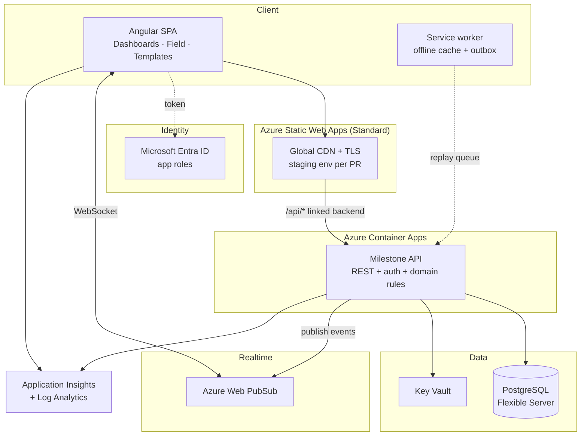

# Milestone Command — Azure Deployment Plan

**Status:** planning · **Written:** 2026-08-14 · **Last reconciled against the code:** 2026-09-07

> ⚠️ **Almost nothing in this plan has been deployed** — corrected 2026-09-13, because the
> earlier blanket claim was wrong.
>
> **What is live:** three Azure Static Web Apps — Dashboards, Templates and Shell — published
> by `angular-app.yml` on every push to `main`, because its `deploy` input defaults to true.
> URLs are in [`links.md`](./links.md). They are public, they answer 200, and **they have no
> backend**: every API call from them fails. They prove the pipeline, not the product.
>
> **What is not:** no Container App, no PostgreSQL Flexible Server, no Key Vault, no registry,
> no Blob storage. No cost in §11 has been tested against a bill. The backend in §3 runs only
> as containers on a laptop and in CI.

> **Superseded on topology, cost and roadmap** by [`platform-architecture.md`](./platform-architecture.md) (2026-08-15): the product is now three separate front-end apps in three repos over a microservices backend. **Still authoritative here:** the gap analysis (§2), database schema (§4), endpoint contract (§5), auth model (§7), the working-day calendar problem (§8), and concurrency/offline (§9) — none of which change with decomposition.
>
> **Backend internals:** [`backend-architecture.md`](./backend-architecture.md) — reconciled against the built service on 2026-09-07 (Boot 4.0.5, Java 21, Maven, `JdbcClient`).

---

## 1. Executive summary

Today Milestone Command is a **complete, working front end with no server behind it**. Every screen renders, the reason-capture flow works end to end, and updates sync live between tabs — but all of it runs in one browser. `StoreService` holds the truth in a signal, persists to `localStorage` under `mc.store.v1`, and fakes multi-user sync with `BroadcastChannel`. Close the tab on another machine and the data was never there.

To put this on Azure as a real product you need to add, in rough order of effort:

| # | Missing piece | Effort | Blocking? |
|---|---|---|---|
| 1 | **Backend API** — no server code exists at all | 4–6 weeks | Yes |
| 2 | **Database** — no schema, no persistence beyond the browser | 1–2 weeks | Yes |
| 3 | **Auth & roles** — actors are hardcoded strings (`'You'`, `'M. Castellano'`) | 1–2 weeks | Yes |
| 4 | **Real-time fan-out** — `BroadcastChannel` is same-browser only | 3–5 days | Yes |
| 5 | **Frontend refactor** — `StoreService` is synchronous; no `HttpClient` anywhere | 2–3 weeks | Yes |
| 6 | **Infra + CI/CD** — no IaC, no pipeline, no environments | 1 week | Yes |
| 7 | **Working-day calendar** — `bizDays()` knows Mon–Fri, not site holidays | 3–5 days | Yes (correctness) |
| 8 | **Offline support for Field** — site crews have no signal | 1–2 weeks | Strongly recommended |
| 9 | **Tests** — zero tests exist; `angular.json` has no `test` target | 1–2 weeks | Recommended |
| 10 | **Observability, hardening, cost controls** | 1 week | Recommended |

**Realistic first production deployment: 10–14 weeks for one full-time developer**, or 6–8 with a split front/back pair. A demo-grade deployment (static site, seed data, no backend) can go live **today** — see §13, Phase 0.

Estimated run cost for a single production environment: **~€75–130/month** at low load (§11).

---

## 2. What existed on 2026-08-14 — ⚠️ superseded, kept as the baseline

| Aspect | Current state |
|---|---|
| Framework | Angular 20.3.28 standalone + Ionic 8, signals throughout |
| Build | `npm run build` → `dist/milestone-command/browser`, clean, zero warnings |
| Routing | Hash-based (`withHashLocation()` in [`src/main.ts`](../src/main.ts)) — `/#/dashboards`, `/#/field`, `/#/templates` |
| State | [`StoreService`](../src/app/core/store.service.ts) — `signal<StoreState>` over hardcoded seed data |
| Persistence | `localStorage['mc.store.v1']`, plus `localStorage['mc.notif.seen']` |
| "Live sync" | `BroadcastChannel('milestone-command')` + `window.storage` event |
| Data | 32 milestones hardcoded in [`core/data.ts`](../src/app/core/data.ts), one project, frozen clock `AS_OF = '2026-06-06'` |
| Auth | None. `by: 'You'` (PM app), `const ME = 'M. Castellano'` (Field app) |
| HTTP | **None** — no `HttpClient`, no `provideHttpClient`, no `fetch()` |
| Config | **No** `src/environments/` — nowhere to put an API URL |
| Tests | **None** — no `test` target in `angular.json`, no spec files |
| Multi-tenancy | None — a single `PROJECT` constant |

The important consequence at the time: **this was a static site.**

### ✅ What changed by 2026-09-07 (twelve sprints)

The header of this document called §2 "still authoritative". It is not, and the row-by-row
delta is the most useful summary of the work that exists:

| Aspect | 2026-08-14 | Now |
|---|---|---|
| Repos | one | **ten** — three front ends (Dashboards, Field, Templates), the shell, the design system, three back-end services, infra, concept |
| State | `signal<StoreState>` over seed data | **The server owns state.** Clients hold a cache and refetch |
| Persistence | `localStorage['mc.store.v1']` | **PostgreSQL 17**, nine migrations · IndexedDB outbox in Field for offline writes only |
| "Live sync" | `BroadcastChannel` | ⚠️ **still nothing** — clients refetch; real-time is designed and unbuilt |
| Data | 32 milestones hardcoded, frozen clock `AS_OF = '2026-06-06'` | Real rows; **the clock is real**, and status moves on an hourly sweep |
| Auth | none, `by: 'You'` | **Entra JWT**, roles, row-level ownership. Actor comes from the token; the body's `by:` is ignored |
| HTTP | none | Typed clients against a pinned OpenAPI contract |
| Config | no `environments/` | Per-app environments, dev-token build for the harness |
| Tests | **none** | ~170 backend tests · ArchUnit + Modulith fitness functions · a contract test · **a browser harness that drives both front ends in CI** |
| Multi-tenancy | none | ⚠️ **still none** — see §4 |
| Evidence | — | Camera capture, Blob storage, sha256, ownership-checked |

Two rows deserve emphasis because they are the ones a reader will assume were fixed.
**Real-time never got built**, and **multi-tenancy never got built** — both were listed as
non-blocking in §1 and both stayed that way for twelve sprints, which is either good
prioritisation or accumulated debt depending on whether the next customer arrives before
Sprint 13 does.

---

## 3. Target architecture



### Why these services

| Concern | Choice | Rationale |
|---|---|---|
| SPA hosting | **Static Web Apps (Standard)** | Built for this exact artifact. Global CDN, free TLS, **a staging environment per pull request**, and a "linked backend" that proxies `/api/*` to Container Apps so the browser sees one origin — no CORS. |
| API | **Container Apps** running **Spring Boot 4.0.5 / Java 21** | No VM to patch, holds a warm connection pool to Postgres, and revision-based rollback. Chosen over Functions because the domain logic benefits from a long-lived process. **Note:** production runs `minReplicas: 1`, not scale-to-zero — the hourly status sweeper needs a live process ([backend §12](./backend-architecture.md#12-scheduled-work)). ⚠️ As built it is **three** container apps, not one — see §10. |
| Database | **PostgreSQL Flexible Server** | Relational is the right shape (hierarchy + dependency graph + append-only audit). Postgres gives `jsonb` for event payloads, recursive CTEs for the downstream-impact walk, and cheap burstable tiers. Azure SQL is an equally valid pick if the team is .NET-first — see §16. |
| Real-time | **Web PubSub** | Direct replacement for `BroadcastChannel`. Serverless WebSockets, one message per mutation, group-per-project fan-out. |
| Identity | **Entra ID** | The users are employees of an EPC contractor and a client. App roles map cleanly onto the four audiences the UI already has. |
| Secrets | **Key Vault** + managed identity | No connection strings in app settings or CI. |
| IaC | **Bicep** | First-party, no state file to manage. |

---

## 4. Database schema

Postgres flavour. The design encodes three domain rules the UI already assumes.

```sql
-- ---------- tenancy & people ----------
CREATE TABLE app_user (
  id            uuid PRIMARY KEY DEFAULT gen_random_uuid(),
  entra_oid     text UNIQUE NOT NULL,       -- Entra object id
  display_name  text NOT NULL,
  email         citext UNIQUE NOT NULL,
  created_at    timestamptz NOT NULL DEFAULT now()
);

CREATE TABLE project (
  id                uuid PRIMARY KEY DEFAULT gen_random_uuid(),
  code              text UNIQUE NOT NULL,   -- 'MRD-T3'
  name              text NOT NULL,
  client            text,
  contractor        text,
  location          text,
  timezone          text NOT NULL DEFAULT 'UTC',
  scheduled_start   date NOT NULL,
  scheduled_finish  date NOT NULL,
  calendar_id       uuid NOT NULL REFERENCES work_calendar(id),
  amber_threshold   int  NOT NULL DEFAULT 3,   -- THRESHOLDS.amber
  red_threshold     int  NOT NULL DEFAULT 10,  -- THRESHOLDS.red
  archived_at       timestamptz
);

CREATE TYPE project_role AS ENUM ('viewer','executive','pm','field','planner','admin');

CREATE TABLE user_project_role (
  user_id     uuid REFERENCES app_user(id),
  project_id  uuid REFERENCES project(id),
  role        project_role NOT NULL,
  PRIMARY KEY (user_id, project_id, role)
);

-- ---------- working-day calendar (see §8) ----------
CREATE TABLE work_calendar (
  id         uuid PRIMARY KEY DEFAULT gen_random_uuid(),
  name       text NOT NULL,
  work_days  int[] NOT NULL DEFAULT '{1,2,3,4,5}'  -- ISO dow
);
CREATE TABLE calendar_holiday (
  calendar_id uuid REFERENCES work_calendar(id),
  day         date NOT NULL,
  label       text,
  PRIMARY KEY (calendar_id, day)
);

-- ---------- hierarchy ----------
CREATE TABLE phase (
  id uuid PRIMARY KEY DEFAULT gen_random_uuid(),
  project_id uuid NOT NULL REFERENCES project(id) ON DELETE CASCADE,
  name text NOT NULL, sort int NOT NULL,
  UNIQUE (project_id, name)
);
CREATE TABLE work_package (
  id uuid PRIMARY KEY DEFAULT gen_random_uuid(),
  phase_id uuid NOT NULL REFERENCES phase(id) ON DELETE CASCADE,
  name text NOT NULL, sort int NOT NULL,
  UNIQUE (phase_id, name)
);

CREATE TYPE milestone_status AS ENUM ('pending','atrisk','done','missed');

CREATE TABLE milestone (
  id               uuid PRIMARY KEY DEFAULT gen_random_uuid(),
  project_id       uuid NOT NULL REFERENCES project(id) ON DELETE CASCADE,
  work_package_id  uuid NOT NULL REFERENCES work_package(id),
  name             text NOT NULL,
  owner_id         uuid REFERENCES app_user(id),
  area             text,
  scheduled_date   date NOT NULL,           -- the baseline; moves only via rebaseline
  real_date        date NOT NULL,           -- forecast while pending, actual once done
  status           milestone_status NOT NULL DEFAULT 'pending',
  critical         boolean NOT NULL DEFAULT false,
  row_version      bigint NOT NULL DEFAULT 1,   -- optimistic concurrency, see §9
  created_at       timestamptz NOT NULL DEFAULT now(),
  updated_at       timestamptz NOT NULL DEFAULT now(),
  deleted_at       timestamptz
);
CREATE INDEX ON milestone (project_id, status) WHERE deleted_at IS NULL;

-- ---------- dependency graph ----------
CREATE TYPE dep_type AS ENUM ('FS','SS','FF','SF');
CREATE TABLE milestone_dependency (
  predecessor_id uuid NOT NULL REFERENCES milestone(id) ON DELETE CASCADE,
  successor_id   uuid NOT NULL REFERENCES milestone(id) ON DELETE CASCADE,
  type           dep_type NOT NULL DEFAULT 'FS',
  lag_days       int NOT NULL DEFAULT 0,
  PRIMARY KEY (predecessor_id, successor_id),
  CHECK (predecessor_id <> successor_id)
);

-- ---------- append-only audit ----------
CREATE TABLE milestone_log (
  id           bigserial PRIMARY KEY,
  milestone_id uuid NOT NULL REFERENCES milestone(id),
  from_date    date NOT NULL,
  to_date      date NOT NULL,
  days         int  NOT NULL,               -- working days, calendar-aware
  reason_code  text NOT NULL REFERENCES reason_code(code),
  note         text,
  actor_id     uuid NOT NULL REFERENCES app_user(id),
  app          text NOT NULL CHECK (app IN ('pm','field')),
  created_at   timestamptz NOT NULL DEFAULT now()
);

CREATE TABLE rebaseline (
  id           bigserial PRIMARY KEY,
  milestone_id uuid NOT NULL REFERENCES milestone(id),
  from_date    date NOT NULL,
  to_date      date NOT NULL,
  reason       text NOT NULL,
  note         text NOT NULL,               -- justification is mandatory
  actor_id     uuid NOT NULL REFERENCES app_user(id),
  created_at   timestamptz NOT NULL DEFAULT now()
);

CREATE TABLE reason_code (
  code text PRIMARY KEY, label text NOT NULL,
  hue int NOT NULL, sort int NOT NULL, active boolean NOT NULL DEFAULT true
);

CREATE TABLE activity_event (
  id           bigserial PRIMARY KEY,
  project_id   uuid NOT NULL REFERENCES project(id),
  milestone_id uuid REFERENCES milestone(id),
  type         text NOT NULL,               -- slipped|recovered|done|updated|rebaselined|created|deleted
  payload      jsonb NOT NULL,
  actor_id     uuid REFERENCES app_user(id),
  created_at   timestamptz NOT NULL DEFAULT now()
);
CREATE INDEX ON activity_event (project_id, created_at DESC);

CREATE TABLE notification_read (
  user_id uuid PRIMARY KEY REFERENCES app_user(id),
  last_seen_at timestamptz NOT NULL
);

-- ---------- templates ----------
CREATE TABLE template (
  id uuid PRIMARY KEY DEFAULT gen_random_uuid(),
  name text NOT NULL, sector text, owner_id uuid REFERENCES app_user(id),
  updated_at timestamptz NOT NULL DEFAULT now()
);
CREATE TABLE template_row (
  id uuid PRIMARY KEY DEFAULT gen_random_uuid(),
  template_id uuid NOT NULL REFERENCES template(id) ON DELETE CASCADE,
  kind text NOT NULL CHECK (kind IN ('phase','wp','ms')),
  name text NOT NULL, owner_id uuid, area text,
  offset_days int, dep_row_id uuid REFERENCES template_row(id),
  sort int NOT NULL
);
```

### ✅ What the schema actually became — nine migrations, reconciled 2026-09-07

The DDL above is `V1` in spirit. Eight migrations followed, and four of them changed the
design rather than extending it:

| | Migration | What changed, and why |
|---|---|---|
| `V2` | `derived.sql` | `biz_days()` + `milestone_view`. **The view is the product's central definition of "late"**, and an ArchUnit rule forbids any Java method from re-deriving it |
| `V4`+`V7` | `reason_codes` | The delay-reason catalogue became **data**, including `requires_note`. The design hardcoded "reason `OTHER` needs a note"; a site whose Marine Access delays needed explaining could not be served without a deployment (MC-344) |
| `V6` | `idempotency` | Required by the Field offline outbox (§9) — a replayed queue must not write twice |
| `V8` | `capture_position` | Where the phone was standing when the date was recorded. **Not** a proof of presence — it is self-reported by the device and trivially spoofed; it is a lead, and the schema does not pretend otherwise |
| `V9` | `evidence` | Metadata only — type, size, **sha256**, who, when. The bytes live in Blob storage (§10) |

⚠️ **There is no `tenant_id`, anywhere.** The schema above is single-tenant and the built one
still is. Every query filters by project, not by customer. This is survivable while the system
has no customers and becomes a migration touching every table the moment it has two — see
`platform-architecture.md` §0b.

---

### Three rules the schema must enforce

**1. The audit trail is immutable.** The whole product promise is "every Real-date change carries a reason, permanently". Enforce it in the database, not just the API:

```sql
REVOKE UPDATE, DELETE ON milestone_log, rebaseline FROM app_role;
```

**2. Re-baseline is a distinct, privileged act.** `scheduled_date` must never change on a routine update path. Guard it with a trigger that rejects any `UPDATE` touching `scheduled_date` unless the transaction also inserts a `rebaseline` row, and gate the endpoint on the `pm`/`planner` role.

**3. Variance is derived, never stored.** Expose it as a view so the client and server can never disagree:

```sql
CREATE VIEW milestone_view AS
SELECT m.*,
       biz_days(m.scheduled_date, m.real_date, p.calendar_id) AS variance,
       CASE WHEN m.status = 'missed' THEN 'red'
            WHEN biz_days(m.scheduled_date, m.real_date, p.calendar_id) > p.red_threshold   THEN 'red'
            WHEN biz_days(m.scheduled_date, m.real_date, p.calendar_id) > p.amber_threshold THEN 'amber'
            ELSE 'green' END AS rag
FROM milestone m JOIN project p ON p.id = m.project_id
WHERE m.deleted_at IS NULL;
```

✅ Built as `V2__derived.sql`, essentially unchanged — one of the few pieces of this plan that
survived contact intact.

⚠️ **"Keep the client copy for optimistic UI, but the server value wins" did not survive
intact, and the gap is live.** Both front ends still carry `ragOf()` and use it to preview the
colour while a user is picking a date — `reason-modal.component.ts` in Dashboards,
`liveRag()` in Field. That much is fine and intended. What is **not** fine is that both call
it with a module constant:

```ts
export const THRESHOLDS: Thresholds = { amber: 3, red: 10 };   // mc-field & mc-dashboards
```

The server sends `amberThreshold` and `redThreshold` on every project tree, **and neither
client reads them.** So the preview is correct for a project whose thresholds happen to be
3 and 10, and silently wrong for any other — showing amber where the server will say green,
on the one screen whose entire job is to tell someone how bad the slip is before they commit
to it. It is invisible in the verification harness because the fixture project uses 3 and 10,
which is the same shape as the `yearMarks` defect recorded in Sprint 11: a hardcoded value
that agrees with the fixture.

The fix is small — pass the project's thresholds through instead of defaulting the parameter
— and it is not yet done. Recorded here because a schema rule that the server honours and the
client quietly reimplements is exactly the failure this section was written to prevent, and it
came back on the other side of the wire.

---

## 5. API contract

Every endpoint below replaces exactly one existing `StoreService` method — that mapping is the migration checklist.

| Today (`store.service.ts`) | Endpoint | Notes |
|---|---|---|
| `milestones()` computed | `GET /api/projects/{id}/milestones` | Returns `milestone_view` incl. server-computed `variance`/`rag` |
| `commitReal(id, opts)` | `POST /api/milestones/{id}/real-date` | Body `{ realDate, status, reason, note, app }`. Requires `If-Match: <row_version>` |
| `rebaseline(id, opts)` | `POST /api/milestones/{id}/rebaseline` | Role-gated to `pm`/`planner`; note mandatory |
| `createMilestone(node)` | `POST /api/projects/{id}/milestones` | |
| `editMilestone(id, patch)` | `PATCH /api/milestones/{id}` | Rejects `scheduledDate` |
| `deleteMilestone(id)` | `DELETE /api/milestones/{id}` | Soft delete → `deleted_at` |
| `downstream(id)` / `impact(id)` | `GET /api/milestones/{id}/impact` | Recursive CTE server-side; today it's a client-side graph walk |
| `events()` computed | `GET /api/projects/{id}/events?since=` | Paged, replaces the 50-item in-memory slice |
| `markSeen()` | `POST /api/me/notifications/seen` | Per user, not per browser |
| `unseenCount()` | `GET /api/me/notifications/count` | |
| `pulse` signal | **Web PubSub** `project.{id}` group | Server publishes after each successful mutation |
| `reset()` | *(drop)* | Demo-only affordance |
| `REASONS` const | `GET /api/reason-codes` | Cache client-side |
| Templates seeds | `GET/POST/PUT /api/templates` | Currently hardcoded in the component |

**Example — the highest-frequency call:**

```http
POST /api/milestones/9f3c.../real-date
Authorization: Bearer <entra token>
If-Match: 42
Content-Type: application/json

{ "realDate": "2026-07-24", "reason": "weather", "note": "Monsoon flooding", "app": "field" }
```

```jsonc
// 200 OK
{ "id": "9f3c…", "realDate": "2026-07-24", "variance": 10, "rag": "amber",
  "status": "atrisk", "rowVersion": 43,
  "impact": { "count": 8, "days": 10 } }     // so the UI can warn without a second call
// 409 Conflict → someone else moved it; client re-fetches and re-prompts
```

---

## 6. Frontend changes required

| File | Change | Size |
|---|---|---|
| [`core/store.service.ts`](../src/app/core/store.service.ts) | The big one. Mutations become HTTP calls; add `loading`/`error` signals; optimistic update + rollback on failure; keep `localStorage` as an **offline cache**, not the source of truth | L |
| **new** `core/api.service.ts` | Typed HTTP client, `If-Match` handling, 409 retry policy | M |
| **new** `core/realtime.service.ts` | Web PubSub client → feeds the existing `pulse` signal (the toast UI needs no change) | M |
| **new** `core/auth/` | MSAL config, guard, token interceptor, `currentUser` signal | M |
| [`src/main.ts`](../src/main.ts) | `provideHttpClient(withInterceptors([authInterceptor]))` + MSAL providers | S |
| [`core/data.ts`](../src/app/core/data.ts) | Delete `AS_OF` (frozen clock) and `SEED_MILESTONES`; keep `bizDays`/`fmt*` as display helpers. **`AS_OF` is referenced in ~8 places** — mostly Field's "this week" windowing | M |
| [`field.component.ts`](../src/app/field/field.component.ts) | `const ME` → real user; add offline outbox + queued-state UI | M |
| [`pm.component.ts`](../src/app/dashboards/pm.component.ts) | Hide Re-baseline / New / Delete by role; handle 409 | M |
| [`templates.component.ts`](../src/app/templates/templates.component.ts) | Seeds move to the API; "Create project from template" becomes a real POST | M |
| **new** `src/environments/` | Does not exist. Needs `apiBaseUrl`, `entraClientId`, `webPubSubEndpoint` + `fileReplacements` in `angular.json` | S |
| `angular.json` | Add a `test` target (none today) | S |
| `index.html` / `main.ts` | Consider dropping `withHashLocation()` once SWA serves the rewrite fallback — nicer URLs, better analytics | S |

**Design note:** the current architecture actually helps here. Because every screen reads through `StoreService`'s computed selectors, swapping the internals to HTTP touches *one file* plus new plumbing — no component needs to change to get real data. The components change only to handle *async* (loading skeletons, error toasts, disabled buttons in flight), which they currently never do.

---

## 7. Auth & roles

**Identity:** Microsoft Entra ID, SPA registered as a public client (PKCE), `@azure/msal-angular`.

Map Entra **app roles** onto the audiences the UI already separates:

| Role | Sees | Can |
|---|---|---|
| `executive` | Dashboards → Executive | Read only |
| `pm` | Dashboards (both), Templates | Update real dates, **re-baseline**, create/delete milestones |
| `field` | Field app only | Update real dates + mark done, **only for milestones they own** |
| `planner` | Templates, Dashboards | Manage templates, create projects |
| `admin` | Everything | Manage users, reason codes, calendars |

Enforce roles **server-side on every endpoint** — the client-side hiding is UX, not security. Note `field` needs a row-level rule (own milestones only), which the current UI implies (`ME` filters the card list) but nothing enforces.

**External users** (the client, Meridian Energy) should come in as Entra **B2B guests** rather than a second identity system.

---

## 8. The working-day calendar (a real correctness gap)

`bizDays()` in [`core/data.ts:60`](../src/app/core/data.ts) counts Mon–Fri and nothing else. On a real EPC project this is wrong in two ways:

1. **No public holidays.** A milestone spanning Eid, Christmas or a national day over-counts working days — and that number drives variance, RAG, the exec slippage figure and every threshold breach.
2. **No site work pattern.** Many industrial sites run 6-day weeks, rotating shifts, or a monsoon shutdown. Mon–Fri is an assumption, not a fact.

Hence `work_calendar` + `calendar_holiday` in the schema and a server-side `biz_days(from, to, calendar_id)`. Ship the client's simple version only as an optimistic estimate, and let the server's value overwrite it on response.

---

## 9. Concurrency, offline & the Field app

**Concurrency.** Two people *will* update the same milestone — that's the whole point of a shared system of record. Today the last write silently wins (`localStorage` overwrite). Use `row_version` + `If-Match`; on `409` re-fetch and show "M. Castellano moved this to 24 Jul while you were editing" rather than clobbering.

**Offline.** The Field app is explicitly for "site crews, mobile" — the population most likely to have no signal. Plan for it rather than retrofitting:

- Add `@angular/pwa` → service worker, app shell, installable on site phones.
- **Outbox pattern:** queue mutations in IndexedDB, show a "queued — will sync" pill (the UI already has a sync-status affordance: *"All synced"*), replay on reconnect.
- Replayed writes must be **idempotent** — send a client-generated `mutationId` and have the API dedupe, or a lost response turns into a double slip.
- Conflict on replay is a real case: resolve as "server wins + notify", never silent discard.

---

## 10. Azure resources

⚠️ **None of these exist.** The table is the target; the "Needed now" column says what the
system as built in twelve sprints would actually require on day one.

| Resource | SKU (prod) | Purpose | Needed now |
|---|---|---|---|
| Static Web App **×2** | Standard | Dashboards and Field are **separate apps in separate repos** — two sites, not one | ✅ yes — and the count is 2, which §11 never updated |
| Container App + Environment | Consumption, 0.5 vCPU / 1 GiB, min 1 replica prod / 0 dev | API | ✅ yes — **×3**: gateway, discovery, milestone-service |
| Container Registry | Basic | API images | ✅ yes |
| PostgreSQL Flexible Server | B2s (prod) / B1ms (dev), 32 GB, 7-day PITR | Database | ✅ yes |
| **Storage Account (Blob)** | Standard LRS, hot | **Evidence photographs** (`V9`). Not in the original plan — the product gained a camera | ✅ yes |
| Web PubSub | Free (dev) / Standard S1 (prod) | WebSocket fan-out | ⚠️ **no** — §11 of `backend-architecture.md` is unbuilt. Provisioning it now would bill for a feature with no code |
| Key Vault | Standard | Secrets via managed identity | ✅ yes |
| Application Insights + Log Analytics | Pay-as-you-go | Traces, metrics, RUM | ✅ yes |
| Entra ID app registrations | Included | SPA + API | ✅ yes |

⚠️ **Three container apps, not one, is a real cost the microservices decision has not yet
paid.** Discovery and the gateway carry no domain logic and each need a replica that cannot
scale to zero — the gateway because it is the front door, discovery because a registry nobody
can reach is worse than no registry. That is roughly two-thirds of the compute bill spent on
routing to a single service. It is the right shape for four services and an expensive shape
for one; see §1 of `backend-architecture.md`.

Naming: `mc-<env>-<resource>` e.g. `mc-prod-api`, `mc-prod-pg`. One resource group per environment.

---

## 11. Cost estimate

Rough monthly, West Europe, low internal load (~50 users). **Verify against the Azure pricing calculator before committing — these move.**

| Item | Dev | Prod | Note |
|---|---|---|---|
| Static Web Apps ×2 | Free (€0) | Standard ~€16 | ⚠️ **doubled** — two front-end apps, not one |
| Container Apps ×3 | scale-to-zero, ~€0–5 | ~€45–70 | ⚠️ **raised** — gateway + discovery + service, and two of the three cannot scale to zero |
| PostgreSQL Flexible | B1ms ~€13 | B2s ~€45 | |
| **Blob storage** | <€1 | **~€2–5** | New. Evidence photographs; cheap until someone uploads video |
| Web PubSub | — | — | ⚠️ **removed for now** — nothing consumes it yet (−€45) |
| Container Registry | ~€4 | ~€4 | |
| Key Vault | <€1 | <€1 | |
| App Insights | free tier | ~€10–20 | |
| **Total** | **~€20/mo** | **~€125–160/mo** | Was "~€140". The Web PubSub saving very nearly cancels the cost of decomposition |

⚠️ **That near-cancellation is a coincidence, not a result.** The headline barely moved
because one unbuilt feature was removed at the same moment the service split doubled the
compute line. If Sprint 13 builds real-time fan-out as planned, Web PubSub returns and the
prod figure goes to roughly **€170–205** — which is the number to quote to anyone deciding
whether the split was worth it, not the flattering one above.

**Cheaper MVP, updated.** Run Postgres B1ms, keep Web PubSub off, and collapse the three
container apps into one — the gateway's version gate and the service can share a process for a
pilot → **~€35–50/month**. ⚠️ **The largest lever is no longer Web PubSub, it is the service
count**, and that is worth stating because it inverts the original advice: the plan assumed
real-time was the expensive luxury, and decomposition turned out to cost more than the
feature it was partly meant to enable.

Polling every 30 s instead of WebSockets remains available and costs the "live" feel. The
clients already refetch, so that is today's behaviour by default rather than a fallback —
which is worth knowing before paying €45/month to replace something nobody has complained
about.

---

## 12. CI/CD

The repo already lives on GitHub, so GitHub Actions is the path of least resistance. Two workflows:

**`.github/workflows/frontend.yml`**
```yaml
on:
  push: { branches: [main] }
  pull_request: { branches: [main] }
jobs:
  build_and_deploy:
    runs-on: ubuntu-latest
    steps:
      - uses: actions/checkout@v4
      - uses: actions/setup-node@v4
        with: { node-version: 20, cache: npm }
      - run: npm ci
      - run: npm run build
      # - run: npm test -- --watch=false --browsers=ChromeHeadless   # once a test target exists
      - uses: Azure/static-web-apps-deploy@v1
        with:
          azure_static_web_apps_api_token: ${{ secrets.SWA_TOKEN }}
          action: upload
          app_location: "/"
          output_location: "dist/milestone-command/browser"   # note the browser/ subfolder
          skip_app_build: true
```

Pull requests get an automatic staging URL from SWA — worth using as the review environment for design sign-off.

**`.github/workflows/api.yml`** — build image → push to ACR → `az containerapp update`, with `main` → dev auto-deploy and a manual approval gate for prod.

**Infra:** `infra/main.bicep` deployed by a third workflow, `what-if` on PR, apply on merge.

**Two repo hygiene items** worth doing at the same time:
- `.gitattributes` with `* text=auto eol=lf` — the working tree is CRLF (`core.autocrlf=true`), so a Linux CI runner will see whole-file diffs.
- `package.json` `homepage` still points at the old `rachidpeaqock/stones`.

---

## 13. Phased roadmap — ✅ scored 2026-09-07

The phases were written as calendar time against an Azure deployment. What actually happened
is twelve sprints of the same work with **no Azure at all**, which reorders them in a way
worth recording.

| Phase | Planned | Outcome |
|---|---|---|
| 0 — Demo on Azure | ½ day | ⚠️ **never done, and no longer wanted.** The frozen `AS_OF` clock that made it a stable demo is exactly what a real system must not have. Skipping it cost nothing |
| 1 — Foundations | 2 wk | ✅ done — minus Bicep and Postgres-on-Azure. Schema and migrations run in containers |
| 2 — Read path | 2 wk | ✅ done — plus `?owner=me`, `/summary`, `/impact`, `/history`, none of which were in the plan |
| 3 — Write path | 3 wk | ✅ done — including idempotency, which the plan put in Phase 6 |
| 4 — Auth & roles | 2 wk | ✅ mostly — JWT, roles and ownership are built; JIT provisioning is not |
| 5 — Real-time | 1 wk | ⚠️ **not started** — the one phase with a one-week estimate, and the only phase after 1 that nobody missed |
| 6 — Field offline | 2 wk | ✅ done — IndexedDB outbox, idempotent replay, queued-state UI |
| 7 — Production hardening | 1–2 wk | ⚠️ **not started.** No prod environment, no restore drill, no alerts, no load test |

**Three things this scoring says that the phase list could not.**

**The order was wrong in a useful direction.** Idempotency was planned for Phase 6 alongside
offline replay and got built in Phase 3, because the write path could not be called correct
without it — an `Idempotency-Key` bolted on after the fact would have meant revisiting every
write. Offline is the *consumer* of that guarantee, not its origin.

**Phase 5 being skipped for twelve sprints is data.** It was estimated at one week and sat at
the top of the backlog the whole time without anyone needing it. Clients refetch; nobody has
complained. That is the strongest evidence available that real-time is a feature to sell
rather than a feature to run on, and it should change how Sprint 13 scopes it.

⚠️ **Phase 7 is the whole remaining risk.** Everything not done is either a second service or
production hardening, and the second service is optional. A restore drill is not. **No backup
has ever been restored, because no database has ever been backed up** — the system's entire
history lives in containers that are recreated on every CI run, and the day that stops being
true is the day this phase becomes urgent rather than tidy.

---

## 14. Testing strategy

✅ **Reconciled 2026-09-07.** "There are no tests today" is no longer true — see
[`backend-architecture.md` §15](./backend-architecture.md#15-testing) for what exists.

| Layer | Tool | What matters most |
|---|---|---|
| Domain unit | Vitest/Jest | ⚠️ **still none on the front ends.** `bizDays` and `ragOf` survive in both clients as preview-only estimates and are untested there — which is how the hardcoded-threshold gap in §4 stayed hidden. The server-side equivalents are covered |
| API integration | Testcontainers + Postgres | ✅ built — audit immutability, re-baseline gating, 409 concurrency, and 15 of 17 test classes on a real Postgres |
| E2E | **playwright-core** | ✅ built as `npm run verify` in both front ends, running in CI — reason capture, offline replay, the version gate, evidence upload. ⚠️ It drives a **stub**, not the real API: it proves the client behaves, not that the two agree. The contract test covers the seam between them |
| Load | k6 | ⚠️ **not built.** The tree still renders every row, and nothing has ever put 5,000 milestones through it. The virtualization question is exactly as open as it was on day one |

✅ That seed grew into `verify/` in both front-end repos: a stub API, a static server, a
driver, and a launcher that starts and stops all of it (`npm run verify`). It uses
**playwright-core against an already-installed browser** — msedge locally, chrome in CI — so
nothing downloads a browser on a restricted machine. Two of its lessons are worth carrying:
the stub **refuses to start on a port somebody else holds** (a stale stub once served old
routes for an entire debugging session), and it **builds its fixtures relative to today**,
because a fixture with fixed dates quietly becomes a different test every week.

---

## 15. Risks

| Risk | Impact | Mitigation |
|---|---|---|
| Working-day math differs client vs server | Wrong variance → wrong RAG → wrong exec decisions | One implementation of record (server); client value is advisory only |
| PM tree renders all rows unvirtualized | Dies on a 5,000-milestone project | Load test early (§14); add CDK virtual scroll if needed |
| Offline replay double-submits | Phantom slips in an immutable audit log | Client `mutationId` + server dedupe |
| Frozen `AS_OF` leaks into production | "This week" in Field silently wrong | Delete the constant in Phase 2; grep for all ~8 usages |
| Web PubSub free tier connection cap (20) | Live sync silently stops at scale | Alert on connection count; budget for S1 before pilot >20 users |
| Single-project assumption | Rework when project #2 arrives | Put `project_id` on everything from day one, even for one project |

---

## 16. Open decisions — ✅ scored 2026-09-07

1. ~~**API stack**~~ — **decided and built:** Spring Boot **4.0.5** on Java **21**, Maven, split
   into services per `platform-architecture.md`. ⚠️ The "modular monolith, not microservices"
   half was **reversed the next day** and the reversal has been expensive so far (§10).
2. ~~**Postgres or Azure SQL?**~~ — **decided: Postgres 17.** The recursive CTE in `/impact`,
   `DISTINCT ON`, array-based cycle guards and the `milestone_view` derivation all lean on it.
   Azure SQL's temporal tables would have given audit immutability natively; `REVOKE` plus a
   trigger got there instead, and is provable by test either way.
3. **Who owns identity** — ⚠️ **still open, and now blocking nothing but will block the first
   customer.** Entra validation is built; there is no tenant, no B2B guest configuration, and
   no JIT provisioning, so a genuinely new user authenticates and owns nothing.
4. **Data residency** — ⚠️ still open. Untouched, because nothing is deployed.
5. ~~**Is multi-project in scope for v1?**~~ — **answered by the build: yes.** Every endpoint is
   project-scoped and the tree is fetched per project. ⚠️ Multi-**tenant** is a different
   question and remains unanswered — see §4.
6. **Integration with the scheduling system of record (P6 / MS Project)** — ⚠️ **still the
   single biggest scope question, and it has grown teeth.** Twelve sprints have built a system
   that *owns* the baseline: `scheduled_date` is trigger-protected, re-baselining is a
   privileged audited act, and the whole product promise rests on that being true here rather
   than somewhere else. **Mirroring P6 would contradict the schema, not merely extend it.**
   The competitive analysis in `mc-concept/docs/competitive-landscape.md` reaches the same
   conclusion from the other direction and recommends a **one-way skeleton import** — P6
   supplies structure once, this system owns the dates from then on. That is now the default
   answer unless a client insists otherwise, and it should be settled in writing before the
   first integration conversation rather than during one.

---

## Reconciliation note

This document was written on 2026-08-14 to plan a deployment that has not happened. It has
been annotated rather than rewritten, because the gap between a plan and its outcome is more
useful than a plan retro-fitted to look correct. Every ✅ was checked against the code or CI
on 2026-09-07; every ⚠️ is a thing that does not exist.
