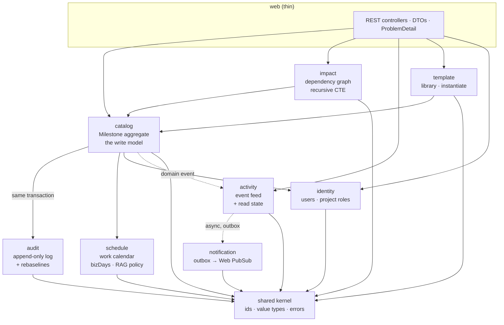
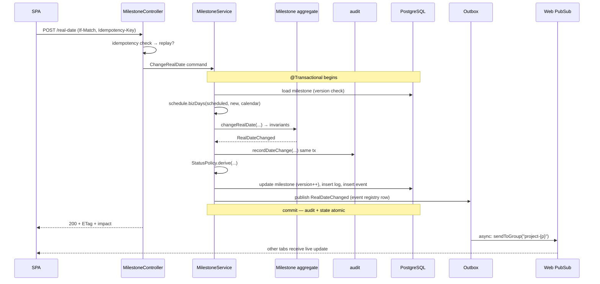
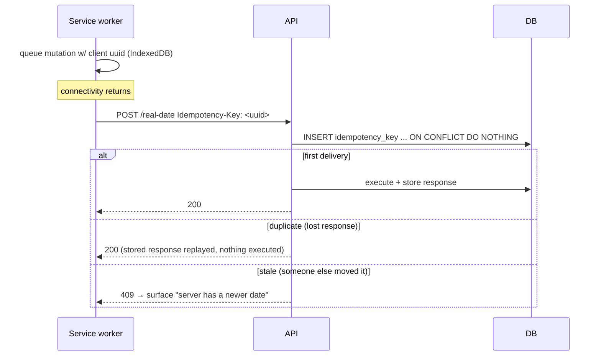

# Milestone Command — Backend Architecture

**Spring Boot 4.0.5 · Java 21 · PostgreSQL 17 · Maven · Azure Container Apps**

Companion to [`azure-deployment-plan.md`](./azure-deployment-plan.md), which covers infrastructure, cost and rollout. This document is the backend build spec: module boundaries, domain model, every endpoint, every cross-cutting concern, and the code idioms to use.

**Status:** partly built · **Written:** 2026-08-14 · **Last reconciled against the code:** 2026-09-07

**Repos that exist:** `mc-discovery-server`, `mc-api-gateway`, `mc-milestone-service`,
`mc-identity-service`, `mc-template-service`, `mc-integration-service`.
**Designed, not created:** `mc-activity-service`, `mc-ai-service`.

> ⚠️ **Read this document as two things at once.** Sections marked ✅ have been reconciled
> against the code and describe what runs; sections marked ⚠️ describe a design that was not
> built, and say so at the top. Where the build differs from the design, the difference and
> its reason are stated rather than the design quietly rewritten — the discarded option is
> usually the more useful half of the record.

> **Superseded on decomposition only.** [`platform-architecture.md`](./platform-architecture.md) is now the authority on how many services exist and where the boundaries fall — §1 and §19 below are updated accordingly. **Everything else in this document applies unchanged to each individual service:** the domain model, aggregate invariants, persistence, API idioms, security, testing and build are per-service concerns and do not change because there are now four of them.

---

## Contents

1. [Decision: four services, each a modular monolith inside](#1-decision-four-services-each-a-modular-monolith-inside)
2. [Stack and versions](#2-stack-and-versions)
3. [Module map](#3-module-map)
4. [Project layout](#4-project-layout)
5. [Domain model and invariants](#5-domain-model-and-invariants)
6. [Persistence](#6-persistence)
7. [API layer](#7-api-layer)
8. [Endpoint catalogue](#8-endpoint-catalogue)
9. [Critical flows](#9-critical-flows)
10. [Security](#10-security)
11. [Real-time fan-out — ⚠️ designed, not built](#11-real-time-fan-out--⚠️-designed-not-built)
12. [Scheduled work](#12-scheduled-work)
13. [Cross-cutting concerns](#13-cross-cutting-concerns)
14. [Configuration and secrets](#14-configuration-and-secrets)
15. [Testing](#15-testing)
16. [Build and packaging](#16-build-and-packaging)
17. [Runtime on Container Apps](#17-runtime-on-container-apps)
18. [Performance and capacity](#18-performance-and-capacity)
19. [When to split into microservices](#19-when-to-split-into-microservices)
20. [Work breakdown](#20-work-breakdown)

---

## 1. Decision: four services, each a modular monolith inside

**Decided 2026-08-15: microservices**, split by data ownership into `milestone-service`, `activity-service`, `template-service` and `identity-service`. Full rationale, repo map and sequencing in [`platform-architecture.md`](./platform-architecture.md).

✅ **One of the four is built.** `milestone-service` runs, behind `mc-api-gateway` with
`mc-discovery-server` for registration — three Spring Boot applications in total, of which
one was a domain service. **`identity-service` joined it on 2026-09-07** — two domain
services now, out of the planned four.

The decision has held up well precisely because nothing forced the others into existence
early. Templates still have no consumer. Activity was asked for twice and had no job both
times: MC-342 showed the feed did not need it, because `milestone-service` already owned
the facts. **Identity was the opposite case and that is why it got built** — a name is
genuinely not milestone data, and no amount of looking would find it already there. **A four-service split where
only one service has any data in it is, so far, a one-service system with two pieces of
routing** — worth stating plainly, because the split's costs arrive before its benefits.

**Each service is still internally modular.** Spring Modulith applies *within* every service exactly as described below: modules declare what they expose, internals are package-private, and the build fails on an illegal dependency. Distribution replaces the largest boundary; it does not remove the need for boundaries inside what remains. `milestone-service` in particular is substantial enough (catalog, audit, schedule, impact) to need them.

### The one argument from the original recommendation that still binds

The transactional invariant. "Change the real date **and** append an immutable audit row **and** record the event" must be one `@Transactional` method. That is why `catalog` + `audit` + the outbox stay together inside `milestone-service` and are **never** split further, no matter how the rest of the system decomposes. See [`platform-architecture.md` §7](./platform-architecture.md#7-the-boundary-that-must-never-be-split).

Everything else that argued for a monolith — one team, one release train, no independent scaling need — was a *cost* argument, not a correctness one. That cost is now accepted deliberately in exchange for independent deployability.

```java
// src/test/java/.../ModularityTests.java — still required, now per service
class ModularityTests {
  static final ApplicationModules MODULES = ApplicationModules.of(MilestoneServiceApplication.class);

  @Test void verifiesModuleBoundaries() { MODULES.verify(); }
}
```

```java
// src/test/java/.../ModularityTests.java — this test is the architecture
class ModularityTests {
  static final ApplicationModules MODULES = ApplicationModules.of(MilestoneCommandApplication.class);

  @Test void verifiesModuleBoundaries() {
    MODULES.verify();                     // fails the build on an illegal dependency
  }

  @Test void writesDocumentation() {
    new Documenter(MODULES)
        .writeModulesAsPlantUml()
        .writeIndividualModulesAsPlantUml()
        .writeModuleCanvases();           // architecture docs generated from the code
  }
}
```

---

## 2. Stack and versions

Verified against current releases as of August 2026.

> ⚠️ **Pinned to Boot 4.0.x by Spring Cloud.** Boot 4.1.0 is the newest release, but **Spring Cloud 2025.1.x "Oakwood" targets Boot 4.0.x** — and Spring Cloud is where Eureka and Gateway live ([platform §8a](./platform-architecture.md#8a-gateway-and-service-discovery)). Adopting them pins the platform to the pair below. Revisit when a 4.1-compatible release train ships.

> ✅ **Reconciled against `mc-milestone-service/pom.xml` on 2026-09-07.** The **Built** column is what
> the project actually resolves; where it differs from the original choice, the reason is given.

| Component | Designed | **Built** | Why it differs |
|---|---|---|---|
| **Spring Boot** | 4.0.5 | ✅ **4.0.5** | — |
| **Spring Cloud** | 2025.1.1 "Oakwood" | ✅ **2025.1.1** | — |
| Spring Framework | 7.0.x | ✅ 7.0.x | — |
| **Java** | **25 LTS** | ⚠️ **21 LTS** | Boot 4.0's baseline is 17 and **25 was never installed on the development machine**. CI compiles on 21, which is the version the code is actually proven against. The JEP 491 argument for 25 still holds and is unclaimed |
| Spring Modulith | 2.1.0 | ⚠️ **2.0.7** | 2.1.0 does not target this Boot line |
| Spring Security | 7.x | ✅ 7.x | — |
| Persistence | Spring Data JPA / Hibernate 7 | ⚠️ **`JdbcClient`, no ORM** | The read path is SQL over a view JPA cannot usefully map, and the optimistic-concurrency check is a plain `WHERE row_version = ?` with a row count — more explicit than `@Version` and visible in a log. See §6 |
| PostgreSQL | 17 | ✅ 17 | — |
| Flyway | 11.x | ✅ 11.x | Migrations run as a **discrete pipeline step**, never on startup (MC-304) |
| Testcontainers | 1.21.x | ⚠️ **2.0.4** | 2.x **renamed every module**: `org.testcontainers:postgresql` → `testcontainers-postgresql`, and the class moved to `org.testcontainers.postgresql`. Azurite runs as a plain `GenericContainer` precisely so it cannot break on the next rename |
| **Object storage** | not designed | ✅ **`azure-storage-blob` 12.31.2** | Evidence photographs (MC-424). Tested against **Azurite**, Microsoft's own emulator, over the real Blob API |
| Azure SDK (real-time) | `azure-messaging-webpubsub` | ⬜ not yet | Sprint 14 |
| API docs | — | ✅ **springdoc 3.1.0** | Publishes the spec the contract test pins |
| Scheduling lock | — | ✅ **ShedLock 7.9.0** | One replica runs the hourly sweep |
| Architecture tests | — | ✅ **ArchUnit 1.5.0** | The fitness functions in §13 |
| **Build** | **Gradle 9 (Kotlin DSL)** | ⚠️ **Maven** | Changed during Sprint 4. Examples in this document are still Gradle and have not been rewritten — they illustrate dependency *choices*, not build syntax |

### Spring Framework 7 features this design actually uses

- **First-class API versioning** — `@RequestMapping(version = "1")` with server-side routing, so v2 can land without breaking the deployed SPA (§7).
- **JSpecify null-safety** — `@NullMarked` at package level; nullness is part of the API contract and IDE/build-checkable.
- **Built-in resilience** — `@Retryable` (`org.springframework.core.retry`) and `@ConcurrencyLimit`, enabled with `@EnableResilientMethods`. No Resilience4j dependency needed for the simple cases.
- **`@ImportHttpServices`** — declarative HTTP interface clients, for the future P6 integration.

---

## 3. Module map



### The one architectural subtlety worth internalising

**Two different kinds of "side effect", handled two different ways:**

| Effect | Mechanism | Why |
|---|---|---|
| Append the audit row | **Synchronous, same transaction**, direct call to the `audit` module's exposed port | The audit entry *is* the invariant. A real-date change without its reason record is a corrupt write. It must commit or roll back atomically. |
| Publish live update to other browsers | **Asynchronous, transactional outbox** via Spring Modulith's event publication registry | A missed toast is a cosmetic annoyance. Blocking the user's save on a Web PubSub round-trip is not acceptable, and a Web PubSub outage must never fail a milestone update. |

Getting this backwards — async audit, sync notification — is the most common way this kind of system goes wrong.

### Module dependency rules (enforced by `MODULES.verify()`)

| Module | May depend on |
|---|---|
| `shared` | nothing |
| `identity` | `shared` |
| `schedule` | `shared` |
| `catalog` | `shared`, `identity`, `schedule`, `audit` (API only) |
| `audit` | `shared`, `identity` |
| `impact` | `shared`, `catalog` (API only) |
| `activity` | `shared`, `identity` |
| `notification` | `shared`, `activity` (events only) |
| `template` | `shared`, `catalog` (API only), `identity` |
| `web` | all module **APIs**, never internals |

---

## 4. Project layout

Spring Modulith convention: **each top-level package under the application package is a module.** Types directly in the module package are the public API; anything in an `internal` sub-package is invisible to other modules and the build enforces it.

```
milestone-command-api/
├── build.gradle.kts
├── settings.gradle.kts
├── Dockerfile                        (or bootBuildImage — §16)
├── compose.yaml                      local Postgres for dev
└── src/
    ├── main/java/com/milestonecommand/
    │   ├── MilestoneCommandApplication.java
    │   ├── package-info.java                 @NullMarked (JSpecify)
    │   │
    │   ├── shared/
    │   │   ├── ProjectId.java  MilestoneId.java  UserId.java     typed ids
    │   │   ├── WorkingDays.java                                  value object
    │   │   ├── Rag.java  MilestoneStatus.java  ReasonCode.java   enums
    │   │   └── error/  DomainException  ConflictException  NotFoundException
    │   │
    │   ├── identity/
    │   │   ├── CurrentUser.java              exposed record
    │   │   ├── ProjectRole.java              enum: VIEWER EXECUTIVE PM FIELD PLANNER ADMIN
    │   │   ├── IdentityApi.java              exposed port
    │   │   └── internal/  AppUser  UserProjectRole  UserRepository  IdentityService
    │   │                  EntraUserProvisioner        just-in-time user creation
    │   │
    │   ├── schedule/
    │   │   ├── WorkCalendarApi.java          bizDays(from,to,calendarId)
    │   │   ├── RagPolicy.java                ragOf(variance,status,thresholds)
    │   │   └── internal/  WorkCalendar  CalendarHoliday  CalendarRepository
    │   │                  WorkingDayCalculator  CalendarCache
    │   │
    │   ├── catalog/
    │   │   ├── MilestoneApi.java             exposed port used by web/template/impact
    │   │   ├── MilestoneView.java            exposed read record
    │   │   ├── commands/  ChangeRealDate  Rebaseline  CreateMilestone  EditMilestone
    │   │   ├── events/    RealDateChanged  Rebaselined  MilestoneCreated  MilestoneDeleted
    │   │   └── internal/  Milestone (aggregate)  Phase  WorkPackage  MilestoneDependency
    │   │                  MilestoneRepository  MilestoneService  MilestoneQueryService
    │   │                  StatusPolicy
    │   │
    │   ├── audit/
    │   │   ├── AuditApi.java                 recordDateChange(...) recordRebaseline(...)
    │   │   ├── LogEntryView.java  RebaselineView.java
    │   │   └── internal/  MilestoneLog  Rebaseline  AuditRepository  AuditService
    │   │
    │   ├── impact/
    │   │   ├── ImpactApi.java                downstream(id) impact(id)
    │   │   └── internal/  DependencyGraphRepository  ImpactService
    │   │
    │   ├── activity/
    │   │   ├── ActivityApi.java
    │   │   ├── ActivityEventRecorded.java    module event → notification
    │   │   └── internal/  ActivityEvent  NotificationRead  ActivityRepository  ActivityService
    │   │
    │   ├── template/
    │   │   ├── TemplateApi.java
    │   │   └── internal/  Template  TemplateRow  TemplateRepository  TemplateService
    │   │                  ProjectInstantiator      template → real project
    │   │
    │   ├── notification/
    │   │   └── internal/  WebPubSubPublisher  RealtimeEventListener  OutboxMonitor
    │   │
    │   ├── web/
    │   │   ├── MilestoneController  ImpactController  ActivityController
    │   │   ├── TemplateController   ProjectController  MeController
    │   │   ├── dto/        request/response records
    │   │   ├── ApiExceptionHandler.java      @RestControllerAdvice → ProblemDetail
    │   │   ├── IdempotencyFilter.java
    │   │   └── ApiVersionConfig.java
    │   │
    │   └── config/
    │       ├── SecurityConfig  JacksonConfig  CacheConfig
    │       ├── AsyncConfig  SchedulingConfig  ObservabilityConfig
    │       └── OpenApiConfig
    │
    ├── main/resources/
    │   ├── application.yml  application-local.yml  application-prod.yml
    │   └── db/migration/    V1__baseline.sql  V2__seed_reference_data.sql  ...
    │
    └── test/java/com/milestonecommand/
        ├── ModularityTests.java               MODULES.verify()
        ├── ArchitectureTests.java             ArchUnit extras
        ├── catalog/  MilestoneServiceTest  ChangeRealDateIntegrationTest
        ├── schedule/ WorkingDayCalculatorTest        ← highest-value unit tests
        └── support/  IntegrationTestBase (Testcontainers)  TestFixtures
```

---

## 5. Domain model and invariants

### ⚠️ The aggregate that was designed — and what got built instead

**This section described a JPA `@Entity` aggregate root with private setters. It does not
exist.** There is no `Milestone` class in the service. The write path is
`MilestoneService` — a transactional service issuing SQL through `JdbcClient` — and the
read path is `MilestoneView`, a record projected straight off the `milestone_view` view.

**Why it went that way.** The read model is a database view that computes `variance` and
`rag` from `biz_days()` and the project's own thresholds. An ORM would have to map that
view *alongside* the table it derives from, which is two mapped representations of one row
and a standing invitation for them to disagree. And the write is one `UPDATE … WHERE
id = ? AND row_version = ?`: the concurrency check **is** the `WHERE` clause, so there was
nothing left for a persistence context to contribute except a second cache to invalidate.

**What it cost.** The design's real argument was that an aggregate is a place invariants
cannot be bypassed — you cannot reach the field without going through the method. That
guarantee is gone. The checks now live at the top of `MilestoneService.changeRealDate`,
and any future code that writes the `milestone` table without going through that method
skips every one of them. ⚠️ **No fitness function currently forbids that** — the ArchUnit
rules govern package dependencies and the variance/RAG ban, not who may issue an `UPDATE`.
What actually holds the line is one layer down, in the database: `milestone_log.reason_code`
is `NOT NULL`, so a write that skips the reason cannot record its audit row, and the
`scheduled_date` trigger refuses a baseline move that did not come through re-baselining.
The invariants survived the loss of the aggregate **because they were also written in
SQL** — which is the argument for putting them in both places, not a reason it is fine
that one place went away.

```java
// The shape as built — catalog/internal/MilestoneService.java
@Transactional
public MilestoneView changeRealDate(ChangeRealDate command, UUID actorId) {
  // … idempotency replay check first: a retried write returns the first result
  var row = load(command.milestoneId());                  // SELECT … FOR the version
  if (row.status() == DONE && !command.realDate().equals(row.realDate()))
    throw new ConflictException("milestone.done.locked", …);
  if (!command.realDate().equals(row.realDate()) && command.reasonCode() == null)
    throw new DomainException("reason.required", …);
  if (requiresNote(command.reasonCode()) && !hasText(command.note()))
    throw new DomainException("note.required", …);
  requireOwnEvidence(command.evidenceId(), command.milestoneId());
  // … UPDATE … WHERE id = ? AND row_version = ?  — 0 rows means someone got there first
}
```

Two details in that method are not in the original design and were each paid for once:

- **`requiresNote` is a column, not a Java `switch` on `OTHER`.** The catalogue owns which
  reasons demand an explanation, so adding one does not require a deployment (MC-344).
- **`requireOwnEvidence`** exists because uploading a photograph against milestone A and
  then citing it from a change on milestone B is a forgery route. It was found only when
  an over-broad `catch` was narrowed — the check that would have caught it was busy
  blaming `reason_code` for every integrity violation.

### Invariants, and where each is enforced

| Invariant | Enforced at |
|---|---|
| Real-date change carries a reason | `MilestoneService.changeRealDate` — **and** DB `NOT NULL` on `milestone_log.reason_code`, which is what actually holds |
| A reason that requires a note has one | `MilestoneService` — driven by `reason_code.requires_note`, **not** a hardcoded `OTHER` (MC-344) |
| `scheduled_date` moves only via re-baseline | DB trigger + role check. ⚠️ There is no aggregate to add a third layer |
| Re-baseline requires justification | `MilestoneService.rebaseline` + DB `NOT NULL` |
| Audit rows are never updated or deleted | DB grants (`REVOKE UPDATE, DELETE`) |
| Only the owner (or a PM) may update from Field | `MilestoneAuthorization` — and the **same rule on evidence upload**, since uploading is half of forging |
| Variance/RAG are derived, never stored | `schedule` module + DB view |
| No dependency cycles | Insert-time check with a recursive CTE |
| Status derives from dates + thresholds | `StatusSweeper` (§12 for the nightly sweep) |

### Status policy — built, and it runs hourly

The original note here said the Angular app treats `missed` as static seed data and nothing
ever *becomes* missed. That is fixed, and not in the app: **status is the server's**, and no
client derives it. `StatusSweeper` owns the rules.

```
DONE                                     → stays done. Nothing reopens a milestone on a timer.
real_date < today and not done           → missed
variance > project.amber_threshold       → atrisk
variance back within the threshold       → pending          ← the recovery arm
```

Two corrections to the design as written:

- **It is hourly, not nightly** (`0 5 * * * *`). A milestone that goes past due at 09:00 is
  flagged by 10:05, not tomorrow morning. On a site where the morning meeting *is* the
  product, a nightly sweep means the board is wrong for the meeting that matters.
- **It recovers as well as degrades.** The design only ever moved status downhill. Without
  the recovery arm, a milestone pulled back inside the amber threshold stays amber for good,
  and a board that never improves is a board people stop believing. Every status the sweeper
  sets is reachable in both directions except `done`.

Each of those four statements is a separate `UPDATE` in one transaction, and the sweeper
holds a **ShedLock** (`milestone-status-sweep`) so two replicas do not both sweep. It also
expires spent idempotency keys on the same tick — the table is a cache of recent writes, and
nothing else was ever going to clean it up.

---

## 6. Persistence

Full DDL lives in [`azure-deployment-plan.md` §4](./azure-deployment-plan.md#4-database-schema). Backend-specific decisions:

### Migrations — Flyway

✅ **As built — nine migrations, reconciled 2026-09-07.** The plan's five are not the five
that exist, and the order differs: `V5` is ShedLock, not the outbox.

```
db/migration/
  V1__baseline.sql                  tables, enums, indexes
  V2__derived.sql                   biz_days() + milestone_view — variance and RAG live here
  V3__immutable_audit.sql           REVOKE UPDATE/DELETE + the scheduled_date trigger
  V4__reason_codes.sql              the delay-reason catalogue
  V5__shedlock.sql                  the scheduler's lock table
  V6__idempotency.sql               idempotency_key
  V7__reason_code_requires_note.sql requires_note — a column, so adding a reason is data
  V8__capture_position.sql          where the phone was standing (MC-420)
  V9__evidence.sql                  the photograph's metadata; the bytes are in Blob
```

⚠️ **There is no outbox table.** Modulith's event publication registry was designed in and
never turned on, because nothing yet consumes an event across a service boundary — see §11,
which is still unbuilt for the same reason.

⚠️ **`V2` is load-bearing in a way a migration usually is not.** `milestone_view` is where
variance and RAG are computed, and an ArchUnit rule forbids any Java method from computing
them (`ArchitectureRulesTest`, the `ragOf|bizDays|variance` name ban). That rule is the only
thing standing between one definition of "late" and four — one per client. Changing the view
changes the product's central number for every reader at once, which is the point.

**Run migrations as a discrete pipeline step, not on app startup, in production.** Flyway does take a lock so concurrent replicas are safe, but coupling schema change to rollout means a bad migration takes the app down with it. Set `spring.flyway.enabled=false` in prod and run a Container Apps *job* against the same image:

```bash
az containerapp job start -n mc-prod-migrate -g mc-prod   # runs `java -jar app.jar --spring.flyway.migrate-only=true`
```

Keep `enabled=true` for `local` and `dev` profiles where convenience wins.

### ✅ SQL everywhere — there is no JPA

This section read "use Spring Data JPA for aggregate load/save, native SQL for the two
queries JPA models badly." **The second half won outright**: every query in the service goes
through `JdbcClient`, and Hibernate is not on the classpath. The reasoning is in §5 — with
`milestone_view` computing the product's central numbers, an ORM would be a second mapping
of rows the database already projects.

The two queries named as JPA-hostile are still the two that carry the most design, and both
are built.

**1. Downstream impact — recursive CTE, with the cycle guard done properly:**

```sql
WITH RECURSIVE walk AS (
  SELECT d.successor_id AS id, 1 AS depth,
         ARRAY[d.predecessor_id, d.successor_id] AS path   -- origin seeded in
    FROM milestone_dependency d WHERE d.predecessor_id = :id
  UNION ALL
  SELECT d.successor_id, w.depth + 1, w.path || d.successor_id
    FROM walk w JOIN milestone_dependency d ON d.predecessor_id = w.id
   WHERE w.depth < :maxDepth
     AND NOT (d.successor_id = ANY (w.path))               -- the actual guard
),
nearest AS (SELECT DISTINCT ON (id) id, depth FROM walk ORDER BY id, depth)
SELECT n.depth, v.* FROM nearest n JOIN milestone_view v ON v.id = n.id
 ORDER BY n.depth, v.scheduled_date, v.name
```

⚠️ **The design said `UNION` (not `UNION ALL`) plus a depth guard. That is not enough.**
`UNION` de-duplicates whole rows, and the rows here carry a depth, so the same milestone
reached at depth 3 and at depth 7 is two distinct rows and the walk keeps going until the
depth guard stops it. The depth guard then becomes the *only* protection — it terminates, but
after doing exponential work on a graph with a loop in it. The path array is the real fix: a
node already on this path is never re-entered, so a cycle costs one wasted hop instead of a
truncated blow-up.

Two consequences worth keeping:

- **The origin is seeded into the path**, so a dependency pointing back at the milestone you
  asked about is caught on the first hop rather than the second lap.
- **`DISTINCT ON (id) … ORDER BY id, depth` keeps the shortest path** to each affected
  milestone. A milestone reachable three ways is one row at its most direct depth — because
  the number this screen exists to communicate is "how close is this to me", and the longest
  chain of causation is the least honest answer to that.

A dependency cycle is a **data-entry mistake, not an impossibility**, which is why the guard
lives in the read query and not only in the insert-time check.

**2. The project tree and summary** — one projection query each, not 32 lazy loads. The tree
endpoint prunes: with `?owner=me`, phases and work packages holding none of the caller's
milestones are dropped rather than returned empty, so a phone is never sent the scaffolding
of work that is not its own.

### Connection pool sizing — the Container Apps trap

Azure PostgreSQL **burstable** tiers cap `max_connections` in the low tens. Container Apps scales replicas horizontally, and each replica opens its own Hikari pool. `maxPoolSize × maxReplicas` must stay under that cap with headroom for migrations, backups and psql sessions.

```yaml
spring:
  datasource:
    hikari:
      maximum-pool-size: 8          # 8 × 5 replicas = 40 connections
      minimum-idle: 2
      connection-timeout: 3000
      leak-detection-threshold: 20000
```

Above ~3 replicas, put **PgBouncer in transaction mode** in front — it is built into Flexible Server, just enable it. Note transaction-mode pooling forbids session-scoped state (prepared statement caching needs `prepareThreshold=0` on the JDBC URL).

### Virtual threads

```yaml
spring:
  threads:
    virtual:
      enabled: true                 # Java 21+; safe for JDBC from JDK 24 (JEP 491)
```

Request handling becomes one virtual thread per request. This does **not** raise database concurrency — Hikari still bounds that, correctly. It removes the platform-thread pool as a bottleneck for I/O-bound work, which is what this API is.

---

## 7. API layer

### Versioning (Spring Framework 7, first-class)

```java
@Configuration
class ApiVersionConfig implements WebMvcConfigurer {
  @Override public void configureApiVersioning(ApiVersionConfigurer configurer) {
    configurer.useRequestHeader("X-API-Version")
              .setDefaultVersion("1")
              .setVersionRequired(false);      // legacy clients keep working
  }
}

@RestController
@RequestMapping(path = "/api/milestones", version = "1")
class MilestoneController { /* ... */ }
```

The deployed SPA pins `X-API-Version: 1`; a breaking change ships as `version = "2"` on the same paths and both run side by side until the front end migrates. This matters here because Field devices are PWAs that may run a **stale cached bundle for weeks**.

### Errors — RFC 9457 Problem Details

```java
@RestControllerAdvice
class ApiExceptionHandler {

  @ExceptionHandler(OptimisticLockingFailureException.class)
  ProblemDetail conflict(OptimisticLockingFailureException ex) {
    var pd = ProblemDetail.forStatus(HttpStatus.CONFLICT);
    pd.setType(URI.create("https://milestonecommand/errors/stale-write"));
    pd.setTitle("Milestone changed while you were editing");
    pd.setDetail("Someone updated this milestone. Reload to see the current dates, then re-apply your change.");
    pd.setProperty("code", "stale_write");
    return pd;
  }

  @ExceptionHandler(DomainException.class)
  ProblemDetail domain(DomainException ex) {
    var pd = ProblemDetail.forStatus(HttpStatus.UNPROCESSABLE_ENTITY);
    pd.setTitle("That change isn't allowed");
    pd.setDetail(ex.getMessage());
    pd.setProperty("code", ex.code());
    return pd;
  }
}
```

Every error carries a stable machine `code` so the SPA can branch (re-prompt on `stale_write`, highlight the note field on `note_required`) instead of string-matching prose.

### Optimistic concurrency over HTTP

`version` is surfaced as a strong ETag; writes require `If-Match`. This is the mechanism that stops two PMs silently overwriting each other — the failure mode the current `localStorage` implementation has by design.

```java
@PostMapping("/{id}/real-date")
ResponseEntity<MilestoneResponse> changeRealDate(
        @PathVariable UUID id,
        @RequestHeader(value = HttpHeaders.IF_MATCH, required = false) String ifMatch,
        @RequestHeader(value = "Idempotency-Key", required = false) String idempotencyKey,
        @Valid @RequestBody ChangeRealDateRequest body,
        @AuthenticationPrincipal Jwt jwt) {

  var result = milestones.changeRealDate(new ChangeRealDate(
      MilestoneId.of(id), body.realDate(), body.reason(), body.note(),
      body.app(), currentUser.from(jwt), Version.parse(ifMatch), idempotencyKey));

  return ResponseEntity.ok()
      .eTag("\"" + result.version() + "\"")
      .body(MilestoneResponse.from(result));
}
```

### Idempotency — required for Field offline replay

A crew member saves in a tunnel, the response is lost, the service worker retries. Without deduplication that is a **second** slip appended to an immutable audit log — permanently wrong data.

```java
@Component
class IdempotencyFilter extends OncePerRequestFilter {
  // On a write with Idempotency-Key:
  //   INSERT INTO idempotency_key(key, user_id, endpoint, request_hash) ... ON CONFLICT DO NOTHING
  //   0 rows  → replay: return the stored response body + status, do not execute
  //   1 row   → execute, then persist status + body against the key (24h TTL)
  // Same key with a different request_hash → 422 (client bug, not a replay)
}
```

### Request validation

Jakarta Bean Validation on DTOs, with domain rules staying in the aggregate:

```java
record ChangeRealDateRequest(
    @NotNull LocalDate realDate,
    @NotNull ReasonCode reason,
    @Size(max = 2000) String note,
    @NotNull SourceApp app) {}
```

### OpenAPI

`springdoc-openapi` generates the spec; a CI step runs `openapi-generator` to emit **TypeScript types consumed by the Angular app**, so a backend contract change breaks the front-end build rather than production.

---

## 8. Endpoint catalogue

`{p}` = project id, `{m}` = milestone id. All requiring a valid Entra token.

> ✅ **Reconciled against `api/openapi.json` on 2026-09-07 — contract 2.6.0.** The paths below are
> what the service actually serves. ⚠️ **The prefix is `/api/v1`, not `/api`**, and the version is
> in the path deliberately: v2 can be a different route to a different deployment rather than a
> header negotiation nobody can see in a log.

### Milestones

| Method | Path | Roles | Notes |
|---|---|---|---|
| `GET` | `/api/v1/projects/{p}/milestones` | any member | Full tree; server-computed `variance` and `rag`. **`?owner=me`** narrows it to the caller's own milestones, resolved from the token — a phone is sent nine rows, not five thousand. ⚠️ `?updatedSince=` was designed and **not built** |
| `GET` | `/api/v1/projects/{p}/summary` | any member | The executive read as aggregates — headline counts, days lost by reason, worst exposure, and the project's own start/finish dates |
| `GET` | `/api/v1/projects/{p}/activity` | any member | **MC-342.** The project's recent activity for the notification bell — the audit trail read across milestones, as two lists. ⚠️ Carries **no captured position**, unlike `/history` |
| `GET` | `/api/v1/milestones/{m}` | any member | Single milestone. ⚠️ **Does not** carry dependencies or log entries — those are their own paths, so the tree endpoint does not ship every audit row on the project |
| `POST` | `/api/v1/milestones` | `pm`, `planner`, `admin` | Create. ⚠️ **Not** under `/projects/{p}` — the project is implied by the work package, and offering both would let a caller name a project and a package that disagree |
| `PATCH` | `/api/v1/milestones/{m}` | `pm`, `planner`, `admin` | Name / owner / area / critical. **Carries neither date**: the field does not exist rather than being rejected |
| `DELETE` | `/api/v1/milestones/{m}` | `pm`, `admin` | Soft delete — the audit trail references the row and outlives it |
| `POST` | `/api/v1/milestones/{m}/real-date` | `pm`, `planner`, `admin`, or `field` **if owner** | The high-frequency call. `If-Match` **mandatory** (428 without it) + optional `Idempotency-Key`. Carries the reason, an optional captured position, and an optional evidence id |
| `POST` | `/api/v1/milestones/{m}/rebaseline` | **`pm`, `planner` only** | Justification mandatory |
| `GET` | `/api/v1/milestones/{m}/history` | any member | The delay log **and** the re-baseline history, as two separate lists |
| `GET` | `/api/v1/milestones/{m}/dependencies` | any member | Direct predecessors and successors, with link `type` and `lagDays` |
| `GET` | `/api/v1/milestones/{m}/impact` | any member | The transitive downstream walk — what a slip here threatens |

⚠️ **`POST /milestones/{m}/mark-done` was designed and does not exist.** Completion is
`real-date` with `status: "done"`, because marking done *is* setting the actual date and a second
endpoint would be a second way to write the same audit row — with its own chance of skipping the
reason.

⚠️ **`/log` and `/rebaselines` became one `/history`.** Two lists in one response rather than two
calls, because a drawer opening on a milestone wants both, and they are kept as separate lists
because a date change and a re-baseline are different acts.

### Reference data, evidence, and the calendar

| Method | Path | Roles | Notes |
|---|---|---|---|
| `GET` | `/api/v1/reason-codes` | any member | The delay-reason catalogue, in presentation order, with `hue` and `requiresNote`. **No client holds a copy** |
| `POST` | `/api/v1/milestones/{m}/evidence` | same rule as `real-date` | Multipart photograph upload. Returns an id the write then cites. Uploading against somebody else's milestone is the first half of forging their trail, so the authorization is identical |
| `GET` | `/api/v1/evidence/{id}` | any member | Metadata: type, size, sha256, who and when |
| `GET` | `/api/v1/evidence/{id}/image` | any member | The bytes, digest re-checked. `nosniff` + content-disposition, because this is the one route where a mistake is stored XSS rather than a broken image |
| `GET` `POST` | `/api/v1/calendars` | read: any member · write: `admin` | Work calendars |
| `GET` | `/api/v1/calendars/{id}` | any member | One calendar |
| `PUT` | `/api/v1/calendars/{id}/work-days` | `admin` | The site week — ISO day numbers |
| `GET` `POST` | `/api/v1/calendars/{id}/holidays` | read: any member · write: `admin` | |
| `DELETE` | `/api/v1/calendars/{id}/holidays/{day}` | `admin` | |

**Calendar reads are open to any authenticated user on purpose**: a client needs the site's work
pattern to render a date picker that skips non-working days. Only the writes are `admin`.

**Request/response for the central call:**

```jsonc
// POST /api/milestones/{m}/real-date
// If-Match: "42"   Idempotency-Key: 6f1c…   X-API-Version: 1
{ "realDate": "2026-07-24", "reason": "weather",
  "note": "Monsoon flooding of cut zones.", "app": "field" }

// 200 OK   ETag: "43"
{ "id": "9f3c…", "name": "Cable tray installation complete",
  "scheduledDate": "2026-07-10", "realDate": "2026-07-24",
  "variance": 10, "rag": "amber", "status": "atrisk", "version": 43,
  "impact": { "count": 8, "days": 10 },
  "logEntry": { "id": 8821, "days": 10, "reason": "weather",
                "actor": "M. Castellano", "createdAt": "2026-07-02T09:14:22Z" } }

// 409 Conflict  (application/problem+json)
{ "type": "https://milestonecommand/errors/stale-write", "status": 409,
  "title": "Milestone changed while you were editing",
  "code": "stale_write", "currentVersion": 44, "currentRealDate": "2026-07-18" }
```

### Dependencies, impact, activity, templates, reference, me

| Method | Path | Roles | Notes |
|---|---|---|---|
| `GET` | `/milestones/{m}/impact` | any member | Transitive downstream, `?depth=` cap |
| `POST` | `/milestones/{m}/dependencies` | `pm`, `planner` | Rejects cycles with 422 |
| `DELETE` | `/milestones/{m}/dependencies/{s}` | `pm`, `planner` | |
| `GET` | `/projects/{p}/events` | any member | `?since=&limit=` — replaces the in-memory 50-item slice |
| `GET` | `/projects/{p}/summary` | any member | Exec dashboard in **one** query: counts, S-curve series, days-lost-by-reason, top exposure |
| `GET` | `/templates` · `/templates/{t}` | any member | ✅ Built (contract 1.0.0). Any authenticated member, not only planner/PM/admin: a template is not secret, and a viewer choosing whether to ask for a project needs to see the library |
| `POST` `PUT` | `/templates…` · `/templates/{t}/copies` | `planner`, `admin` | ✅ Built. `PUT` replaces the whole document and requires `If-Match` (409 `template.stale`, 428 without). ⚠️ **No `DELETE`**, deliberately — see `LibraryApi` in the service |
| `POST` | `/projects` | `planner`, `admin` | ✅ **Sprint 16, on milestone-service** (contract 2.9.0). A project created whole — phases, work packages, milestones with `offsetDays`, dependencies by `ref` — in one transaction; offsets resolve to dates in the database (`add_work_days()`); `Idempotency-Key`. ⚠️ Replaces the designed `/templates/{t}/instantiate`: the client turns the template into this structure and calls it with the planner's token, so no service-to-service identity is needed. See sprint-plan Sprint 16 |
| `GET` | `/projects` · `/projects/{p}` | any member | ✅ Sprint 16. Headers with counts |
| `GET` | `/reason-codes` · `/calendars/{c}` | any member | Cacheable reference data |
| `GET` | `/me` | authenticated | Profile, roles per project |
| `GET`/`POST` | `/me/notifications/count` · `/seen` | authenticated | Replaces `localStorage['mc.notif.seen']` |
| `GET` | `/realtime/token` | any member | Short-lived Web PubSub client access token, scoped to that project's group |

`/projects/{p}/summary` deserves emphasis: the exec dashboard currently derives everything client-side from all 32 milestones. At 5,000 that must not ship the whole table to a browser — it becomes one aggregate query.

---

## 9. Critical flows

### Change a real date (the hot path)



The dashed second half is the only part allowed to fail independently. If Web PubSub is down, the update is still committed, audited and visible on refresh — exactly the degradation you want.

### Field offline replay



---

## 10. Security

### Resource server

```java
@Configuration
@EnableWebSecurity
@EnableMethodSecurity
class SecurityConfig {

  @Bean SecurityFilterChain api(HttpSecurity http) throws Exception {
    return http
      .securityMatcher("/api/**")
      .authorizeHttpRequests(a -> a
          .requestMatchers("/api/health/**").permitAll()
          .anyRequest().authenticated())
      .oauth2ResourceServer(o -> o.jwt(j -> j.jwtAuthenticationConverter(entraConverter())))
      .sessionManagement(s -> s.sessionCreationPolicy(STATELESS))
      .csrf(CsrfConfigurer::disable)            // stateless bearer tokens, no cookies
      .headers(h -> h.httpStrictTransportSecurity(withDefaults()))
      .build();
  }

  private JwtAuthenticationConverter entraConverter() {
    var roles = new JwtGrantedAuthoritiesConverter();
    roles.setAuthoritiesClaimName("roles");     // Entra app roles
    roles.setAuthorityPrefix("ROLE_");
    var conv = new JwtAuthenticationConverter();
    conv.setJwtGrantedAuthoritiesConverter(roles);
    return conv;
  }
}
```

```yaml
spring.security.oauth2.resourceserver.jwt:
  issuer-uri: https://login.microsoftonline.com/${AZURE_TENANT_ID}/v2.0
  audiences: api://milestone-command
```

### ✅ Two layers of authorisation — built as designed

**Role level** — coarse, annotation-driven, on the controller:

```java
@PreAuthorize("hasAnyRole('PM','PLANNER')")           // rebaseline
@PreAuthorize("hasAnyRole('PM','PLANNER','ADMIN')")   // create, edit, delete
```

**Row level** — the rule the UI implies: *a field user may only update milestones they own.*

```java
@Component("milestoneAuth")
class MilestoneAuthorization {
  public boolean canChangeRealDate(UUID milestoneId, Authentication authentication) {
    if (hasAnyRole(authentication, "PM", "PLANNER", "ADMIN")) return true;
    if (!hasAnyRole(authentication, "FIELD"))                 return false;
    return milestones.isOwnedBy(milestoneId, currentActor.idOf(token));
  }
}

@PreAuthorize("@milestoneAuth.canChangeRealDate(#milestoneId, authentication)")
```

✅ **The same expression guards evidence upload.** `EvidenceController` does not have a rule of
its own — it references `canChangeRealDate`, because uploading a photograph against a
milestone is the first half of writing to it. A separate, weaker rule on the upload endpoint
would have been the obvious way to write it and would have left the forgery route open at the
door rather than in the room. (The other half of that route — citing *somebody else's* upload
from your own milestone — is closed in the service by `requireOwnEvidence`; see §5.)

⚠️ **One deviation:** the annotations sit on the **controller**, not the service as sketched
above. That is a real weakening — a second caller reaching the service directly is unguarded
— and it is tolerable today only because the module rules mean the only caller *is* the web
layer. If a scheduled job or an event listener ever needs to change a real date, the check
has to move down before that code is written, not after.

Every authorization rule has a test asserting **denial**, not just permission — the common bug
is a rule that never fires.

### Other security requirements

| Requirement | Status |
|---|---|
| **Actor is taken from the token, never the body** | ✅ `CurrentActor`. The client's `by:` field, if sent, is ignored — otherwise the audit trail is forgeable, which would make the whole product a lie |
| Audit rows immutable | ✅ DB `REVOKE`, proven by `AuditImmutabilityTest` |
| Evidence served safely | ✅ `nosniff` + content-disposition, digest re-checked on read (§10a of `platform-architecture.md`) |
| **JIT user provisioning** | ⚠️ **not built.** A user row exists only if seeded; a genuinely new Entra user authenticates fine and then owns nothing |
| B2B guests for client-side users | ⚠️ not built — no tenant exists yet |
| **Rate limiting** | ⚠️ **not built** — nothing limits write volume anywhere. See §20 B14 |
| Managed identity for Key Vault / Postgres | ⚠️ not built — nothing is deployed to Azure |
| Audit the reads | ⚠️ not built — cheap, and worth doing before the first client asks "who saw the slippage and when" |

⚠️ **The minimum-client-version gate lives at the gateway, not here** (`ClientVersionGate`),
and that is deliberate: a version check is not authorization, and putting it at the edge keeps
it out of every service. The inverse — putting *authorization* at the edge — would be the
mistake; see `platform-architecture.md` §9 for the threat model that separates them.

---

## 11. Real-time fan-out — ⚠️ designed, not built

**None of this section exists.** There is no `notification` module, no Web PubSub resource,
no `/realtime/token` endpoint, and no event publication registry table (see §6 — `V5` is
ShedLock, not the outbox). Clients refetch; the dashboards' `pulse` signal is a client-side
poll, not a push.

✅ **And the notification bell was built anyway, in Sprint 13, without any of it** (MC-342).
`GET /projects/{p}/activity` is fetched when the bell is opened and once on load. That is the
strongest evidence this section has about its own necessity: **the feature real-time existed
to enable turned out not to need it.** What remains genuinely push-shaped is narrower than
this section assumes — someone else's change appearing on a screen you are already looking
at — and it should be scoped as that, not as a general event backbone.

It is documented here as a design rather than deleted, because it is the shape Sprint 13
intends to build and the reasoning still holds. Two things about it have already been
learned the hard way, though, and belong in the design before anyone implements it:

- **A group per project is not sufficient once `?owner=me` exists.** A field user is
  deliberately sent only their own milestones on the read path; putting them in
  `project-{id}` would push them every change on the project, which is the same leak by a
  different route. The fan-out has to respect the same narrowing the query does.
- **The payload must not become a second read path.** Stated in the original design and
  worth keeping in bold, because the pressure to "just include the new variance" will be
  immediate — and §6's ArchUnit rule exists precisely to stop a second definition of the
  number appearing outside the view.

The original design, retained for Sprint 13:

```java
// catalog — inside the transaction
events.publishEvent(new RealDateChanged(...));

// notification/internal — after commit, async, retried
@ApplicationModuleListener       // = @Async + @TransactionalEventListener(AFTER_COMMIT) + @Transactional
@Retryable(maxAttempts = 4, delay = 500, multiplier = 2.0)
void on(RealDateChanged e) {
  hub.sendToGroup("project-" + e.projectId(), RealtimePayload.from(e).toJson(), APPLICATION_JSON);
}
```

- **At-least-once delivery.** Payloads carry the event id; the client dedupes.
- **Incomplete publications must be visible** — `republish-outstanding-events-on-restart=true`,
  and the registry table queryable for an alert on stuck events.
- **The server mints the client's token, scoped to the groups it is allowed** — never let a
  browser name its own group.

---

## 12. Scheduled work

| Job | Cadence | Status | Why |
|---|---|---|---|
| **Status sweeper** | Hourly (`0 5 * * * *`) | ✅ built | Moves status in **both** directions — `→ missed` once `real_date < today`, `→ atrisk` past the amber threshold, and back to `pending` on recovery. The system cannot report reality without it (§5) |
| Idempotency-key reaper | Hourly, same tick | ✅ built | Folded into the sweeper rather than given its own schedule and its own lock — one job, one lock, one thing to be told about when it stops |
| Outbox monitor | 5 min | ⚠️ n/a | There is no outbox (§11) |
| Read-model refresh | Nightly | ⚠️ not needed | The S-curve is computed live from `milestone_view`; no materialized view yet earns its refresh |

Multiple replicas run the same scheduler, so **jobs must be locked**:

```java
@Scheduled(cron = "0 5 * * * *")
@SchedulerLock(name = "milestone-status-sweep", lockAtMostFor = "PT10M", lockAtLeastFor = "PT30S")
void sweep() { ... }                              // ✅ ShedLock 7.9.0, backed by Postgres (V5)
```

⚠️ **Container Apps scale-to-zero kills all of this.** With `minReplicas: 0` there is no process to run the sweeper or drain the outbox. Either keep `minReplicas: 1` in production (the plan's assumption) or move background work into a separate Container Apps **job** on a cron trigger. Decide deliberately; the failure is silent.

---

## 13. Cross-cutting concerns

### Observability

```yaml
management:
  endpoints.web.exposure.include: health,info,metrics,prometheus
  endpoint.health.probes.enabled: true          # /health/liveness, /health/readiness
  tracing.sampling.probability: 0.1             # 1.0 in dev
  otlp.tracing.endpoint: ${OTEL_ENDPOINT}
```

- **Azure Monitor OpenTelemetry** agent attached at the image level — no code coupling to App Insights.
- **Structured JSON logging** with `traceId`/`spanId`, so a front-end error and its server trace join up.
- **Domain metrics, not just HTTP metrics** — counters for `milestone.realdate.changed` tagged by reason and app, `milestone.rebaselined`, `impact.query.depth`. "Re-baselines this month" is a governance number a sponsor will ask for.
- **Correlate to the SPA** — the front end should send a `traceparent` header.

### Caching

Caffeine, in-process. Reference data only — never cache milestone state.

```java
@Cacheable(cacheNames = "workCalendar", key = "#calendarId")
WorkCalendar load(UUID calendarId) { ... }
```

`workCalendar` and `reasonCodes` (long TTL, evicted on admin write). Holiday lookups happen inside every `bizDays` call, which runs on every read of every milestone — this cache is the difference between one query and thousands.

### Resilience

```java
@Configuration @EnableResilientMethods
class ResilienceConfig {}
```

- `@Retryable` on Web PubSub publishes and any outbound integration.
- `@ConcurrencyLimit` on the impact query to stop one pathological graph walk from saturating the pool.
- Hard timeouts on every outbound call. Nothing waits forever.

### Transaction boundaries

One rule: **the service method is the transaction.** Controllers never open transactions, repositories never open transactions, and no `@Transactional` sits on a class that also does I/O to Web PubSub.

---

## 14. Configuration and secrets

```yaml
# application.yml (shared)
spring:
  application.name: milestone-command-api
  threads.virtual.enabled: true
  jpa:
    open-in-view: false            # explicitly off — no lazy loading in the view layer
    properties.hibernate.jdbc.batch_size: 50
  modulith.events.republish-outstanding-events-on-restart: true

server:
  shutdown: graceful               # drain in-flight requests on revision swap
  forward-headers-strategy: framework

milestone-command:
  webpubsub.hub: milestones
  idempotency.ttl: PT24H
  impact.max-depth: 50
```

| Setting | Where it comes from |
|---|---|
| DB host/user | App Configuration (non-secret) |
| DB password | **Not used** — Entra managed identity auth to Postgres |
| Web PubSub connection string | Key Vault → `spring-cloud-azure-starter-keyvault-secrets` via managed identity |
| Entra tenant/audience | Container App env vars (non-secret) |

Profiles: `local` (compose + Flyway on + sample data), `dev`, `prod`. **No secret ever reaches a `.env`, `application-prod.yml` or a GitHub secret** beyond the deploy credential itself.

---

## 15. Testing

✅ **Reconciled 2026-09-07: 17 test classes, ~170 test methods, none disabled.**

⚠️ **The most important fact about testing here is not in the table below: there is no JVM
on the development machine.** Every backend change is a hypothesis until CI answers. That is
not a footnote — it shapes what a good test is on this project. A test whose failure message
does not explain itself is nearly useless, because the person reading it cannot attach a
debugger, add a print statement, or re-run it in isolation for another twenty minutes. The
practical rules that came out of it:

- **Assert on the reason, not the symptom.** A migration mistake once turned into 60 red
  tests with one root cause, and the fastest route to the cause was the one test that named
  the constraint rather than the count.
- **A failing build should be readable in the log.** No test depends on inspecting state that
  is only visible in a debugger.

| Layer | Tool | As built |
|---|---|---|
| **Calendar and RAG** | JUnit 5 + **Testcontainers** | `BizDaysTest`, `RagDerivationTest`. **Highest value in the codebase** — these numbers drive every executive decision |
| Write-path invariants | `@SpringBootTest` + Testcontainers | `MilestoneWritePathTest`, `MilestoneCrudTest`, `ReasonCatalogueTest`: reason required, done-locked, justification required, `requires_note` honoured |
| Read path | same | `MilestoneReadPathTest`, `MilestoneDetailTest`, `ImpactAndSummaryTest` — the recursive CTE, cycle handling, `?owner=me` pruning |
| Evidence & position | same | `EvidenceTest` (incl. **foreign-evidence rejection**), `CapturedPositionTest` |
| Scheduled work | same | `StatusSweeperTest` — both directions, including recovery |
| Audit immutability | same | `AuditImmutabilityTest` — `REVOKE` actually blocking an `UPDATE`, proven against real Postgres |
| Architecture | `MODULES.verify()` + ArchUnit | `ModularityTest`, `ArchitectureRulesTest` — boundaries, no dependency on `..internal..`, and the **variance/RAG name ban** |
| Contract | `OpenApiContractTest` | The served spec must equal the committed `api/openapi.json`. A backend change that breaks a client fails the build |
| Load | k6 | ⚠️ not built |

⚠️ **`@DataJpaTest` and "aggregate tests with no Spring" do not appear, and cannot.** With the
domain logic in SQL (§6), **15 of the 17 test classes need a real Postgres** — they extend
`AbstractPostgresTest`, which holds one `static` container shared across the whole JVM run.
This is the bill for the view: a rule that can only be expressed in the database can only be
tested against a database, and the fast, dependency-free unit test the design imagined is not
available at any price. The container is shared rather than per-class because that bill is
paid on every CI run, and per-class startup would have added minutes to the only compiler
this project has.

```java
class AuditImmutabilityTest extends AbstractPostgresTest {
  @Test void auditRowCannotBeUpdated() {
    assertThatThrownBy(() -> jdbc.sql("UPDATE milestone_log SET note='tampered'").update())
        .isInstanceOf(DataAccessException.class);       // DB grant, not app code
  }
}
```

**Coverage targets:** 90%+ on `schedule` and `catalog`; ~60% overall is fine. Do not chase a
number on controllers.

---

## 16. Build and packaging

✅ **Reconciled 2026-09-07. It is Maven, not Gradle**, and the dependency list below is the
one that resolves. The switch was not ideological: the pipeline needed a build whose exact
dependency resolution could be read off a single file by a human reviewing a CI failure, and
on a project where **CI is the only compiler that exists** (no JVM on the development laptop
— see §15) the ability to read a build without running it is worth more than Kotlin DSL.

```xml
<parent>
  <groupId>org.springframework.boot</groupId>
  <artifactId>spring-boot-starter-parent</artifactId>
  <version>4.0.5</version>
</parent>

<properties>
  <java.version>21</java.version>
  <spring-cloud.version>2025.1.1</spring-cloud.version>
  <spring-modulith.version>2.0.7</spring-modulith.version>
  <testcontainers.version>2.0.4</testcontainers.version>
  <springdoc.version>3.1.0</springdoc.version>
  <shedlock.version>7.9.0</shedlock.version>
  <archunit.version>1.5.0</archunit.version>
  <azure-storage.version>12.31.2</azure-storage.version>
</properties>

<!-- runtime -->
spring-boot-starter-web
spring-boot-starter-jdbc              <!-- ⚠️ not data-jpa; see §6 -->
spring-boot-starter-validation
spring-boot-starter-actuator
spring-boot-starter-oauth2-resource-server
spring-cloud-starter-netflix-eureka-client
spring-boot-flyway + flyway-database-postgresql
org.postgresql:postgresql
spring-modulith-starter-core          <!-- ⚠️ not starter-jpa: no outbox (§11) -->
springdoc-openapi-starter-webmvc-api  <!-- ⚠️ -api, not -ui: no Swagger UI in the image -->
shedlock-spring + shedlock-provider-jdbc-template
com.azure:azure-storage-blob

<!-- test -->
spring-boot-starter-test, spring-boot-testcontainers,
testcontainers-postgresql, testcontainers-junit-jupiter,
spring-modulith-starter-test, com.tngtech.archunit:archunit
```

**Five deliberate differences from the design, each with a reason:**

| Designed | Built | Why |
|---|---|---|
| Java 25 LTS | **21** | The runners' JDK. Nothing in the code wants 25; pinning to what CI has removes a class of "works in the design" failure |
| `starter-data-jpa` | **`starter-jdbc`** | §6 — there is no ORM |
| `modulith-starter-jpa` | **`starter-core`** | The JPA starter exists to provide the event publication registry. §11 is unbuilt, so the starter would have created an outbox table nothing writes to |
| `springdoc …-ui` | **`…-api`** | The generated spec is the contract and is committed as `api/openapi.json`; Swagger UI in a production image is an extra attack surface for a page nobody opens there |
| `azure-messaging-webpubsub` | **absent** | §11 is unbuilt. `azure-storage-blob` is here instead, for evidence bytes |

⚠️ **The OpenAPI baseline is generated, never hand-written.** `OpenApiContractTest` fails the
build when the served spec drifts from the committed one. Hand-patching that file to make the
test pass repeatedly failed on springdoc details no human predicts — the working method is to
take the spec from the CI artifact and commit it wholesale.

**Image:** Paketo buildpacks via `spring-boot:build-image` — reproducible, non-root, SBOM
included, no Dockerfile to maintain.

**Startup: use CDS / the JDK AOT cache, not GraalVM native.** Native image cuts startup to
~50 ms but costs multi-minute builds and constant reflection friction. With `minReplicas: 1`
(which §12 requires anyway for scheduled work), cold start is not on the critical path.
Revisit native only if background work moves to jobs and the API scales to zero.

---

## 17. Runtime on Container Apps

```yaml
properties:
  configuration:
    ingress: { external: false, targetPort: 8080, transport: auto }   # SWA linked backend only
  template:
    containers:
      - name: api
        image: mcprodacr.azurecr.io/milestone-command-api:1.4.0
        resources: { cpu: 0.5, memory: 1Gi }
        probes:
          - type: Liveness
            httpGet: { path: /actuator/health/liveness, port: 8080 }
            initialDelaySeconds: 20
          - type: Readiness
            httpGet: { path: /actuator/health/readiness, port: 8080 }
            periodSeconds: 5
          - type: Startup
            httpGet: { path: /actuator/health/liveness, port: 8080 }
            failureThreshold: 30
    scale:
      minReplicas: 1          # NOT 0 — see §12, background jobs need a live process
      maxReplicas: 5          # bounded by the Postgres connection cap, §6
      rules:
        - name: http-rule
          http: { metadata: { concurrentRequests: "50" } }
```

- **Ingress internal**, reachable only through the Static Web App's linked backend — the API is never directly on the public internet.
- **Graceful shutdown** (`server.shutdown: graceful`) plus a readiness probe means revision swaps drain in-flight requests instead of dropping them.
- **Revision mode: single** with a brief overlap; roll back by activating the previous revision.
- **Managed identity** on the app for ACR pull, Key Vault and Postgres.

---

## 18. Performance and capacity

| Path | Budget | Approach |
|---|---|---|
| `GET /projects/{p}/milestones` (5,000 rows) | < 400 ms p95 | Single projection query via `JdbcClient`, no entity graph. Gzip. `updatedSince` delta sync |
| `GET /projects/{p}/summary` | < 300 ms p95 | One aggregate query; materialized view if it drifts |
| `POST /real-date` | < 200 ms p95 | Single aggregate load + 3 inserts; impact computed *after* commit or capped by depth |
| `GET /impact` | < 250 ms p95 | Recursive CTE, depth-capped, `@ConcurrencyLimit` |

**Indexes that matter:** `milestone(project_id) WHERE deleted_at IS NULL`, `milestone(work_package_id)`, `milestone_dependency(predecessor_id)` and `(successor_id)`, `milestone_log(milestone_id, created_at DESC)`, `activity_event(project_id, created_at DESC)`.

**The N+1 to watch:** rendering the PM tree touches phase → work package → milestone → owner. ✅ Built as one flat projection assembled into a tree in the service — there are no JPA associations to fall into.

**Known front-end ceiling:** the PM tree renders every row unvirtualized. The API can serve 5,000 milestones long before the browser can paint them — load-test both ends (see the deployment plan §14).

---

## 19. Service boundaries — what splits, what never does

Superseded by [`platform-architecture.md` §6](./platform-architecture.md#6-backend-service-decomposition). Summary of where the lines now fall:

| Service | Modules it contains | Splits further? |
|---|---|---|
| **milestone-service** | `catalog` `audit` `schedule` `impact` `shared` | **No.** `catalog` + `audit` share one transactional invariant |
| **activity-service** | `activity` `notification` | No |
| **template-service** | `template` | No |
| **identity-service** | `identity` | No |
| *later* **integration-service** | Camel routes | No |

The infrastructure this requires — Service Bus, a database per service, distributed tracing, contract tests, gateway — is no longer optional and is budgeted in [`platform-architecture.md` §12](./platform-architecture.md#12-recalculated-timeline) as work item B6/B7.

---

## 20. Work breakdown

✅ **Reconciled against the code and `sprint-plan.md` on 2026-09-07** — twelve sprints closed.
The estimates are left as written so the plan can be judged rather than quietly improved.

| # | Deliverable | Est. | Status |
|---|---|---|---|
| B1 | Repo, build, Boot skeleton, compose, CI build | 3 d | ✅ **built** — Maven, not Gradle (§16) |
| B2 | Flyway baseline (tables, views, grants, triggers) | 4 d | ✅ **built** — grew to nine migrations (§6) |
| B3 | `shared` + `identity` (Entra JWT, JIT provisioning, roles) | 5 d | ✅ **built** — JWT validation and roles in each service's `SecurityConfig`, and **JIT provisioning in `mc-identity-service`** (2026-09-07), which also resolves ids to names in batch. ⚠️ Per-project roles are still not built: authorization reads Entra app roles from the token, so a `user_project_role` table would be a second source of truth nothing reads |
| B4 | `schedule` (work calendar, `bizDays`, RAG) + unit suite | 4 d | ✅ **built** — in SQL, tested against real Postgres (§15) |
| B5 | `catalog` read path + `/milestones`, `/summary` | 6 d | ✅ **built**, plus `?owner=me` pruning, which was not in the plan |
| B6 | `catalog` write path + `audit` | 8 d | ✅ **built** — without `mark-done`, which collapsed into `real-date` (§8) |
| B7 | Optimistic concurrency + idempotency | 4 d | ✅ **built** — `If-Match` **mandatory**, 428 without it |
| B8 | `rebaseline` + role gating + immutability tests | 3 d | ✅ **built** |
| B9 | `impact` (recursive CTE, cycle guard) | 3 d | ✅ **built** — with a stronger guard than the plan specified (§6) |
| B10 | `activity` + notification read state | 3 d | ✅ **activity built** (MC-342) as a query on the audit trail, not a service. ⚠️ **Read state is not**: the unread watermark is `localStorage`, so it is per browser, not per user |
| B11 | `notification` (outbox → Web PubSub) + `/realtime/token` | 4 d | ⚠️ **not started** (§11) |
| B12 | `template` + instantiate-project | 5 d | ⚠️ **not started** |
| B13 | Scheduled jobs + ShedLock | 2 d | ✅ **built** — one job, hourly, both directions (§12) |
| B14 | Observability, caching, resilience, rate limiting | 4 d | ✅ **mostly built** at the gateway — write rate limiting, connect/response timeouts (there were none), a circuit breaker with a 503 fallback that refuses to fake an empty project. ⚠️ **Caching deliberately not built**: the only cacheable thing is the reason catalogue, fetched once per session, and a server-side cache would not touch the round trip that is the actual cost. ⚠️ Tracing is still MC-215 |
| B15 | OpenAPI → TypeScript client generation in CI | 2 d | ⚠️ **deliberately not done** — no `mc-api-client` exists; the two front ends declare their own wire types. See `platform-architecture.md` §0b for why that is a decision and not an omission |
| B16 | Container Apps deploy, probes, migration job, runbook | 4 d | ⚠️ **not started** for anything backend — no Container App, no managed Postgres, no probes, no runbook. ✅ The front ends *are* on Azure Static Web Apps (see [`links.md`](./links.md)), deployed by default on every push, with no backend behind them |
| | **Total** | **≈60 dev-days** | **≈35 days’ worth delivered; the remaining 25 are the four items that need a second service or a cloud account** |

**Two things this table is worth reading for.**

First, **the estimate was not badly wrong about the parts that got built**, and was wrong in
an interesting way about the parts that did not: B10–B12, B14–B16 are precisely the items whose
cost is *not* code. They need an Azure subscription, a second deployable service, or a
published client package — organisational facts, not engineering ones. An estimate in
dev-days silently assumes those exist.

Second, **B14 was the largest genuine risk in this document, and is now mostly closed.**
Rate limiting, timeouts and circuit-breaking are built at the gateway (2026-09-07). Caching
was argued away rather than built — the only cacheable thing is a handful of reason-code rows
fetched once per session, and a server-side cache does not touch the round trip that is the
real cost; `ETag` revalidation is the version worth building if load ever justifies it.

⚠️ **What remains genuinely unprotected is one layer down.** The limiter and the breaker sit
at the gateway, and every service is still directly addressable on its own port — which is the
same threat model §10 already states for authorization. A caller who reaches `milestone-service`
directly is limited by nothing at all. That is acceptable while the only network is a compose
file, and it is the first thing to revisit the day anything is deployed.

Front-end integration work runs in parallel from B5 onward — see
[`azure-deployment-plan.md` §6](./azure-deployment-plan.md#6-frontend-changes-required).

---

## Sources

- [Spring Boot 4.0.5 release announcement](https://spring.io/blog/2026/03/26/spring-boot-4-0-5-available-now/) · [Spring Boot versions and EOL dates](https://www.herodevs.com/blog-posts/spring-boot-versions-eol-dates-and-latest-releases-april-2026) · [endoflife.date/spring-boot](https://endoflife.date/spring-boot)
- [Spring Framework 7.0 Release Notes](https://github.com/spring-projects/spring-framework/wiki/Spring-Framework-7.0-Release-Notes) · [Spring Framework 7.0 GA](https://spring.io/blog/2025/11/13/spring-framework-7-0-general-availability/)
- [Spring Modulith 2.0 GA](https://spring.io/blog/2025/11/21/spring-modulith-2-0-ga-1-4-5-and-1-3-11-released/) · [Spring Modulith reference](https://docs.spring.io/spring-modulith/reference/index.html)
