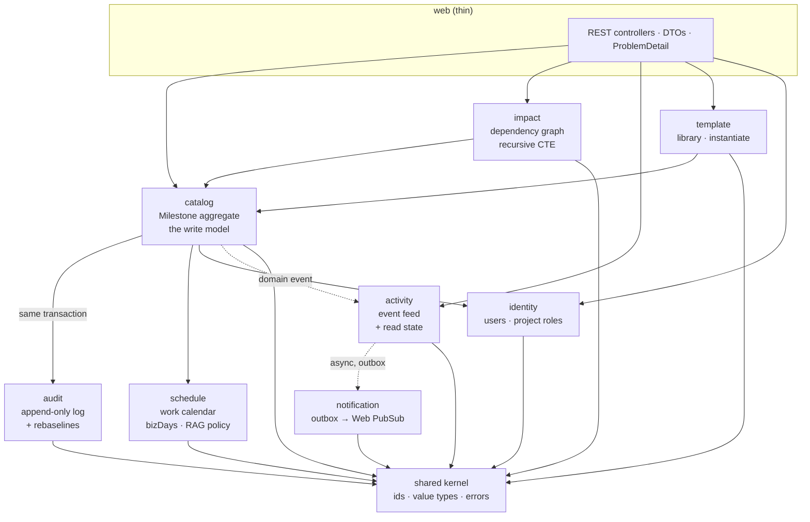
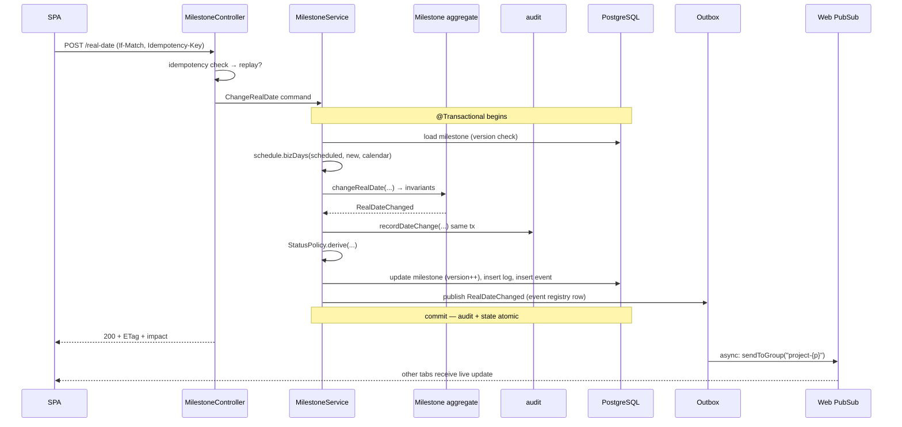
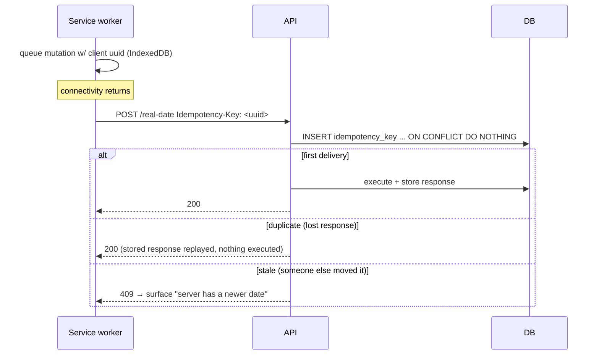

# Milestone Command — Backend Architecture

**Spring Boot 4.1 · Java 25 LTS · PostgreSQL · Azure Container Apps**

Companion to [`azure-deployment-plan.md`](./azure-deployment-plan.md), which covers infrastructure, cost and rollout. This document is the backend build spec: module boundaries, domain model, every endpoint, every cross-cutting concern, and the code idioms to use.

**Status:** design · **Written:** 2026-08-14 · **Revised:** 2026-08-15 · **Target repos:** `mc-milestone-service`, `mc-activity-service`, `mc-template-service`, `mc-identity-service`

> **Superseded on decomposition only.** [`platform-architecture.md`](./platform-architecture.md) is now the authority on how many services exist and where the boundaries fall — §1 and §19 below are updated accordingly. **Everything else in this document applies unchanged to each individual service:** the domain model, aggregate invariants, persistence, API idioms, security, testing and build are per-service concerns and do not change because there are now four of them.

---

## Contents

1. [Decision: modular monolith, not microservices](#1-decision-modular-monolith-not-microservices)
2. [Stack and versions](#2-stack-and-versions)
3. [Module map](#3-module-map)
4. [Project layout](#4-project-layout)
5. [Domain model and invariants](#5-domain-model-and-invariants)
6. [Persistence](#6-persistence)
7. [API layer](#7-api-layer)
8. [Endpoint catalogue](#8-endpoint-catalogue)
9. [Critical flows](#9-critical-flows)
10. [Security](#10-security)
11. [Real-time fan-out](#11-real-time-fan-out)
12. [Scheduled work](#12-scheduled-work)
13. [Cross-cutting concerns](#13-cross-cutting-concerns)
14. [Configuration and secrets](#14-configuration-and-secrets)
15. [Testing](#15-testing)
16. [Build and packaging](#16-build-and-packaging)
17. [Runtime on Container Apps](#17-runtime-on-container-apps)
18. [Performance and capacity](#18-performance-and-capacity)
19. [When to split into microservices](#19-when-to-split-into-microservices)
20. [Work breakdown](#20-work-breakdown)

---

## 1. Decision: four services, each a modular monolith inside

**Decided 2026-08-15: microservices**, split by data ownership into `milestone-service`, `activity-service`, `template-service` and `identity-service`. Full rationale, repo map and sequencing in [`platform-architecture.md`](./platform-architecture.md).

**Each service is still internally modular.** Spring Modulith applies *within* every service exactly as described below: modules declare what they expose, internals are package-private, and the build fails on an illegal dependency. Distribution replaces the largest boundary; it does not remove the need for boundaries inside what remains. `milestone-service` in particular is substantial enough (catalog, audit, schedule, impact) to need them.

### The one argument from the original recommendation that still binds

The transactional invariant. "Change the real date **and** append an immutable audit row **and** record the event" must be one `@Transactional` method. That is why `catalog` + `audit` + the outbox stay together inside `milestone-service` and are **never** split further, no matter how the rest of the system decomposes. See [`platform-architecture.md` §7](./platform-architecture.md#7-the-boundary-that-must-never-be-split).

Everything else that argued for a monolith — one team, one release train, no independent scaling need — was a *cost* argument, not a correctness one. That cost is now accepted deliberately in exchange for independent deployability.

```java
// src/test/java/.../ModularityTests.java — still required, now per service
class ModularityTests {
  static final ApplicationModules MODULES = ApplicationModules.of(MilestoneServiceApplication.class);

  @Test void verifiesModuleBoundaries() { MODULES.verify(); }
}
```

```java
// src/test/java/.../ModularityTests.java — this test is the architecture
class ModularityTests {
  static final ApplicationModules MODULES = ApplicationModules.of(MilestoneCommandApplication.class);

  @Test void verifiesModuleBoundaries() {
    MODULES.verify();                     // fails the build on an illegal dependency
  }

  @Test void writesDocumentation() {
    new Documenter(MODULES)
        .writeModulesAsPlantUml()
        .writeIndividualModulesAsPlantUml()
        .writeModuleCanvases();           // architecture docs generated from the code
  }
}
```

---

## 2. Stack and versions

Verified against current releases as of August 2026.

> ⚠️ **Pinned to Boot 4.0.x by Spring Cloud.** Boot 4.1.0 is the newest release, but **Spring Cloud 2025.1.x "Oakwood" targets Boot 4.0.x** — and Spring Cloud is where Eureka and Gateway live ([platform §8a](./platform-architecture.md#8a-gateway-and-service-discovery)). Adopting them pins the platform to the pair below. Revisit when a 4.1-compatible release train ships.

| Component | Version | Notes |
|---|---|---|
| **Spring Boot** | **4.0.5** (March 2026) | Pinned by Spring Cloud compatibility, not by preference |
| **Spring Cloud** | **2025.1.1 "Oakwood"** | Eureka (`spring-cloud-starter-netflix-eureka-server`/`-client`) and Gateway (`spring-cloud-starter-gateway-server-webflux` — **renamed** in this train) |
| Spring Framework | 7.0.x | JDK 17 baseline, **JDK 25 recommended**, Jakarta EE 11, Servlet 6.1, JPA 3.2 |
| **Java** | **25 LTS** | Boot 4.0 baseline is 17; take the LTS. JDK 24 removed virtual-thread monitor pinning (JEP 491), so blocking JDBC on virtual threads is finally safe. *(Note: this machine has JDK 17 and 19 installed — 25 is a prerequisite to install.)* |
| Spring Modulith | 2.1.0 | The line that targets Boot 4.x |
| Spring Security | 7.x | Ships with Boot 4.1; lambda DSL only |
| Spring Data JPA | via Boot 4.1 BOM | Hibernate 7 |
| PostgreSQL | 17 | Azure Database for PostgreSQL Flexible Server |
| Flyway | 11.x | Schema migrations |
| Testcontainers | 1.21.x | Integration tests against real Postgres |
| Azure SDK | `azure-messaging-webpubsub`, `azure-identity` | Real-time publish, managed identity |
| Build | Gradle 9 (Kotlin DSL) | Maven is fine too; examples here are Gradle |

### Spring Framework 7 features this design actually uses

- **First-class API versioning** — `@RequestMapping(version = "1")` with server-side routing, so v2 can land without breaking the deployed SPA (§7).
- **JSpecify null-safety** — `@NullMarked` at package level; nullness is part of the API contract and IDE/build-checkable.
- **Built-in resilience** — `@Retryable` (`org.springframework.core.retry`) and `@ConcurrencyLimit`, enabled with `@EnableResilientMethods`. No Resilience4j dependency needed for the simple cases.
- **`@ImportHttpServices`** — declarative HTTP interface clients, for the future P6 integration.

---

## 3. Module map



### The one architectural subtlety worth internalising

**Two different kinds of "side effect", handled two different ways:**

| Effect | Mechanism | Why |
|---|---|---|
| Append the audit row | **Synchronous, same transaction**, direct call to the `audit` module's exposed port | The audit entry *is* the invariant. A real-date change without its reason record is a corrupt write. It must commit or roll back atomically. |
| Publish live update to other browsers | **Asynchronous, transactional outbox** via Spring Modulith's event publication registry | A missed toast is a cosmetic annoyance. Blocking the user's save on a Web PubSub round-trip is not acceptable, and a Web PubSub outage must never fail a milestone update. |

Getting this backwards — async audit, sync notification — is the most common way this kind of system goes wrong.

### Module dependency rules (enforced by `MODULES.verify()`)

| Module | May depend on |
|---|---|
| `shared` | nothing |
| `identity` | `shared` |
| `schedule` | `shared` |
| `catalog` | `shared`, `identity`, `schedule`, `audit` (API only) |
| `audit` | `shared`, `identity` |
| `impact` | `shared`, `catalog` (API only) |
| `activity` | `shared`, `identity` |
| `notification` | `shared`, `activity` (events only) |
| `template` | `shared`, `catalog` (API only), `identity` |
| `web` | all module **APIs**, never internals |

---

## 4. Project layout

Spring Modulith convention: **each top-level package under the application package is a module.** Types directly in the module package are the public API; anything in an `internal` sub-package is invisible to other modules and the build enforces it.

```
milestone-command-api/
├── build.gradle.kts
├── settings.gradle.kts
├── Dockerfile                        (or bootBuildImage — §16)
├── compose.yaml                      local Postgres for dev
└── src/
    ├── main/java/com/milestonecommand/
    │   ├── MilestoneCommandApplication.java
    │   ├── package-info.java                 @NullMarked (JSpecify)
    │   │
    │   ├── shared/
    │   │   ├── ProjectId.java  MilestoneId.java  UserId.java     typed ids
    │   │   ├── WorkingDays.java                                  value object
    │   │   ├── Rag.java  MilestoneStatus.java  ReasonCode.java   enums
    │   │   └── error/  DomainException  ConflictException  NotFoundException
    │   │
    │   ├── identity/
    │   │   ├── CurrentUser.java              exposed record
    │   │   ├── ProjectRole.java              enum: VIEWER EXECUTIVE PM FIELD PLANNER ADMIN
    │   │   ├── IdentityApi.java              exposed port
    │   │   └── internal/  AppUser  UserProjectRole  UserRepository  IdentityService
    │   │                  EntraUserProvisioner        just-in-time user creation
    │   │
    │   ├── schedule/
    │   │   ├── WorkCalendarApi.java          bizDays(from,to,calendarId)
    │   │   ├── RagPolicy.java                ragOf(variance,status,thresholds)
    │   │   └── internal/  WorkCalendar  CalendarHoliday  CalendarRepository
    │   │                  WorkingDayCalculator  CalendarCache
    │   │
    │   ├── catalog/
    │   │   ├── MilestoneApi.java             exposed port used by web/template/impact
    │   │   ├── MilestoneView.java            exposed read record
    │   │   ├── commands/  ChangeRealDate  Rebaseline  CreateMilestone  EditMilestone
    │   │   ├── events/    RealDateChanged  Rebaselined  MilestoneCreated  MilestoneDeleted
    │   │   └── internal/  Milestone (aggregate)  Phase  WorkPackage  MilestoneDependency
    │   │                  MilestoneRepository  MilestoneService  MilestoneQueryService
    │   │                  StatusPolicy
    │   │
    │   ├── audit/
    │   │   ├── AuditApi.java                 recordDateChange(...) recordRebaseline(...)
    │   │   ├── LogEntryView.java  RebaselineView.java
    │   │   └── internal/  MilestoneLog  Rebaseline  AuditRepository  AuditService
    │   │
    │   ├── impact/
    │   │   ├── ImpactApi.java                downstream(id) impact(id)
    │   │   └── internal/  DependencyGraphRepository  ImpactService
    │   │
    │   ├── activity/
    │   │   ├── ActivityApi.java
    │   │   ├── ActivityEventRecorded.java    module event → notification
    │   │   └── internal/  ActivityEvent  NotificationRead  ActivityRepository  ActivityService
    │   │
    │   ├── template/
    │   │   ├── TemplateApi.java
    │   │   └── internal/  Template  TemplateRow  TemplateRepository  TemplateService
    │   │                  ProjectInstantiator      template → real project
    │   │
    │   ├── notification/
    │   │   └── internal/  WebPubSubPublisher  RealtimeEventListener  OutboxMonitor
    │   │
    │   ├── web/
    │   │   ├── MilestoneController  ImpactController  ActivityController
    │   │   ├── TemplateController   ProjectController  MeController
    │   │   ├── dto/        request/response records
    │   │   ├── ApiExceptionHandler.java      @RestControllerAdvice → ProblemDetail
    │   │   ├── IdempotencyFilter.java
    │   │   └── ApiVersionConfig.java
    │   │
    │   └── config/
    │       ├── SecurityConfig  JacksonConfig  CacheConfig
    │       ├── AsyncConfig  SchedulingConfig  ObservabilityConfig
    │       └── OpenApiConfig
    │
    ├── main/resources/
    │   ├── application.yml  application-local.yml  application-prod.yml
    │   └── db/migration/    V1__baseline.sql  V2__seed_reference_data.sql  ...
    │
    └── test/java/com/milestonecommand/
        ├── ModularityTests.java               MODULES.verify()
        ├── ArchitectureTests.java             ArchUnit extras
        ├── catalog/  MilestoneServiceTest  ChangeRealDateIntegrationTest
        ├── schedule/ WorkingDayCalculatorTest        ← highest-value unit tests
        └── support/  IntegrationTestBase (Testcontainers)  TestFixtures
```

---

## 5. Domain model and invariants

### The aggregate

`Milestone` is the aggregate root and the **only** place its state changes. No setters, no `save()` sprinkled through services.

```java
package com.milestonecommand.catalog.internal;

@Entity
@Table(name = "milestone")
class Milestone {

  @Id private UUID id;

  @Column(nullable = false) private UUID projectId;
  @ManyToOne(fetch = LAZY) private WorkPackage workPackage;

  @Column(nullable = false) private String name;
  private UUID ownerId;
  private String area;

  /** The baseline. Changes ONLY through rebaseline(). */
  @Column(name = "scheduled_date", nullable = false) private LocalDate scheduledDate;

  /** Forecast while pending, actual once done. */
  @Column(name = "real_date", nullable = false) private LocalDate realDate;

  @Enumerated(STRING) @Column(nullable = false) private MilestoneStatus status;
  private boolean critical;

  @Version private long version;                       // optimistic locking → ETag
  private Instant createdAt;
  private Instant updatedAt;
  private Instant deletedAt;

  // ---------- behaviour ----------

  /**
   * Routine forecast/actual update. Never touches scheduledDate.
   * Returns the facts the caller needs for audit + events.
   */
  RealDateChanged changeRealDate(LocalDate newDate, ReasonCode reason, @Nullable String note,
                                 UserId actor, SourceApp app, int workingDayDelta) {
    if (this.status == MilestoneStatus.DONE && !newDate.equals(this.realDate)) {
      throw new DomainException("milestone.done.locked",
          "A completed milestone's date cannot be changed — re-open it first.");
    }
    if (!newDate.equals(this.realDate) && reason == null) {
      throw new DomainException("reason.required",
          "Every real-date change must carry a reason.");
    }
    if (reason == ReasonCode.OTHER && !StringUtils.hasText(note)) {
      throw new DomainException("note.required",
          "Reason 'Other' requires a note.");
    }
    var previous = this.realDate;
    this.realDate = newDate;
    this.updatedAt = Instant.now();
    return new RealDateChanged(id(), previous, newDate, workingDayDelta, reason, note, actor, app);
  }

  /** The deliberate, audited baseline move. Role-gated at the API edge. */
  Rebaselined rebaseline(LocalDate newScheduled, String reason, String justification, UserId actor) {
    if (!StringUtils.hasText(justification)) {
      throw new DomainException("justification.required",
          "A re-baseline requires a written justification.");
    }
    var previous = this.scheduledDate;
    this.scheduledDate = newScheduled;
    this.updatedAt = Instant.now();
    return new Rebaselined(id(), previous, newScheduled, reason, justification, actor);
  }

  void markDone(LocalDate actualDate) { this.realDate = actualDate; this.status = MilestoneStatus.DONE; }
  void applyStatus(MilestoneStatus s) { this.status = s; }
  void softDelete()                   { this.deletedAt = Instant.now(); }
}
```

### Invariants, and where each is enforced

| Invariant | Enforced at |
|---|---|
| Real-date change carries a reason | Aggregate (`changeRealDate`) — **and** DB `NOT NULL` on `milestone_log.reason_code` |
| Reason `OTHER` requires a note | Aggregate |
| `scheduled_date` moves only via re-baseline | Aggregate + DB trigger + role check |
| Re-baseline requires justification | Aggregate + DB `NOT NULL` |
| Audit rows are never updated or deleted | DB grants (`REVOKE UPDATE, DELETE`) |
| Only the owner (or a PM) may update from Field | `@PreAuthorize` + service check |
| Variance/RAG are derived, never stored | `schedule` module + DB view |
| No dependency cycles | Insert-time check with a recursive CTE |
| Status derives from dates + thresholds | `StatusPolicy` (§12 for the nightly sweep) |

### Status policy — a gap in the current front end

The Angular app treats `missed` as static seed data. Nothing ever *becomes* missed. Server-side:

```java
MilestoneStatus derive(Milestone m, LocalDate today, Thresholds t, int variance) {
  if (m.status() == DONE)                              return DONE;
  if (m.realDate().isBefore(today))                    return MISSED;   // past due, not done
  if (variance > t.amber())                            return ATRISK;
  return PENDING;
}
```

Applied on every write **and** by the nightly sweeper (§12), so a milestone that quietly goes past due is flagged without anyone touching it.

---

## 6. Persistence

Full DDL lives in [`azure-deployment-plan.md` §4](./azure-deployment-plan.md#4-database-schema). Backend-specific decisions:

### Migrations — Flyway

```
db/migration/
  V1__baseline.sql                  tables, enums, indexes, views
  V2__seed_reference_data.sql       reason codes, default work calendar
  V3__audit_immutability.sql        REVOKE + trigger guarding scheduled_date
  V4__idempotency.sql               idempotency_key table
  V5__outbox.sql                    Modulith event publication table
```

**Run migrations as a discrete pipeline step, not on app startup, in production.** Flyway does take a lock so concurrent replicas are safe, but coupling schema change to rollout means a bad migration takes the app down with it. Set `spring.flyway.enabled=false` in prod and run a Container Apps *job* against the same image:

```bash
az containerapp job start -n mc-prod-migrate -g mc-prod   # runs `java -jar app.jar --spring.flyway.migrate-only=true`
```

Keep `enabled=true` for `local` and `dev` profiles where convenience wins.

### JPA where it fits, SQL where it doesn't

Use Spring Data JPA for aggregate load/save. Use **native SQL for the two queries JPA models badly**:

**1. Downstream impact — recursive CTE with cycle protection:**

```java
@Repository
class DependencyGraphRepository {

  private static final String DOWNSTREAM = """
      WITH RECURSIVE ds AS (
          SELECT d.successor_id AS id, 1 AS depth
            FROM milestone_dependency d
           WHERE d.predecessor_id = :root
          UNION
          SELECT d.successor_id, ds.depth + 1
            FROM milestone_dependency d
            JOIN ds ON d.predecessor_id = ds.id
           WHERE ds.depth < 50
      )
      SELECT m.id, m.name, m.area, m.real_date, m.scheduled_date, m.status, ds.depth
        FROM ds JOIN milestone_view m ON m.id = ds.id
       WHERE m.status <> 'done'
       ORDER BY ds.depth, m.real_date
      """;

  List<DownstreamRow> downstream(UUID rootId) { /* JdbcClient query */ }
}
```

`UNION` (not `UNION ALL`) plus the depth guard makes a cyclic graph terminate instead of hanging a request thread. Postgres 14+ `CYCLE` syntax is the alternative.

**2. The dashboard read model** — one projection query rather than 32 lazy loads. Use `JdbcClient` with a `record` mapper; do not let Hibernate near the exec dashboard.

### Connection pool sizing — the Container Apps trap

Azure PostgreSQL **burstable** tiers cap `max_connections` in the low tens. Container Apps scales replicas horizontally, and each replica opens its own Hikari pool. `maxPoolSize × maxReplicas` must stay under that cap with headroom for migrations, backups and psql sessions.

```yaml
spring:
  datasource:
    hikari:
      maximum-pool-size: 8          # 8 × 5 replicas = 40 connections
      minimum-idle: 2
      connection-timeout: 3000
      leak-detection-threshold: 20000
```

Above ~3 replicas, put **PgBouncer in transaction mode** in front — it is built into Flexible Server, just enable it. Note transaction-mode pooling forbids session-scoped state (prepared statement caching needs `prepareThreshold=0` on the JDBC URL).

### Virtual threads

```yaml
spring:
  threads:
    virtual:
      enabled: true                 # Java 21+; safe for JDBC from JDK 24 (JEP 491)
```

Request handling becomes one virtual thread per request. This does **not** raise database concurrency — Hikari still bounds that, correctly. It removes the platform-thread pool as a bottleneck for I/O-bound work, which is what this API is.

---

## 7. API layer

### Versioning (Spring Framework 7, first-class)

```java
@Configuration
class ApiVersionConfig implements WebMvcConfigurer {
  @Override public void configureApiVersioning(ApiVersionConfigurer configurer) {
    configurer.useRequestHeader("X-API-Version")
              .setDefaultVersion("1")
              .setVersionRequired(false);      // legacy clients keep working
  }
}

@RestController
@RequestMapping(path = "/api/milestones", version = "1")
class MilestoneController { /* ... */ }
```

The deployed SPA pins `X-API-Version: 1`; a breaking change ships as `version = "2"` on the same paths and both run side by side until the front end migrates. This matters here because Field devices are PWAs that may run a **stale cached bundle for weeks**.

### Errors — RFC 9457 Problem Details

```java
@RestControllerAdvice
class ApiExceptionHandler {

  @ExceptionHandler(OptimisticLockingFailureException.class)
  ProblemDetail conflict(OptimisticLockingFailureException ex) {
    var pd = ProblemDetail.forStatus(HttpStatus.CONFLICT);
    pd.setType(URI.create("https://milestonecommand/errors/stale-write"));
    pd.setTitle("Milestone changed while you were editing");
    pd.setDetail("Someone updated this milestone. Reload to see the current dates, then re-apply your change.");
    pd.setProperty("code", "stale_write");
    return pd;
  }

  @ExceptionHandler(DomainException.class)
  ProblemDetail domain(DomainException ex) {
    var pd = ProblemDetail.forStatus(HttpStatus.UNPROCESSABLE_ENTITY);
    pd.setTitle("That change isn't allowed");
    pd.setDetail(ex.getMessage());
    pd.setProperty("code", ex.code());
    return pd;
  }
}
```

Every error carries a stable machine `code` so the SPA can branch (re-prompt on `stale_write`, highlight the note field on `note_required`) instead of string-matching prose.

### Optimistic concurrency over HTTP

`version` is surfaced as a strong ETag; writes require `If-Match`. This is the mechanism that stops two PMs silently overwriting each other — the failure mode the current `localStorage` implementation has by design.

```java
@PostMapping("/{id}/real-date")
ResponseEntity<MilestoneResponse> changeRealDate(
        @PathVariable UUID id,
        @RequestHeader(value = HttpHeaders.IF_MATCH, required = false) String ifMatch,
        @RequestHeader(value = "Idempotency-Key", required = false) String idempotencyKey,
        @Valid @RequestBody ChangeRealDateRequest body,
        @AuthenticationPrincipal Jwt jwt) {

  var result = milestones.changeRealDate(new ChangeRealDate(
      MilestoneId.of(id), body.realDate(), body.reason(), body.note(),
      body.app(), currentUser.from(jwt), Version.parse(ifMatch), idempotencyKey));

  return ResponseEntity.ok()
      .eTag("\"" + result.version() + "\"")
      .body(MilestoneResponse.from(result));
}
```

### Idempotency — required for Field offline replay

A crew member saves in a tunnel, the response is lost, the service worker retries. Without deduplication that is a **second** slip appended to an immutable audit log — permanently wrong data.

```java
@Component
class IdempotencyFilter extends OncePerRequestFilter {
  // On a write with Idempotency-Key:
  //   INSERT INTO idempotency_key(key, user_id, endpoint, request_hash) ... ON CONFLICT DO NOTHING
  //   0 rows  → replay: return the stored response body + status, do not execute
  //   1 row   → execute, then persist status + body against the key (24h TTL)
  // Same key with a different request_hash → 422 (client bug, not a replay)
}
```

### Request validation

Jakarta Bean Validation on DTOs, with domain rules staying in the aggregate:

```java
record ChangeRealDateRequest(
    @NotNull LocalDate realDate,
    @NotNull ReasonCode reason,
    @Size(max = 2000) String note,
    @NotNull SourceApp app) {}
```

### OpenAPI

`springdoc-openapi` generates the spec; a CI step runs `openapi-generator` to emit **TypeScript types consumed by the Angular app**, so a backend contract change breaks the front-end build rather than production.

---

## 8. Endpoint catalogue

`{p}` = project id, `{m}` = milestone id. All under `/api`, all requiring a valid Entra token.

### Milestones

| Method | Path | Roles | Notes |
|---|---|---|---|
| `GET` | `/projects/{p}/milestones` | any member | Full tree; server-computed `variance`, `rag`, `version`. Supports `?updatedSince=` for delta sync |
| `GET` | `/milestones/{m}` | any member | Single, with dependencies + last 20 log entries |
| `POST` | `/projects/{p}/milestones` | `pm`, `planner`, `admin` | Create |
| `PATCH` | `/milestones/{m}` | `pm`, `planner`, `admin` | Name/owner/area only — **rejects `scheduledDate` with 422** |
| `DELETE` | `/milestones/{m}` | `pm`, `admin` | Soft delete |
| `POST` | `/milestones/{m}/real-date` | `pm`, `planner`, `admin`, or `field` **if owner** | The high-frequency call. `If-Match` + `Idempotency-Key` |
| `POST` | `/milestones/{m}/mark-done` | same as above | Sets actual date + status `DONE` |
| `POST` | `/milestones/{m}/rebaseline` | **`pm`, `planner` only** | Justification mandatory |
| `GET` | `/milestones/{m}/log` | any member | Paged audit trail |
| `GET` | `/milestones/{m}/rebaselines` | any member | Baseline history |

**Request/response for the central call:**

```jsonc
// POST /api/milestones/{m}/real-date
// If-Match: "42"   Idempotency-Key: 6f1c…   X-API-Version: 1
{ "realDate": "2026-07-24", "reason": "weather",
  "note": "Monsoon flooding of cut zones.", "app": "field" }

// 200 OK   ETag: "43"
{ "id": "9f3c…", "name": "Cable tray installation complete",
  "scheduledDate": "2026-07-10", "realDate": "2026-07-24",
  "variance": 10, "rag": "amber", "status": "atrisk", "version": 43,
  "impact": { "count": 8, "days": 10 },
  "logEntry": { "id": 8821, "days": 10, "reason": "weather",
                "actor": "M. Castellano", "createdAt": "2026-07-02T09:14:22Z" } }

// 409 Conflict  (application/problem+json)
{ "type": "https://milestonecommand/errors/stale-write", "status": 409,
  "title": "Milestone changed while you were editing",
  "code": "stale_write", "currentVersion": 44, "currentRealDate": "2026-07-18" }
```

### Dependencies, impact, activity, templates, reference, me

| Method | Path | Roles | Notes |
|---|---|---|---|
| `GET` | `/milestones/{m}/impact` | any member | Transitive downstream, `?depth=` cap |
| `POST` | `/milestones/{m}/dependencies` | `pm`, `planner` | Rejects cycles with 422 |
| `DELETE` | `/milestones/{m}/dependencies/{s}` | `pm`, `planner` | |
| `GET` | `/projects/{p}/events` | any member | `?since=&limit=` — replaces the in-memory 50-item slice |
| `GET` | `/projects/{p}/summary` | any member | Exec dashboard in **one** query: counts, S-curve series, days-lost-by-reason, top exposure |
| `GET` | `/templates` · `/templates/{t}` | `planner`, `pm`, `admin` | |
| `POST` `PUT` `DELETE` | `/templates…` | `planner`, `admin` | |
| `POST` | `/templates/{t}/instantiate` | `planner`, `admin` | Template → real project, offsets resolved against a start date via the work calendar |
| `GET` | `/reason-codes` · `/calendars/{c}` | any member | Cacheable reference data |
| `GET` | `/me` | authenticated | Profile, roles per project |
| `GET`/`POST` | `/me/notifications/count` · `/seen` | authenticated | Replaces `localStorage['mc.notif.seen']` |
| `GET` | `/realtime/token` | any member | Short-lived Web PubSub client access token, scoped to that project's group |

`/projects/{p}/summary` deserves emphasis: the exec dashboard currently derives everything client-side from all 32 milestones. At 5,000 that must not ship the whole table to a browser — it becomes one aggregate query.

---

## 9. Critical flows

### Change a real date (the hot path)



The dashed second half is the only part allowed to fail independently. If Web PubSub is down, the update is still committed, audited and visible on refresh — exactly the degradation you want.

### Field offline replay



---

## 10. Security

### Resource server

```java
@Configuration
@EnableWebSecurity
@EnableMethodSecurity
class SecurityConfig {

  @Bean SecurityFilterChain api(HttpSecurity http) throws Exception {
    return http
      .securityMatcher("/api/**")
      .authorizeHttpRequests(a -> a
          .requestMatchers("/api/health/**").permitAll()
          .anyRequest().authenticated())
      .oauth2ResourceServer(o -> o.jwt(j -> j.jwtAuthenticationConverter(entraConverter())))
      .sessionManagement(s -> s.sessionCreationPolicy(STATELESS))
      .csrf(CsrfConfigurer::disable)            // stateless bearer tokens, no cookies
      .headers(h -> h.httpStrictTransportSecurity(withDefaults()))
      .build();
  }

  private JwtAuthenticationConverter entraConverter() {
    var roles = new JwtGrantedAuthoritiesConverter();
    roles.setAuthoritiesClaimName("roles");     // Entra app roles
    roles.setAuthorityPrefix("ROLE_");
    var conv = new JwtAuthenticationConverter();
    conv.setJwtGrantedAuthoritiesConverter(roles);
    return conv;
  }
}
```

```yaml
spring.security.oauth2.resourceserver.jwt:
  issuer-uri: https://login.microsoftonline.com/${AZURE_TENANT_ID}/v2.0
  audiences: api://milestone-command
```

### Two layers of authorisation

**Role level** — coarse, annotation-driven:

```java
@PreAuthorize("hasAnyRole('PM','PLANNER')")
public RebaselineResult rebaseline(Rebaseline cmd) { ... }
```

**Row level** — the rule the UI implies but nothing enforces: *a field user may only update milestones they own.*

```java
@Component("milestoneAuth")
class MilestoneAuthorization {
  public boolean canChangeRealDate(UUID milestoneId, Authentication auth) {
    if (hasAnyRole(auth, "PM", "PLANNER", "ADMIN")) return true;
    return hasRole(auth, "FIELD") && milestones.isOwnedBy(milestoneId, currentUserId(auth));
  }
}

@PreAuthorize("@milestoneAuth.canChangeRealDate(#cmd.milestoneId().value(), authentication)")
public ChangeResult changeRealDate(ChangeRealDate cmd) { ... }
```

Every authorization rule gets a test that asserts **denial**, not just permission — the common bug is a rule that never fires.

### Other security requirements

- **JIT user provisioning** — first authenticated request creates the `app_user` row from token claims; no manual user admin.
- **B2B guests** for client-side users (Meridian Energy) rather than a second identity system.
- **Actor is taken from the token, never the request body.** Today the client sends `by: 'You'`; that field must be ignored server-side or the audit trail is forgeable.
- **Rate limiting** — Bucket4j per user on write endpoints, or push it to Azure Front Door / APIM.
- **Managed identity** for Key Vault and Postgres (Entra authentication for Postgres removes the password entirely).
- **Audit the reads too** if the client contract requires it — access logging on `/projects/{p}/summary` is cheap and answers "who saw the slippage and when".

---

## 11. Real-time fan-out

Spring Modulith's event publication registry **is** a transactional outbox: the event row commits with your data, and delivery is retried until acknowledged.

```java
// catalog — inside the transaction
events.publishEvent(new RealDateChanged(...));

// notification/internal — after commit, async, retried
@Component
class RealtimeEventListener {

  private final WebPubSubServiceClient hub;

  @ApplicationModuleListener                       // = @Async + @TransactionalEventListener(AFTER_COMMIT) + @Transactional
  @Retryable(maxAttempts = 4, delay = 500, multiplier = 2.0)   // org.springframework.core.retry
  void on(RealDateChanged e) {
    hub.sendToGroup("project-" + e.projectId(),
        RealtimePayload.from(e).toJson(), WebPubSubContentType.APPLICATION_JSON);
  }
}
```

- **At-least-once delivery.** Payloads carry the event id; the SPA dedupes. The current `pulse` signal already tolerates this.
- **Incomplete publications are visible** — `spring.modulith.events.republish-outstanding-events-on-restart=true`, and the registry table is queryable for an alert on stuck events.
- **Group per project** (`project-{id}`), so a user only receives what they can see. The `/realtime/token` endpoint mints a client token scoped to exactly those groups — never let the browser choose its own group.
- **Payload is a summary, not the aggregate.** Enough for the toast and to trigger a targeted refetch. It must not become a second, divergent read path.

---

## 12. Scheduled work

| Job | Cadence | Why |
|---|---|---|
| **Overdue sweeper** | Hourly | Flip `pending`/`atrisk` → `missed` once `real_date < today` in project timezone. **The system cannot report reality without this** — today nothing ever becomes missed on its own |
| Idempotency-key reaper | Daily | Delete keys older than 24h |
| Outbox monitor | 5 min | Alert on event publications incomplete for >10 min |
| Read-model refresh | Nightly | If the exec S-curve becomes a materialized view |

Multiple replicas run the same scheduler, so **jobs must be locked**:

```java
@Scheduled(cron = "0 5 * * * *")
@SchedulerLock(name = "overdue-sweeper", lockAtMostFor = "10m", lockAtLeastFor = "1m")
void sweepOverdue() { ... }                       // ShedLock, backed by Postgres
```

⚠️ **Container Apps scale-to-zero kills all of this.** With `minReplicas: 0` there is no process to run the sweeper or drain the outbox. Either keep `minReplicas: 1` in production (the plan's assumption) or move background work into a separate Container Apps **job** on a cron trigger. Decide deliberately; the failure is silent.

---

## 13. Cross-cutting concerns

### Observability

```yaml
management:
  endpoints.web.exposure.include: health,info,metrics,prometheus
  endpoint.health.probes.enabled: true          # /health/liveness, /health/readiness
  tracing.sampling.probability: 0.1             # 1.0 in dev
  otlp.tracing.endpoint: ${OTEL_ENDPOINT}
```

- **Azure Monitor OpenTelemetry** agent attached at the image level — no code coupling to App Insights.
- **Structured JSON logging** with `traceId`/`spanId`, so a front-end error and its server trace join up.
- **Domain metrics, not just HTTP metrics** — counters for `milestone.realdate.changed` tagged by reason and app, `milestone.rebaselined`, `impact.query.depth`. "Re-baselines this month" is a governance number a sponsor will ask for.
- **Correlate to the SPA** — the front end should send a `traceparent` header.

### Caching

Caffeine, in-process. Reference data only — never cache milestone state.

```java
@Cacheable(cacheNames = "workCalendar", key = "#calendarId")
WorkCalendar load(UUID calendarId) { ... }
```

`workCalendar` and `reasonCodes` (long TTL, evicted on admin write). Holiday lookups happen inside every `bizDays` call, which runs on every read of every milestone — this cache is the difference between one query and thousands.

### Resilience

```java
@Configuration @EnableResilientMethods
class ResilienceConfig {}
```

- `@Retryable` on Web PubSub publishes and any outbound integration.
- `@ConcurrencyLimit` on the impact query to stop one pathological graph walk from saturating the pool.
- Hard timeouts on every outbound call. Nothing waits forever.

### Transaction boundaries

One rule: **the service method is the transaction.** Controllers never open transactions, repositories never open transactions, and no `@Transactional` sits on a class that also does I/O to Web PubSub.

---

## 14. Configuration and secrets

```yaml
# application.yml (shared)
spring:
  application.name: milestone-command-api
  threads.virtual.enabled: true
  jpa:
    open-in-view: false            # explicitly off — no lazy loading in the view layer
    properties.hibernate.jdbc.batch_size: 50
  modulith.events.republish-outstanding-events-on-restart: true

server:
  shutdown: graceful               # drain in-flight requests on revision swap
  forward-headers-strategy: framework

milestone-command:
  webpubsub.hub: milestones
  idempotency.ttl: PT24H
  impact.max-depth: 50
```

| Setting | Where it comes from |
|---|---|
| DB host/user | App Configuration (non-secret) |
| DB password | **Not used** — Entra managed identity auth to Postgres |
| Web PubSub connection string | Key Vault → `spring-cloud-azure-starter-keyvault-secrets` via managed identity |
| Entra tenant/audience | Container App env vars (non-secret) |

Profiles: `local` (compose + Flyway on + sample data), `dev`, `prod`. **No secret ever reaches a `.env`, `application-prod.yml` or a GitHub secret** beyond the deploy credential itself.

---

## 15. Testing

| Layer | Tool | Target |
|---|---|---|
| **Domain unit** | JUnit 5 + AssertJ | `WorkingDayCalculator` (holidays, year boundaries, negative spans, 6-day weeks), `RagPolicy`, `StatusPolicy`. **Highest value in the codebase** — these numbers drive every executive decision |
| Aggregate | JUnit 5, no Spring | `Milestone` invariants: reason required, done-locked, justification required |
| Module | `@ApplicationModuleTest` | Boots one module with the rest stubbed; verifies published events |
| Persistence | `@DataJpaTest` + Testcontainers `@ServiceConnection` | Real Postgres. Recursive CTE, cycle handling, `REVOKE` actually blocking an audit `UPDATE` |
| Web slice | `@WebMvcTest` + `@MockitoBean` | Status codes, ProblemDetail shape, ETag/`If-Match`, **403 denial cases** |
| Full integration | `@SpringBootTest` + Testcontainers | The whole change-real-date flow incl. audit + event publication |
| Architecture | `MODULES.verify()` + ArchUnit | Boundaries; "no controller touches a repository"; "no `internal` type in a public signature" |
| Contract | openapi-generator diff in CI | Backend change that breaks the Angular client fails CI |
| E2E | Playwright | Reuse the existing driver against a real API |
| Load | k6 | 5,000-milestone dashboard, 50 concurrent field writes |

```java
@SpringBootTest
@Testcontainers
class ChangeRealDateIntegrationTest {

  @Container @ServiceConnection
  static PostgreSQLContainer<?> db = new PostgreSQLContainer<>("postgres:17");

  @Test void appendsAuditRowAndPublishesEventAtomically() { /* ... */ }

  @Test void rejectsSecondDeliveryOfTheSameIdempotencyKey() { /* ... */ }

  @Test void auditRowCannotBeUpdated() {
    assertThatThrownBy(() -> jdbc.sql("UPDATE milestone_log SET note='tampered'").update())
        .isInstanceOf(DataAccessException.class);       // DB grant, not app code
  }
}
```

**Coverage targets:** 90%+ on `schedule` and `catalog` domain classes; ~60% overall is fine. Do not chase a number on controllers.

---

## 16. Build and packaging

```kotlin
// build.gradle.kts
plugins {
  java
  id("org.springframework.boot") version "4.1.0"
  id("io.spring.dependency-management") version "1.1.7"
}

java { toolchain { languageVersion = JavaLanguageVersion.of(25) } }

dependencies {
  implementation("org.springframework.boot:spring-boot-starter-web")
  implementation("org.springframework.boot:spring-boot-starter-data-jpa")
  implementation("org.springframework.boot:spring-boot-starter-security")
  implementation("org.springframework.boot:spring-boot-starter-oauth2-resource-server")
  implementation("org.springframework.boot:spring-boot-starter-validation")
  implementation("org.springframework.boot:spring-boot-starter-actuator")
  implementation("org.springframework.boot:spring-boot-starter-cache")

  implementation(platform("org.springframework.modulith:spring-modulith-bom:2.1.0"))
  implementation("org.springframework.modulith:spring-modulith-starter-jpa")
  implementation("org.springframework.modulith:spring-modulith-events-api")

  implementation("com.azure:azure-messaging-webpubsub:1.5.0")
  implementation("com.azure.spring:spring-cloud-azure-starter-keyvault-secrets")
  implementation("com.github.ben-manes.caffeine:caffeine")
  implementation("net.javacrumbs.shedlock:shedlock-spring")
  implementation("org.flywaydb:flyway-database-postgresql")
  implementation("org.springdoc:springdoc-openapi-starter-webmvc-ui:2.8.0")
  runtimeOnly("org.postgresql:postgresql")

  testImplementation("org.springframework.boot:spring-boot-starter-test")
  testImplementation("org.springframework.security:spring-security-test")
  testImplementation("org.springframework.modulith:spring-modulith-starter-test")
  testImplementation("org.testcontainers:postgresql")
  testImplementation("com.tngtech.archunit:archunit-junit5:1.3.0")
}

tasks.named<BootBuildImage>("bootBuildImage") {
  imageName = "mcprodacr.azurecr.io/milestone-command-api:${project.version}"
  environment = mapOf("BP_JVM_VERSION" to "25", "BP_SPRING_AOT_ENABLED" to "true")
}
```

**Image:** Paketo buildpacks via `bootBuildImage` — reproducible, non-root, SBOM included, no Dockerfile to maintain.

**Startup: use CDS / the JDK AOT cache, not GraalVM native.** Native image cuts startup to ~50 ms but costs multi-minute builds and constant reflection friction with Hibernate. With `minReplicas: 1` (which §12 requires anyway for scheduled work), cold start is not on the critical path. AOT + CDS gets JVM startup under a second for a fraction of the complexity. Revisit native only if you later move background work to jobs and scale the API to zero.

---

## 17. Runtime on Container Apps

```yaml
properties:
  configuration:
    ingress: { external: false, targetPort: 8080, transport: auto }   # SWA linked backend only
  template:
    containers:
      - name: api
        image: mcprodacr.azurecr.io/milestone-command-api:1.4.0
        resources: { cpu: 0.5, memory: 1Gi }
        probes:
          - type: Liveness
            httpGet: { path: /actuator/health/liveness, port: 8080 }
            initialDelaySeconds: 20
          - type: Readiness
            httpGet: { path: /actuator/health/readiness, port: 8080 }
            periodSeconds: 5
          - type: Startup
            httpGet: { path: /actuator/health/liveness, port: 8080 }
            failureThreshold: 30
    scale:
      minReplicas: 1          # NOT 0 — see §12, background jobs need a live process
      maxReplicas: 5          # bounded by the Postgres connection cap, §6
      rules:
        - name: http-rule
          http: { metadata: { concurrentRequests: "50" } }
```

- **Ingress internal**, reachable only through the Static Web App's linked backend — the API is never directly on the public internet.
- **Graceful shutdown** (`server.shutdown: graceful`) plus a readiness probe means revision swaps drain in-flight requests instead of dropping them.
- **Revision mode: single** with a brief overlap; roll back by activating the previous revision.
- **Managed identity** on the app for ACR pull, Key Vault and Postgres.

---

## 18. Performance and capacity

| Path | Budget | Approach |
|---|---|---|
| `GET /projects/{p}/milestones` (5,000 rows) | < 400 ms p95 | Single projection query via `JdbcClient`, no entity graph. Gzip. `updatedSince` delta sync |
| `GET /projects/{p}/summary` | < 300 ms p95 | One aggregate query; materialized view if it drifts |
| `POST /real-date` | < 200 ms p95 | Single aggregate load + 3 inserts; impact computed *after* commit or capped by depth |
| `GET /impact` | < 250 ms p95 | Recursive CTE, depth-capped, `@ConcurrencyLimit` |

**Indexes that matter:** `milestone(project_id) WHERE deleted_at IS NULL`, `milestone(work_package_id)`, `milestone_dependency(predecessor_id)` and `(successor_id)`, `milestone_log(milestone_id, created_at DESC)`, `activity_event(project_id, created_at DESC)`.

**The N+1 to watch:** rendering the PM tree touches phase → work package → milestone → owner. Fetch it as one flat projection and assemble the tree in the API, not with JPA associations.

**Known front-end ceiling:** the PM tree renders every row unvirtualized. The API can serve 5,000 milestones long before the browser can paint them — load-test both ends (see the deployment plan §14).

---

## 19. Service boundaries — what splits, what never does

Superseded by [`platform-architecture.md` §6](./platform-architecture.md#6-backend-service-decomposition). Summary of where the lines now fall:

| Service | Modules it contains | Splits further? |
|---|---|---|
| **milestone-service** | `catalog` `audit` `schedule` `impact` `shared` | **No.** `catalog` + `audit` share one transactional invariant |
| **activity-service** | `activity` `notification` | No |
| **template-service** | `template` | No |
| **identity-service** | `identity` | No |
| *later* **integration-service** | Camel routes | No |

The infrastructure this requires — Service Bus, a database per service, distributed tracing, contract tests, gateway — is no longer optional and is budgeted in [`platform-architecture.md` §12](./platform-architecture.md#12-recalculated-timeline) as work item B6/B7.

---

## 20. Work breakdown

| # | Deliverable | Est. | Depends on |
|---|---|---|---|
| B1 | Repo, Gradle, Boot 4.1 skeleton, compose, CI build | 3 d | — |
| B2 | Flyway baseline (all tables, views, grants, triggers) | 4 d | B1 |
| B3 | `shared` + `identity` (Entra JWT, JIT provisioning, roles) | 5 d | B2 |
| B4 | `schedule` (work calendar, `bizDays`, RAG policy) **+ full unit suite** | 4 d | B2 |
| B5 | `catalog` read path + `/milestones`, `/summary` | 6 d | B3, B4 |
| B6 | `catalog` write path + `audit` (real-date, mark-done, CRUD) | 8 d | B5 |
| B7 | Optimistic concurrency (ETag/`If-Match`) + idempotency | 4 d | B6 |
| B8 | `rebaseline` + role gating + immutability tests | 3 d | B6 |
| B9 | `impact` (recursive CTE, cycle guard) | 3 d | B5 |
| B10 | `activity` + notification read state | 3 d | B6 |
| B11 | `notification` (outbox → Web PubSub) + `/realtime/token` | 4 d | B10 |
| B12 | `template` + instantiate-project | 5 d | B6 |
| B13 | Scheduled jobs + ShedLock | 2 d | B6 |
| B14 | Observability, caching, resilience, rate limiting | 4 d | B6 |
| B15 | OpenAPI → TypeScript client generation in CI | 2 d | B6 |
| B16 | Container Apps deploy, probes, migration job, runbook | 4 d | B1–B14 |
| | **Total** | **≈ 60 dev-days (12 weeks solo, ~7 with two backend devs)** | |

Front-end integration work runs in parallel from B5 onward — see [`azure-deployment-plan.md` §6](./azure-deployment-plan.md#6-frontend-changes-required).

---

## Sources

- [Spring Boot 4.0.5 release announcement](https://spring.io/blog/2026/03/26/spring-boot-4-0-5-available-now/) · [Spring Boot versions and EOL dates](https://www.herodevs.com/blog-posts/spring-boot-versions-eol-dates-and-latest-releases-april-2026) · [endoflife.date/spring-boot](https://endoflife.date/spring-boot)
- [Spring Framework 7.0 Release Notes](https://github.com/spring-projects/spring-framework/wiki/Spring-Framework-7.0-Release-Notes) · [Spring Framework 7.0 GA](https://spring.io/blog/2025/11/13/spring-framework-7-0-general-availability/)
- [Spring Modulith 2.0 GA](https://spring.io/blog/2025/11/21/spring-modulith-2-0-ga-1-4-5-and-1-3-11-released/) · [Spring Modulith reference](https://docs.spring.io/spring-modulith/reference/index.html)
