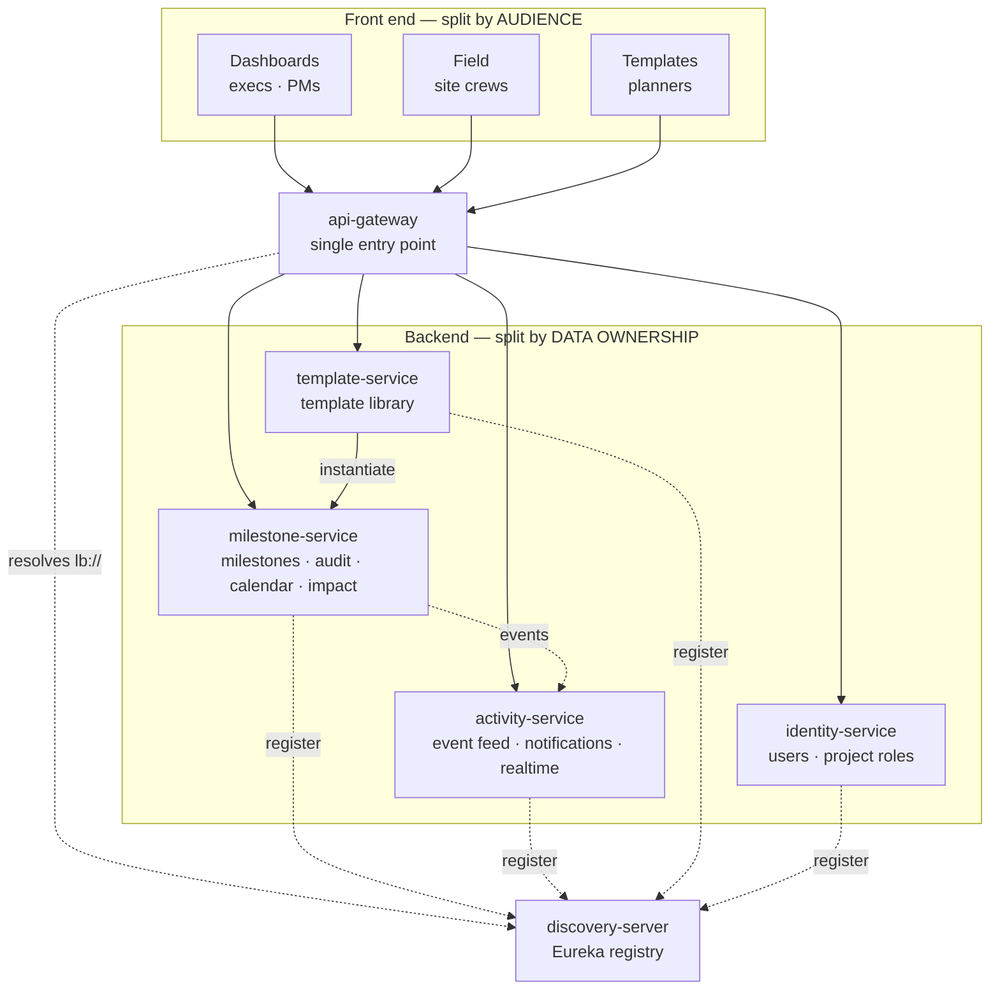

# Milestone Command — Platform Architecture

**A milestone platform: a stable domain core, a published contract, and consumers that come and go**

Its first three consumers are two web apps and a native mobile app. It is designed so the fourth, fifth and sixth cost almost nothing to add — see [§0](#0-design-stance--this-is-a-platform-not-an-app).

**Status:** design · **Written:** 2026-08-15 · **Supersedes** the single-repo / modular-monolith assumption in [`azure-deployment-plan.md`](./azure-deployment-plan.md) and [`backend-architecture.md`](./backend-architecture.md), which remain valid on every other subject (domain model, endpoints, security, Spring idioms, DB schema).

---

## Contents

0. [**Design stance — this is a platform, not an app**](#0-design-stance--this-is-a-platform-not-an-app)
1. [The decision](#1-the-decision)
2. [Frontend split ≠ backend split](#2-frontend-split--backend-split)
3. [Repository map](#3-repository-map)
4. [Front-end decomposition](#4-front-end-decomposition)
   - [4b. The Field app is a native mobile app](#4b-the-field-app-is-a-native-mobile-app)
5. [Extraction plan from the current repo](#5-extraction-plan-from-the-current-repo)
6. [Backend service decomposition](#6-backend-service-decomposition)
7. [The boundary that must never be split](#7-the-boundary-that-must-never-be-split)
8. [Service communication](#8-service-communication)
   - [8a. Gateway and service discovery](#8a-gateway-and-service-discovery)
   - [8b. Event backbone — Kafka, not ActiveMQ](#8b-event-backbone--kafka-not-activemq)
   - [8c. The AI service (Python)](#8c-the-ai-service-python)
   - [8e. Shared code between services — the day-one trap](#8e-shared-code-between-services--the-day-one-trap)
   - [8f. Platform mechanics — how new consumers arrive](#8f-platform-mechanics--how-new-consumers-arrive)
9. [Cross-cutting concerns in a distributed system](#9-cross-cutting-concerns-in-a-distributed-system)
10. [Infrastructure delta](#10-infrastructure-delta)
11. [Recalculated cost](#11-recalculated-cost)
12. [Recalculated timeline](#12-recalculated-timeline)
13. [Risks](#13-risks)
14. [Recommended sequencing](#14-recommended-sequencing)

---

## 0. Design stance — this is a platform, not an app

**Stated constraint: time is not a constraint.** This is a personal project. The goal is an architecture that stays good as features accumulate and — critically — **as new applications arrive that consume this system**.

That last point is the load-bearing one, and it changes the design:

> **The API and the event stream are the product. The three apps are its first three consumers.**

An app designed for three known front ends and a platform designed for unknown future ones differ in specific, checkable ways:

| | App thinking | **Platform thinking** |
|---|---|---|
| API shape | Whatever the screens need | Resource-oriented and coherent to someone who has never seen the UI |
| Breaking changes | Coordinate a deploy | **Never break a published contract** — expand/contract, deprecate with a sunset date |
| Events | Internal plumbing | **A public contract** with versioned schemas |
| New consumer | Change the API to suit it | Register an OAuth client; the core is untouched |
| Screen-shaped endpoints | Put them in the core API | Put them in a **BFF** so the core stays clean |

### Three principles, in priority order

**1. A small stable core, with seams.** The domain core — milestone, audit trail, working-day calendar, dependency graph — should be the most stable code in the system, changing only when the *business* meaning changes. Everything volatile (reason codes, calendars, thresholds, notification channels, integrations, reports) hangs off it through a seam. The test for any new feature is §0's table below: *what do I have to change to add this?*

**2. Simple and extensible beats complex and flexible.** A configurable rules engine is flexible; a `reason_code` table is extensible. Prefer the second. Every abstraction you add now is one a future reader must understand forever — and with no deadline pressure the temptation to over-build is *higher*, not lower. YAGNI still applies.

**3. Encode the rules so they outlive your memory.** A principle that lives only in this document erodes. A principle enforced by a failing build survives contributors, context switches, and two-year gaps. See "fitness functions" in §8f.

### The extension test

A well-placed seam means new work is *additive*. For this domain, that should look like:

| When this arrives… | You change… | Core touched? |
|---|---|---|
| A fourth app (mobile exec, client portal, kiosk) | New OAuth client + scopes; optionally a BFF | **No** |
| A new delay reason category | One row in `reason_code` | **No** |
| A site working a 6-day week, or new holidays | `work_calendar` / `calendar_holiday` rows | **No** |
| A new dependency type (SS/FF/SF) | Already in the schema — `dep_type` enum | **No** |
| A second project, or a second client | `project_id` is on everything from day one | **No** |
| A new notification channel (Teams, SMS, WhatsApp) | A channel adapter in `activity-service` | **No** |
| A new external system (P6, ERP, SharePoint) | A Camel route in `integration-service` | **No** |
| A new report or metric | A read-model projection off the event stream | **No** (write path untouched) |
| A new role or permission | `user_project_role` + a policy rule | **No** |
| A new *attribute* on a milestone | Typed custom-field table, not `ALTER TABLE` per feature | **No** |
| A change to what "variance" or "re-baseline" *means* | The core aggregate — deliberately hard, deliberately rare | **Yes** |

If a routine feature request forces you into the last row, the seam was in the wrong place. That's the signal to redesign, and it's cheap to act on early.

---

## 1. The decision

| | ~~Superseded~~ | ✅ **Current decision** |
|---|---|---|
| Product shape | ~~An app with three views~~ | **A platform** — the API and event stream are the product (§0) |
| Front end | ~~One Angular workspace, 3 lazy routes~~ | **2 web apps + 1 native mobile app**, separate repos, + a shared design-system package |
| Field app | ~~Browser, phone-frame mock~~ | **Native iOS + Android** (Capacitor 8) — no web build |
| Backend | ~~One Spring Boot modular monolith~~ | **Microservices**, boundaries by data ownership |
| Repos | ~~1~~ | **15** |
| CI/CD pipelines | ~~2~~ | **13** |
| Entry point | ~~direct~~ | **Spring Cloud Gateway** + Eureka discovery |
| Event backbone | ~~none~~ | **Kafka** (Event Hubs), replacing Service Bus |
| AI | ~~none~~ | **`mc-ai-service`** — Python, Claude on Microsoft Foundry |
| Prod cost | ~~~€140/mo~~ | **~€390/mo infra + €350–550/mo tokens** |
| Build effort | ~~~60 dev-days backend + 3 wks FE~~ | **~248 dev-days** |

The middle column is what this document **replaced** — it is kept only to show what changed. Read the right-hand column.

The split roughly **triples the build effort and the infrastructure run cost**. That is the honest price of independent deployability, and it buys real things: each app ships on its own cadence, a Field store release cannot break the exec dashboard, and the three audiences can be handed to three different teams later.

---

## 2. Frontend split ≠ backend split

This is the single most important decision in the whole plan.



**Note the crossing lines. That is the point.** All three front ends talk to `milestone-service`, because all three are views of the same milestones. If instead you built one backend per front end, each would need read *and write* access to the same `milestone` table — a shared database between services, which means no independent deployment, no independent schema evolution, and a lock-contention bug that spans three codebases. That is a distributed monolith: all the operational cost of microservices, none of the benefit.

| What the front end does | Which service owns it |
|---|---|
| Dashboards: tree, drawer, exec rollup, reason capture | `milestone-service` |
| Dashboards: activity bell, live toast | `activity-service` |
| Field: my milestones this week, update, mark done | `milestone-service` |
| Field: sync status, live confirmation | `activity-service` |
| Templates: library CRUD, tree-grid editing | `template-service` |
| Templates: "create project from template" | `template-service` → calls `milestone-service` |
| All three: who am I, what may I do | `identity-service` |

---

## 3. Repository map

| # | Repo | Contents | Artifact | Deploys to |
|---|---|---|---|---|
| 1 | `mc-design-system` | Tokens, UI primitives, top bar, formatting helpers | npm package | GitHub Packages |
| 2 | `mc-api-client` | OpenAPI-generated TS clients + auth interceptor + realtime client | npm package | GitHub Packages |
| 3 | `mc-shell` | Launcher, app switcher, auth landing | static SPA | Static Web App |
| 4 | `mc-dashboards` | Exec + PM apps | SPA | Static Web App |
| 5 | `mc-field` | **Native mobile app — iOS + Android only, no web build** | Ionic + Capacitor 8 | App Store / Play / MDM |
| 6 | `mc-templates` | Templates app | SPA | Static Web App |
| 7a | `mc-discovery-server` | **Eureka** service registry | container | Container Apps |
| 7b | `mc-api-gateway` | **Spring Cloud Gateway** — single entry point, routing, cross-cutting | container | Container Apps |
| 7 | `mc-milestone-service` | **The core.** Milestones, audit, calendar, impact | container | Container Apps |
| 8 | `mc-activity-service` | Event feed, notification state, Web PubSub fan-out | container | Container Apps |
| 9 | `mc-template-service` | Template library, project instantiation | container | Container Apps |
| 10 | `mc-identity-service` | User profiles, project role assignment | container | Container Apps |
| 11 | `mc-ai-service` | **Python 3.12 / FastAPI** — reason classification, exec narratives, NL query | container | Container Apps |
| 12 | `mc-integration-service` | **Apache Camel 4.20** — P6, SFTP, email, format mediation | container | Container Apps |
| 13 | `mc-platform-infra` | Bicep, environments, shared pipelines | IaC | — |

**Start with fewer.** §14 sequences this so you are not standing up eleven repos before the first user sees anything. `identity-service` in particular can begin as a module inside `milestone-service` and be extracted when it earns it.

---

## 4. Front-end decomposition

### Composition strategy: independent SPAs, path-routed

Two options exist. Take the simple one.

| | **Independent SPAs (recommended)** | Native Federation |
|---|---|---|
| How | Each app is its own SWA, routed by path or subdomain | Runtime module loading, one shared Angular instance |
| App switch | Full page load | In-page |
| Coupling | None — different Angular versions are fine | Tight — shared singleton versions must align |
| Build | 4 ordinary `ng build`s | Federation config, remote entry maps, version negotiation |
| Failure mode | One app 404s | A version skew breaks *all* apps at runtime |

**The audiences are disjoint.** An executive opens Dashboards and stays there; a welder opens Field on a phone and never touches anything else. Paying Native Federation's complexity tax to save a page load that happens a handful of times a week is a bad trade. Choose independent SPAs; the option to federate later stays open.

**Routing:** one domain, path-routed via Front Door — `app.milestonecommand.com/` (shell), `/dashboards`, `/field`, `/templates`. Same origin means one cookie/token domain and no CORS between apps. Subdomains work too but complicate SSO silently.

### What goes in the design system

Everything the three apps currently share, extracted once and versioned:

```
@milestone-command/design-system
├── styles/
│   ├── tokens.scss          ← src/global.scss  (OKLCH palette, spacing, radii, shadows)
│   └── ionic.scss           ← src/theme/variables.scss
├── ui/                      ← src/app/core/ui/ui.components.ts
│   ├── mc-status-chip  mc-rag-bead  mc-variance  mc-reason-badge
├── shell/
│   └── mc-top-bar           ← src/app/shell/top-bar.component.ts (all 3 apps use it)
└── format/
    └── fmtDate  fmtShort  fmtVar  varClass   ← the display half of core/data.ts
```

**Note what is *not* shared: the reason-capture UI.** The PM modal (`reason-modal.component.ts`, 560px desktop sheet) and the Field bottom sheet are already two separate implementations of the same domain concept — a fact discovered when the apps were built. Do not force them into one component; they have genuinely different ergonomics. Share the *rules* (which live server-side anyway), not the widget.

### Auth across three apps

One Entra **app registration**, three redirect URIs. MSAL acquires tokens silently in each app; because they share an origin, the shell's login carries across and the user authenticates once. Roles arrive in the token, so each app can hide what its user cannot do — with the real enforcement server-side.

---

## 4b. The Field app is a native mobile app

**`mc-field` ships to iOS and Android only. There is no web build.** That makes its own repo mandatory rather than merely tidy — it has a different runtime, a different release process, a different CI shape, and a different set of stores to answer to.

### Stack: Ionic + Angular + Capacitor 8

Keep the existing code. The Field app was already built on Ionic primitives — `ion-modal` with `initialBreakpoint: 0.9`, `ion-content`, the segmented tabs — and Capacitor wraps that same Angular app in a native iOS/Android shell. **Capacitor 8.4.1** is current and Angular 20 + Ionic 8 is a supported pairing.

The alternatives (React Native, Flutter, .NET MAUI) would mean rewriting the Field app from scratch and giving up the shared design system for the sake of a runtime the users will never notice. The one thing that *does* change: the simulated 440px phone frame in the current code disappears — it's running on a real phone now.

### What being native actually changes

| Concern | Web SPA (before) | **Native app (now)** |
|---|---|---|
| Release | Instant on deploy | **Store review — days, sometimes a rejection round** |
| Version control | Everyone on latest within a refresh | **Users run months-old binaries you cannot force off** |
| Hosting | Static Web App | None — the binary ships to the device |
| Auth | MSAL redirect in-browser, token in `localStorage` | MSAL native flow (`ASWebAuthenticationSession` / Chrome Custom Tabs), token in **Keychain / Keystore** |
| Push while backgrounded | Web PubSub only when the tab is open | **APNs / FCM via Azure Notification Hubs** |
| Offline | Nice to have | **Table stakes** — users expect it of a native app |
| CI | Any Linux runner | **macOS runner for iOS**, signing certs, provisioning profiles |

**Two consequences worth planning around now:**

1. **API versioning stops being optional.** A crew member can be running a build from three releases ago with no way for you to force an upgrade. Every endpoint needs the Framework 7 version header from day one, plus a **minimum-supported-version check** — the app calls `/api/version` on launch and shows a blocking upgrade screen below the floor. Without that, the only way to retire an API shape is to break working phones.
2. **Web PubSub no longer covers notifications.** It works while the app is foregrounded; a backgrounded or killed app needs **Azure Notification Hubs** fanning out to APNs and FCM. That's a second delivery path with its own certificates and its own failure modes.

### Native capabilities worth having — the upside

Going native isn't only cost. These are genuinely valuable on a construction site and impossible in a browser:

| Capability | Why it matters here |
|---|---|
| **Camera** | Photo evidence attached to a slip. "Fireproofing incomplete" plus a picture is worth far more in a dispute than a reason code alone |
| **GPS** | Confirms the update was submitted *on site*, not from a hotel room — a real audit-quality signal |
| **Biometric unlock** | Re-auth in seconds with gloves half-off; the alternative is a password on a phone in the rain |
| **Barcode / QR scan** | Scan an equipment tag to jump straight to its milestone |
| **Background sync** | The outbox flushes when signal returns, without the app being open |

The camera one is worth taking seriously: it turns the audit trail from a text record into an evidenced one, which is exactly what matters when a delay claim is contested.

### Distribution — check this before assuming store review

If Field is **internal to the contractor's crews** (which it reads as), you likely do not need the public App Store at all:

- **Apple Business Manager custom apps** or **Intune / MDM private distribution** put the app on managed devices with **no public App Store review**.
- Google Play **private/managed app** distribution does the same on Android.

That removes the single worst property of native — the review-cycle release latency — and keeps the app off public listings, which is usually what an EPC contractor wants anyway. **Confirm the device-management story early**, because it changes the release cadence, the timeline, and whether you need App Store compliance artifacts (privacy manifest, data-safety form, age rating) at all.

### What it consumes from the design system

A subset. Tokens, `mc-status-chip`, `mc-variance`, `mc-reason-badge` all apply. `mc-top-bar` does not — it's desktop chrome. Field's navigation is native, not a web header, so the shared package must not assume every consumer wants the shell.

---

### Live sync gets *better*, not worse

Today cross-app sync works only because all three run in one browser on one origin (`BroadcastChannel`). After the split that mechanism would be fragile. Web PubSub replaces it and is origin-agnostic: each app subscribes to `project-{id}` independently, so a Field publish on a phone reaches a PM's dashboard on a laptop — which `BroadcastChannel` never could. **The split forces the fix that was needed anyway.**

---

## 5. Extraction plan from the current repo

Concrete mapping from what exists today:

| Current path | Goes to |
|---|---|
| `src/global.scss`, `src/theme/variables.scss` | `mc-design-system/styles` |
| `src/app/core/ui/ui.components.ts` | `mc-design-system/ui` |
| `src/app/shell/top-bar.component.ts` | `mc-design-system/shell` |
| `src/app/core/data.ts` — `fmtDate` `fmtShort` `fmtVar` `varClass` `parseD` `addDays` | `mc-design-system/format` |
| `src/app/core/data.ts` — `bizDays` `ragOf` `THRESHOLDS` | **Server-side** (`milestone-service`); keep a client copy only for optimistic UI |
| `src/app/core/data.ts` — `SEED_MILESTONES` `DEPS` `PROJECT` `AS_OF` | **Delete.** Becomes database rows |
| `src/app/core/models.ts` | Replaced by `mc-api-client` generated types |
| `src/app/core/store.service.ts` | Split per app; shared HTTP/auth/realtime plumbing → `mc-api-client` |
| `src/app/dashboards/**` (7 files) | `mc-dashboards` |
| `src/app/field/**` (2 files) | `mc-field` |
| `src/app/templates/**` (2 files) | `mc-templates` |
| `src/app/launcher/**` | `mc-shell` |
| `app.component.ts`, `app.routes.ts`, `main.ts`, `index.html` | Recreated per app (4×) |
| `docs/**` | `mc-platform-infra` or a `mc-docs` repo |

**Keep this repo.** Archive it as `milestone-command-prototype` — it is the working reference the three apps are extracted *from*, and the only place the full flow currently runs end to end.

### Package versioning discipline

The design system becomes a shared dependency of four repos, which is where micro-frontends usually go wrong.

- **Semver strictly.** A token change is a minor; removing a component is a major.
- **Apps pin a caret range** (`^2.1.0`) and take patches automatically via Renovate.
- **Never require lockstep upgrades.** If a design-system change forces all three apps to release together, you have re-created the monolith with extra steps — that is the signal you made a breaking change that should have been additive.
- **CI publishes on tag**, with the package built from the same commit that is tagged.

---

## 6. Backend service decomposition

| Service | Owns (tables) | Why it is its own service | Min replicas |
|---|---|---|---|
| **discovery-server** | *(none — in-memory registry)* | Eureka registry; every service registers here (§8a) | **2** (peer-aware) |
| **api-gateway** | *(none — stateless)* | Single entry point, routing and edge concerns (§8a) | **2** (on every request path) |
| **milestone-service** | `project` `phase` `work_package` `milestone` `milestone_dependency` `milestone_log` `rebaseline` `work_calendar` `calendar_holiday` `reason_code` | The transactional core. Every write invariant lives here | **1** (scheduled sweeper + outbox) |
| **activity-service** | `activity_event` `notification_read` | Different scaling profile — fan-out volume is unrelated to write volume; owns the Web PubSub connection | **1** (outbox drain) |
| **template-service** | `template` `template_row` | Genuinely separate lifecycle; planners use it in bursts, no shared invariant with milestones | 0 (scale to zero) |
| **identity-service** | `app_user` `user_project_role` | Read-mostly, cached everywhere, changes rarely | 0 |
| *later* **integration-service** | `integration_run` `external_ref` | Camel 4.20, external cadence, batch-shaped | 0 (cron job) |

Each service keeps the internal structure described in [`backend-architecture.md`](./backend-architecture.md) — Spring Boot 4.1, Java 25, modules inside, aggregate-owned invariants. `milestone-service` is roughly 70% of the total backend work and inherits most of that document unchanged.

**Database topology:** one PostgreSQL Flexible Server, **one database per service**, one login per service with no cross-database grants. This gives real schema isolation at a quarter of the cost of four servers. It is a deliberate, reversible compromise — if a service ever needs its own scaling or availability profile, it moves to its own server without an application change.

⚠️ **The rule that makes it a real boundary:** no service may query another service's database. Ever. The moment `template-service` opens a connection to the milestone database to "just read a name", the architecture is dead and you are back to a distributed monolith. Enforce it with database grants, not code review.

---

## 7. The boundary that must never be split

**`milestone` + `milestone_log` + the event outbox stay in one service, one database, one transaction.**

Changing a real date means, atomically:

1. update `milestone.real_date` (and derive status)
2. append an immutable `milestone_log` row with reason, note, actor
3. record the outbox event

If any of those can commit without the others, you have a milestone whose date moved with no recorded reason — the exact thing the product exists to prevent. Split across services, this requires a saga with compensating transactions, and "compensate an immutable audit log" is not a coherent operation.

`activity-service` receives the event **after** commit, asynchronously, at-least-once. A lost toast is cosmetic. A lost audit row is a corrupt record. Those two facts justify the entire boundary.

---

## 8. Service communication

| Interaction | Mechanism | Why |
|---|---|---|
| Front end → any service | REST via Front Door, bearer token | One origin, no CORS |
| `milestone-service` → everything else | **Async, Kafka** (Event Hubs) | Fire-and-forget; milestone writes must not fail because a consumer is down |
| `template-service` → `milestone-service` (instantiate) | **Sync REST**, idempotent, `Idempotency-Key` | The planner is waiting for a result; a 30-milestone create is one bounded call |
| Any service → `identity-service` | **Sync REST + aggressive cache** (5 min TTL) | Role data changes rarely; every request needs it |
| `ai-service` → `milestone-service` | **Sync REST**, read-only, user's token | The AI service must obey the same row-level authorization as a human |
| `integration-service` ↔ everything | **Camel routes over Kafka** | Batch, retryable, no user waiting |

**On "create project from template":** resist modelling this as a saga. Make it one idempotent `POST /projects/{id}/milestones:bulk` call to `milestone-service` that either creates the whole hierarchy or none of it, in one transaction on that side. `template-service` retries on failure with the same idempotency key. This is a *distributed transaction avoided by design*, which is always cheaper than one managed.

---

## 8a. Gateway and service discovery

**Decided: Spring Cloud Gateway in front, Netflix Eureka behind.**

### API gateway — the single entry point

No browser ever addresses a service directly. All three front ends call the gateway, which routes by path to a logical service name:

```yaml
# mc-api-gateway — application.yml
spring:
  cloud:
    gateway:
      routes:
        - id: milestones
          uri: lb://milestone-service      # lb:// = resolve via Eureka
          predicates: [ Path=/api/projects/**,/api/milestones/** ]
        - id: activity
          uri: lb://activity-service
          predicates: [ Path=/api/events/**,/api/me/notifications/** ]
        - id: templates
          uri: lb://template-service
          predicates: [ Path=/api/templates/** ]
        - id: identity
          uri: lb://identity-service
          predicates: [ Path=/api/me,/api/users/** ]
```

What the gateway owns, so no service has to:

| Concern | Why it belongs at the edge |
|---|---|
| **JWT validation** | Validate the Entra token once, not five times. Services still enforce *authorization* (roles, row-level rules) — the gateway does authentication only |
| **Correlation ID** | Mint `traceparent` on entry so one request is traceable across every hop |
| **Rate limiting** | Per-user quotas belong where all traffic converges |
| **CORS** | One policy, one place |
| **Request/response logging** | A single audit of who called what |
| **Circuit breaking** | Shed load toward a failing service before it cascades |

⚠️ **The gateway authenticates; it does not authorize.** A service that trusts "the gateway already checked" is one misrouted request away from a breach — every service independently validates the token and applies its own role and row-level rules ([§7 of the backend doc](./backend-architecture.md#10-security)).

### Eureka — service registry

Services register on startup and resolve peers by logical name. Nothing hardcodes a host.

**Honest trade-off, since you asked for Eureka specifically:** on Container Apps you get service discovery for free via internal DNS, so Eureka is a moving part you don't strictly need there. What it buys, and why it's a defensible choice:

- **Portability.** The architecture runs unchanged on Container Apps, AKS, plain VMs, or a laptop. Nothing is bound to Azure's DNS shape.
- **Local dev parity.** `docker compose up` gives the exact topology that runs in production — the discovery mechanism doesn't change between environments.
- **Instance-level visibility.** The registry dashboard shows every instance, its health, and its metadata — information Container Apps ingress doesn't surface as directly.

The cost is two extra deployables and a registry that must itself stay available (below). Recorded as a deliberate decision, not an accident.

### Production requirements

| Component | Requirement |
|---|---|
| `discovery-server` | **2+ replicas, peer-aware** (each registers with the other). A single-instance registry is a single point of failure |
| Self-preservation | **On in production** (off in dev). It stops mass eviction during a network blip; without it a transient heartbeat failure can empty the registry |
| Client-side caching | Clients cache the registry, so a brief registry outage doesn't stop traffic — but it does stop *new* instances being discovered |
| `api-gateway` | **2+ replicas.** It is on the path of every request |
| Startup order | Registry first, then services, then gateway. Registration lag means a service can be up but not yet routable — health probes must account for it |

### How this fits Front Door

Front Door stays at the very edge for TLS, WAF and routing the **static apps**; `/api/*` goes to the gateway. Two layers with distinct jobs — Front Door is the CDN/edge, the gateway is the application entry point.

⚠️ **Version constraint (verified):** **Spring Cloud 2025.1.x "Oakwood" targets Spring Boot 4.0.x, not 4.1.** Adding Eureka and Gateway therefore pins the whole backend to **Boot 4.0.5 + Spring Cloud 2025.1.1**. Also note the gateway starter was renamed in this release train — it is `spring-cloud-starter-gateway-server-webflux`, not the older `spring-cloud-starter-gateway`.

---

## 8b. Event backbone — Kafka, not ActiveMQ

**Decision: Kafka, hosted as Azure Event Hubs with the Kafka protocol enabled.**

Kafka and ActiveMQ solve different problems. ActiveMQ is a classic JMS broker — queues, per-message acknowledgement, work distribution. Kafka is a durable, replayable event **log**: many independent consumers read the same stream at their own offsets, and a new consumer can replay history it was never online for.

That last property decides it. Three consumers already want the same milestone events, and a fourth (AI) wants to read them *from the beginning*:

| Consumer | What it does with the stream |
|---|---|
| `activity-service` | Turns events into the feed and the live Web PubSub push |
| `integration-service` | Pushes changes outward to P6 / ERP |
| `ai-service` | Reads the **whole history** to build the classifier training set |
| Future analytics | Replays from offset 0 into a warehouse without anyone re-emitting |

With a queue broker, "let a new consumer read everything that ever happened" requires re-publishing history. With a log, it's an offset seek.

### Hosting: Event Hubs, with eyes open

Event Hubs speaks the Kafka protocol, so Spring Kafka and `confluent-kafka-python` connect unchanged and there is no cluster to operate. Know the boundaries before you commit:

| Capability | Status on Event Hubs |
|---|---|
| Produce / consume, consumer groups | ✅ Fully supported — this is all your services need |
| **Log compaction** | ✅ GA across all tiers |
| **Kafka Streams** | ⚠️ Preview, **Premium/Dedicated tiers only** |
| **Kafka transactions** (exactly-once) | ⚠️ Preview, **Premium/Dedicated tiers only** |
| **Kafka Connect** | ❌ No native framework |
| Topic administration | ❌ Via Azure APIs/Bicep, not the Kafka admin API |

Your services do plain produce/consume with consumer groups, so **Standard tier is sufficient**. The two traps: don't design around Kafka Streams (use the services themselves, or Azure Stream Analytics / Flink); and provision topics in Bicep, because `AdminClient.createTopics()` won't work.

If you later need Streams, transactions, or Connect, the migration target is **Confluent Cloud on Azure** — same protocol, so application code is unchanged; only the bootstrap servers and auth move.

**This replaces Azure Service Bus** in the earlier plan. One backbone, not two. Service Bus would only earn its place if you need per-message dead-lettering with queue semantics — which the Camel routes handle at the edge instead.

**Topics:** `milestone.events`, `milestone.audit`, `integration.inbound`, `integration.outbound`, `ai.requests`. Partition by `project_id` so per-project ordering holds.

---

## 8c. The AI service (Python)

A separate `mc-ai-service` — Python because that is where the ML tooling lives, and separate because its scaling profile, release cadence, and skill set share nothing with the Java services.

### The asset you already have

**Your audit trail is a rare, clean, labeled dataset.** Every `milestone_log` row is a free-text note *already labeled* with a human-chosen reason code, an actor, a working-day delta, and the milestone's full context. Most teams building delay-classification models have to pay for that labeling. You get it as a byproduct of the product's core interaction — the reason-capture modal.

That single fact is why the AI features below are tractable rather than speculative, and it is an argument for shipping the reason-capture flow to real users *before* building the AI service: the data has to accumulate first.

### Features, in order of value-to-effort

| # | Feature | Shape | Notes |
|---|---|---|---|
| 1 | **Reason auto-suggest** | Single LLM call, structured output | Crew types "welders pulled to Train 2"; model proposes `labour` + a cleaned note. Trained/evaluated on the audit trail. Highest volume, simplest call. |
| 2 | **Executive narrative** | Single call, streaming | "This week: 3 slips, 18 working days lost, all traceable to the cryo welder shortage." Generated from the activity feed — replaces a human writing the weekly report. |
| 3 | **Natural-language query** | **Tool use** over existing endpoints | "What's threatened by the compressor delay?" The model calls `GET /milestones/{id}/impact` — an endpoint you're building anyway. No RAG, no vector store, no embeddings: the API *is* the retrieval layer. |
| 4 | **Delay root-cause clustering** | Embeddings + clustering | Groups free-text notes to surface systemic causes the seven reason codes flatten. |
| 5 | **Slip-risk prediction** | **Not an LLM** — LightGBM/scikit-learn | Tabular: history, owner, area, dependency depth, reason mix. Use the right tool; an LLM is the wrong instrument for this and will be worse and dearer. |

Feature 3 is the one to build first after the classifier. It's the least code — the tools are HTTP calls to endpoints that already exist — and the most visibly impressive to a sponsor.

### Provider: Claude on Microsoft Foundry

Since the platform is Azure and nothing is pinned in the existing code:

**Claude models are available through Microsoft Foundry**, billed via the Microsoft Marketplace at standard API rates — so you keep Azure-native billing, networking and identity rather than adding a second vendor relationship.

```python
from anthropic import AnthropicFoundry

client = AnthropicFoundry(api_key=..., resource="mc-prod-foundry")

response = client.messages.create(
    model="claude-opus-5",
    max_tokens=16000,
    system=[{"type": "text", "text": PROJECT_CONTEXT, "cache_control": {"type": "ephemeral"}}],
    thinking={"type": "adaptive"},
    messages=[{"role": "user", "content": note}],
)
```

**Two Foundry limitations that affect design:**

- **The Batches API is not available on Foundry.** A nightly bulk job (re-classifying history, regenerating summaries) can't use the 50%-cheaper batch path. Either run those through the first-party Claude API, or accept standard rates.
- Several features (prompt caching, structured outputs, adaptive thinking, token counting) are **beta on Foundry** while GA first-party. They work; verify each against your compliance posture before depending on it.

If neither constraint matters more than Azure-native billing, use Foundry. If the nightly batch economics matter, use the first-party Claude API and treat it as an ordinary external dependency — Camel already gives you a clean place to put outbound calls.

### Token cost is the real cost — plan for it

⚠️ **The AI service's token bill can exceed every other line in the infrastructure budget combined.**

At `claude-opus-5` rates ($5/M input, $25/M output), a single-project pilot with ~50 users lands roughly at:

| Feature | Rough monthly |
|---|---|
| Reason classification (~100/day) | €40–50 |
| Exec narratives (~30/day) | €100–140 |
| NL query with tool results (~50/day) | €200–350 |
| **Total** | **€350–550/month** |

Two levers, in order:

1. **Prompt caching.** Project context, milestone hierarchy and reason definitions are the same on every call — cache that prefix and it bills at ~10% of input rates. On a workload this prefix-heavy it is the single biggest saving available.
2. **Effort tuning.** Classification is not an intelligence-sensitive task; run it at low effort. Reserve high effort for NL query and narratives.

Model choice is also a lever — a smaller model is materially cheaper for the classification path — but that's a quality/cost call for you to make against your own eval set, not a default to assume.

**Build an eval set before you tune anything.** Hold out a few hundred labeled rows from the audit trail; every prompt, model, or effort change gets measured against it. Without that, tuning is guesswork.

### Service design

- **Python 3.12, FastAPI**, Container Apps, `minReplicas: 0` (bursty, latency-tolerant).
- **No database access.** Reads milestone data through `milestone-service`'s REST API **with the caller's token**, so the AI service cannot see anything the user couldn't. This is the same no-cross-database rule as §6, and it doubles as the authorization boundary.
- **Kafka consumer** on `milestone.events` for the classifier's training corpus and for triggering narratives.
- **Every AI output is a suggestion, never a write.** The model proposes a reason code; the human confirms it in the existing modal; the *human's* choice is what enters the immutable audit trail. An LLM must never author an audit record — that would destroy the provenance the product exists to guarantee.

---

## 8e. Shared code between services — the day-one trap

**Do not create a shared domain library.** No `mc-common.jar` holding `Milestone`, its DTOs, or its enums. This is the most common way a microservices split silently becomes a distributed monolith, and it arrives through the build system rather than the database — so the §6 database rule alone won't catch it.

Four failure modes, in the order they bite:

1. **Lockstep deploys return.** Add a field to a shared `Milestone` and every service recompiles and redeploys together. The independent deployability you paid ~248 dev-days for is gone.
2. **Each service needs a different view of the same concept.** `milestone-service` needs the full aggregate with invariants; `activity-service` needs id, name and area for a feed row; `template-service` needs a name. One class serving all three becomes the union of every consumer's needs, grows monotonically, and can never shed a field because nobody can tell who reads it.
3. **Shared JPA entities leak persistence across the boundary.** A service holding another service's `@Entity` has the table mapping for a database it is forbidden to query. The rule survives in the docs and dies on the classpath.
4. **Version skew you cannot compile against.** Service A on `commons:1.2`, service B on `1.4` — the mismatch surfaces as a runtime deserialization failure in production, not a compile error in CI.

### The test

> **If changing this library forces two services to deploy together, it must not be in the library.**

Identical to the design-system rule in §5 — the same failure in a different tier.

### What to share, and what never to

| Share ✅ — `mc-platform-commons` | Never share ❌ |
|---|---|
| `ProblemDetail` shape + error `code` constants | Domain models and aggregates |
| Tracing / correlation-ID filter | **JPA entities** — anything with `@Table` |
| Auth token propagation | Request/response DTOs |
| Kafka producer/consumer base config | Business rules, validators, policies |
| Logging config, base test fixtures, parent POM | The working-day calculator, RAG policy |

`mc-platform-commons` is worth having, on two conditions: **zero domain types**, and strict additive-only semver.

### How types cross the boundary instead

- **Contract-first, generated per consumer.** The producer publishes its OpenAPI spec; each consumer generates its own client types at build time. Types are derived from the contract, so a breaking change fails in CI rather than in production, and each consumer generates only what it uses. Same mechanism §9 already specifies for the TypeScript front ends.
- **Events carry a versioned schema** (Avro or JSON Schema in a registry) — never a shared Java class.
- **Otherwise, copy the handful of fields you need.** Two services each owning a small, different `MilestoneSummary` is not duplication to be eliminated; it is the boundary doing its job. Across a service boundary a little duplication is the price of independence, and it is far cheaper than the coupling it replaces.

---

## 8f. Platform mechanics — how new consumers arrive

§0 sets the stance. This is the machinery that makes it true.

### The published contract

Two contracts are public, and both get the same discipline:

**REST.** Versioned per service via Spring Framework 7's `@RequestMapping(version = "1")`. The rules:

- **Additive changes only within a version.** New optional field, new endpoint, new enum value that old clients can ignore — fine. Removing a field, renaming, tightening validation, or changing a default is a **new version**.
- **Two versions live concurrently.** `v1` keeps serving while consumers migrate.
- **Deprecation is announced, not sprung.** `Deprecation` and `Sunset` response headers, with a minimum 6-month window. A native Field binary in someone's pocket is the reason this is not optional (§4b).
- **The OpenAPI spec is a deliverable, not a byproduct.** Published on every merge; consumers generate clients from it (§8e).

**Events.** `milestone.events` is as public as the REST API the moment a second consumer subscribes.

- **Schema registry with backward-compatibility enforcement.** Avro or JSON Schema. CI rejects a producer change that would break existing consumers — this is the single highest-value gate in the platform, because event consumers are invisible to the producer.
- **Events are facts, not commands.** `MilestoneRealDateChanged`, not `UpdateDashboard`. A fact stays true regardless of who listens; a command assumes a listener.
- **Include enough context to be useful alone.** A consumer shouldn't need a callback to `milestone-service` just to render a feed row. Not the whole aggregate — the fields a reasonable consumer needs.

### Fitness functions — rules that enforce themselves

Principle 3 of §0, made concrete. Each of these fails the build:

| Rule | Enforced by |
|---|---|
| No module reaches into another's internals | `ApplicationModules.verify()` (Spring Modulith) |
| No controller touches a repository directly | ArchUnit |
| **No service connects to another service's database** | Per-service DB credentials + an integration test asserting the connection is refused |
| **No shared domain types across services** (§8e) | ArchUnit rule on `mc-platform-commons`: no `@Entity`, no domain packages |
| A producer change doesn't break a consumer | Spring Cloud Contract / Pact in both pipelines |
| An event schema change stays backward-compatible | Schema-registry compatibility check in CI |
| A REST change doesn't silently break v1 | OpenAPI diff gate — breaking changes fail unless the version is bumped |
| The audit trail stays immutable | Integration test asserting `UPDATE milestone_log` is rejected by the DB |

This is what "an architecture that evolves well" actually means in practice. Documents describing principles decay; a red build does not. Write these in Phase B, before there is anything to violate.

### BFFs — the reason the core stays clean

With unknown future consumers, screen-shaped endpoints become a liability in the core API. `GET /projects/{p}/summary` — S-curve series, days-lost-by-reason, top exposure — exists because *one* dashboard wanted it. A fourth consumer wants a different shape, and now the core API accretes one endpoint per screen of every app that ever existed.

**The pattern:** the core services expose a coherent, resource-oriented domain API. Each app that needs screen-shaped aggregation gets a **BFF** that composes core calls into exactly its payload.

- Deploy a BFF **only when an app actually needs one** — not preemptively (§0, principle 2). Dashboards will earn one; Templates likely never will.
- A BFF holds **no state and no business rules**. It composes and reshapes. The moment a rule appears in a BFF, it belongs in a domain service.
- **The mobile app is the strongest case.** Round-trips are expensive on site connectivity, so a Field BFF returning one payload per screen is a real latency win, not architectural decoration.

### Onboarding a new app — the checklist that proves the design

If adding a consumer needs more than this, a seam is missing:

1. Register an Entra **app registration** with the scopes it needs.
2. Grant it project roles (`user_project_role`) — or `client_credentials` if it's a machine consumer, not a user-facing app.
3. Generate its client from the published OpenAPI spec.
4. Subscribe to the Kafka topics it cares about, with its own consumer group.
5. *(Optional)* Add a BFF if it needs screen-shaped payloads.

**No core service is modified. No shared library is versioned. No existing consumer is redeployed.** That is the whole point.

### Authorization has to generalize past humans

The current model is user roles per project. A platform also serves machines: a client's reporting tool, a data warehouse loader, another internal system.

- **OAuth scopes alongside roles.** `milestones.read`, `milestones.write`, `templates.manage`, `events.subscribe`. A client is granted scopes; a user carries roles; **a request must satisfy both**. Scopes bound what an *app* may ever do; roles bound what *this user* may do through it.
- **`client_credentials` flow** for consumers with no human, with tight scopes and a service-account identity in the audit trail — never a shared human account. "Who changed this date" must never resolve to "the integration user".
- **Webhooks** for third parties who can't consume Kafka: they subscribe to event types, you POST with HMAC signatures and retries. This is the extension point that lets systems you've never heard of react to a slip.

### Decisions reconsidered now that time isn't a constraint

Several things I de-scoped for delivery speed are now worth doing properly:

| Earlier | **Now** |
|---|---|
| "Skip `identity-service` extraction if it isn't a burden" (§14 Phase F) | **Extract it.** With unknown consumers, identity and authorization is a platform concern, not a milestone-service module |
| Schema registry implied optional | **Required.** Event consumers are invisible; only CI can protect them |
| Contract tests "recommended" | **Required**, both directions, in both pipelines |
| BFFs "optional, phase 2" | **Pattern established early**, deployed per-app on demand |
| Dashboard aggregates as core endpoints | **Move to a Dashboards BFF**; keep the core domain-shaped |
| One PostgreSQL server, DB per service (cost compromise) | Still correct — logical isolation is what matters; split servers if a service ever needs its own profile |

Still **not** worth building: event sourcing across the whole system, a generic rules engine, a plugin runtime, or multi-region. The audit trail already gives you the event-log benefits where they matter, and the rest is speculative generality — expensive forever, useful maybe.

---

## 9. Cross-cutting concerns in a distributed system

These stop being optional the moment there is more than one service.

| Concern | Requirement |
|---|---|
| **Distributed tracing** | Mandatory. W3C `traceparent` propagated from the browser through every service. Without it, "the save was slow" is unanswerable |
| **Correlation** | Every log line carries `traceId` + `userId` + `projectId` |
| **Contract testing** | Spring Cloud Contract or Pact between every service pair. This replaces the compiler, which no longer checks across the boundary |
| **API versioning** | Per service, via Framework 7 versioning. Field PWAs run stale bundles for weeks |
| **Shared error format** | RFC 9457 problem+json with stable `code` fields, identical across services — published from one shared library |
| **Token propagation** | The user's token flows service-to-service; no service trusts a claimed identity in a body |
| **Health & readiness** | Per service, and the gateway must not route to a service failing readiness |
| **Schema change discipline** | Expand/contract migrations only. No service may assume another deployed simultaneously |

---

## 10. Infrastructure delta

Added relative to the monolith plan:

| Resource | Why | Cost impact |
|---|---|---|
| Static Web Apps ×4 (was 1) | One per front end + shell | +€24 |
| Container Apps ×4 (was 1) | One per service | +€45 |
| Azure Service Bus (Standard) | Was optional, now required for async events | +€9 |
| Azure Front Door (Standard) | Path routing across four SWAs + one origin | +€30 |
| GitHub Packages | Private npm for design system + client | included |
| PostgreSQL | Same server, 4 databases | €0 |
| Container Registry | Same registry, 4 repositories | €0 |
| App Insights | 4× telemetry volume | +€15 |

Unchanged: Key Vault, Entra ID, Web PubSub, PostgreSQL SKU.

---

## 11. Recalculated cost

| Item | ~~Monolith plan~~ | ✅ **This plan** |
|---|---|---|
| Static Web Apps | €8 | €24 (3 × Standard — Field is native) |
| **Notification Hubs** (APNs/FCM) | — | €10 |
| **Apple Developer Program** | — | €8 (€99/yr) |
| **Google Play** | — | ~€0 ($25 one-time) |
| **macOS CI minutes** (iOS builds) | — | €20–50 |
| Front Door | — | €30 |
| Container Apps | €25–40 | €130 (6 services + gateway ×2 + registry ×2) |
| PostgreSQL (1 server, 5 DBs) | €45 | €45 |
| Web PubSub S1 | €45 | €45 |
| **Event Hubs Standard** (Kafka) | — | €20 |
| Container Registry | €4 | €4 |
| App Insights | €10–20 | €30–40 |
| Key Vault | <€1 | <€1 |
| **Infrastructure total** | **~€140/mo** | **~€390/mo** (range €370–410) |
| **+ LLM tokens** (§8c) | — | **€350–550/mo** |
| **Prod total** | **~€140/mo** | **~€750–950/mo** |
| **Dev total** | ~€20/mo | **~€80/mo** + token spend |

⚠️ **Read that table twice.** Once the AI service is live, **the token bill is larger than all the infrastructure put together.** Prompt caching and effort tuning (§8c) are what keep it in the lower half of that range. Infrastructure figures: verify against the Azure pricing calculator; token figures: verify against your own eval set at real volume.

---

## 12. Recalculated timeline

### Front end

| # | Work | Est. |
|---|---|---|
| F1 | `mc-design-system` — extract, build, publish pipeline, consume from one app | 8 d |
| F2 | `mc-api-client` — OpenAPI generation, auth interceptor, realtime client | 5 d |
| F3 | `mc-dashboards` repo — scaffold, migrate, CI/CD | 4 d |
| F4 | **`mc-field` native app** — Capacitor shell, native auth + secure token storage, offline outbox, APNs/FCM push, camera/GPS capture, macOS CI + signing, store or MDM provisioning, device testing | 28 d |
| F5 | `mc-templates` repo — scaffold, migrate, CI/CD | 4 d |
| F6 | `mc-shell` — launcher, app switcher, Front Door routing, SSO across apps | 6 d |
| F7 | API integration in each app (async states, error handling, 409 UX) | 14 d |
| | **Front-end subtotal** | **69 d** |

### Backend

| # | Work | Est. |
|---|---|---|
| B0 | **`mc-discovery-server` + `mc-api-gateway`** — Eureka registry, gateway routes, JWT validation at the edge, correlation IDs, rate limiting, local `docker compose` topology | 9 d |
| B1 | Shared platform: error library, tracing, base image, pipeline template | 6 d |
| B2 | **`mc-milestone-service`** — the whole of `backend-architecture.md` §20 minus templates/activity | 45 d |
| B3 | `mc-activity-service` — feed, notification state, Web PubSub, **Kafka consumer**, Notification Hubs push for mobile | 16 d |
| B4 | `mc-template-service` — library, tree-grid persistence, instantiate | 14 d |
| B5 | `mc-identity-service` — profiles, roles, JIT provisioning, caching | 8 d |
| B6 | Inter-service: Kafka topics, contract tests, token propagation | 10 d |
| B7 | `mc-platform-infra` — Bicep for 2 environments, Front Door, 11 pipelines | 14 d |
| | **Backend subtotal** | **122 d** |

### AI and integration

| # | Work | Est. |
|---|---|---|
| A1 | `mc-ai-service` scaffold — FastAPI, Kafka consumer, Foundry client, CI/CD | 6 d |
| A2 | **Eval set** from the audit trail + evaluation harness | 5 d |
| A3 | Reason auto-suggest + front-end integration in the reason modal | 8 d |
| A4 | Executive narrative generation | 6 d |
| A5 | NL query via tool use over `milestone-service` endpoints | 10 d |
| A6 | Prompt caching, effort tuning, cost instrumentation | 4 d |
| A7 | `mc-integration-service` — Camel 4.20, P6 ingestion, outbound routes | 18 d |
| | **AI + integration subtotal** | **57 d** |

**Total ≈ 248 dev-days** (was ~85 for the monolith). Solo: ~50 weeks. Two devs: ~25 weeks. Four (1 web FE, 1 mobile, 2 BE) plus a part-time Python/ML: ~13–15 weeks.

**Mobile is a distinct skill set.** The Field app needs someone who has shipped to the App Store before — signing, provisioning, review, and device debugging are their own discipline, and "an Angular developer with Capacitor docs open" is how three-week store rejections happen.

A2 is not optional overhead. Without an eval set, every later prompt or model change is unmeasurable, and the cost-tuning work in A6 has nothing to protect quality against.

---

## 13. Risks

| Risk | Severity | Mitigation |
|---|---|---|
| **Distributed monolith** — services sharing tables, **sharing a domain library**, or released in lockstep | **Critical** | Database grants per service; **no shared domain types (§8e)**; contract tests; if two services must deploy together, merge them back |
| **A published contract broken by a producer** | **Critical** | Schema-registry compatibility gate + OpenAPI diff gate in CI (§8f). Once a consumer you don't control exists, this is the only protection there is |
| **Screen-shaped endpoints accreting in the core API** | High | Aggregation goes in a BFF, never the domain service (§8f) |
| Over-engineering because there's no deadline | Medium | §0 principle 2 — extensible beats flexible; the explicit not-building list in §8f |
| Design-system lockstep upgrades | High | Additive changes only; caret ranges; a breaking change is a signal, not a routine |
| 9 pipelines for a small team | High | One reusable workflow template in `mc-platform-infra`; do not hand-write nine |
| Debugging across four services | High | Tracing from day one, not "when we need it" |
| Cost creep from idle services | Medium | Scale-to-zero on `template`/`identity`; alert on spend |
| Auth complexity across 4 origins | Medium | Single origin via Front Door path routing — the reason to prefer paths over subdomains |
| Over-splitting too early | Medium | §14 sequencing; ship `milestone-service` before building any other |
| **LLM token spend exceeding infrastructure** | **High** | Prompt caching on the shared project prefix; effort tuning per feature; per-feature cost metrics from day one; a monthly budget alert |
| **AI output entering the audit trail** | **Critical** | Suggestions only — a human confirms every reason code. An LLM-authored audit row destroys the provenance guarantee the product is sold on |
| Building AI before there's data to learn from | Medium | Phase G is late on purpose; the audit trail must accumulate first |
| **Old Field binaries hitting a changed API** | **High** | Versioned endpoints from day one + a minimum-supported-version gate with a blocking upgrade screen. You cannot force an update on a phone |
| **Store review blocking a release** | High | Prefer MDM / Business Manager private distribution — it removes review entirely for an internal app |
| iOS signing and provisioning stalling CI | Medium | Start Apple enrolment in Phase A; certificates in Key Vault, not on a laptop |
| Push delivery failing silently (APNs/FCM) | Medium | Notification Hubs telemetry + a foreground WebSocket fallback; never make push the only path to a state change |
| Event Hubs Kafka feature gaps (Streams, transactions, Connect) | Medium | Design for plain produce/consume; Confluent Cloud on Azure is the protocol-compatible escape hatch |

---

## 14. Recommended sequencing

Time is not the constraint (§0), so these phases are ordered by **architectural risk retired per phase**, not by speed to demo. The day estimates exist to sequence work, not to set deadlines. Still: do not stand up fifteen repos before anything works — each phase is independently useful, and each proves something before the next depends on it.

**Two rules that override the ordering:**

- **Fitness functions land in Phase B, before there is anything to violate** (§8f). Retrofitting `ApplicationModules.verify()`, contract tests and the no-cross-database assertion onto an existing codebase means fixing violations *and* writing the tests. Writing them first means they're never violated at all.
- **The published contract is versioned from the first endpoint** — `v1` on day one, OpenAPI emitted on every merge. A contract that starts unversioned never gets versioned; it just accumulates consumers who can't move.

**Phase A — Split the front end (5 weeks).** Extract `mc-design-system`, then the three apps + shell, all still running on `localStorage`. No backend required. You get four deployable apps, four pipelines, and the design-system discipline proven early while the stakes are low. *This de-risks everything after it.*

**Phase B — gateway + registry + `milestone-service` + one app (11 weeks).** Stand up `discovery-server` and `api-gateway` first (B0) — everything after registers behind them, and retrofitting a gateway once three apps already call services directly is far more painful than starting with one. Then build the core service and wire **Dashboards only** to it. One front end proves the whole stack: auth, API client, concurrency, error handling. The other two apps still run on local data.

**Phase C — Field native app (6 weeks).** Wire `mc-field` to the API, add the offline outbox, then the native work: Capacitor shell, secure auth, push, camera/GPS, signing and distribution. **Start the provisioning paperwork in Phase A** — Apple Developer enrolment, MDM decision, and certificates have lead times measured in weeks and block nothing else, so there's no reason for them to sit on the critical path.

**Phase D — `activity-service` (3 weeks).** Real-time replaces `BroadcastChannel` across all three apps at once.

**Phase E — `template-service` (3 weeks).** Wire `mc-templates`, including create-project-from-template.

**Phase F — `identity-service` (2 weeks).** Extract it. My earlier advice was to skip this unless it became a burden — that was app thinking. On a platform, identity, scopes and authorization are a **platform concern** that every future consumer depends on, and burying them inside `milestone-service` makes the milestone service a dependency of things that have nothing to do with milestones (§8f).

**Phase G — `ai-service` (5 weeks).** Deliberately late, and not because it's low value: **the classifier needs an audit trail to learn from, and that only exists once real crews have been capturing reasons for a while.** Build the eval set first (A2), then auto-suggest, then NL query. Shipping this in month two would mean training on 32 seeded rows.

**Phase H — `integration-service` (Camel 4.20) (4 weeks).** When P6 sync is scoped.

---

## Related documents

- [`backend-architecture.md`](./backend-architecture.md) — Spring Boot 4.1 internals; applies to each service. §1 and §19 are superseded by this document
- [`azure-deployment-plan.md`](./azure-deployment-plan.md) — DB schema (§4), endpoint contract (§5), working-day calendar (§8), concurrency & offline (§9); topology and cost superseded by this document
